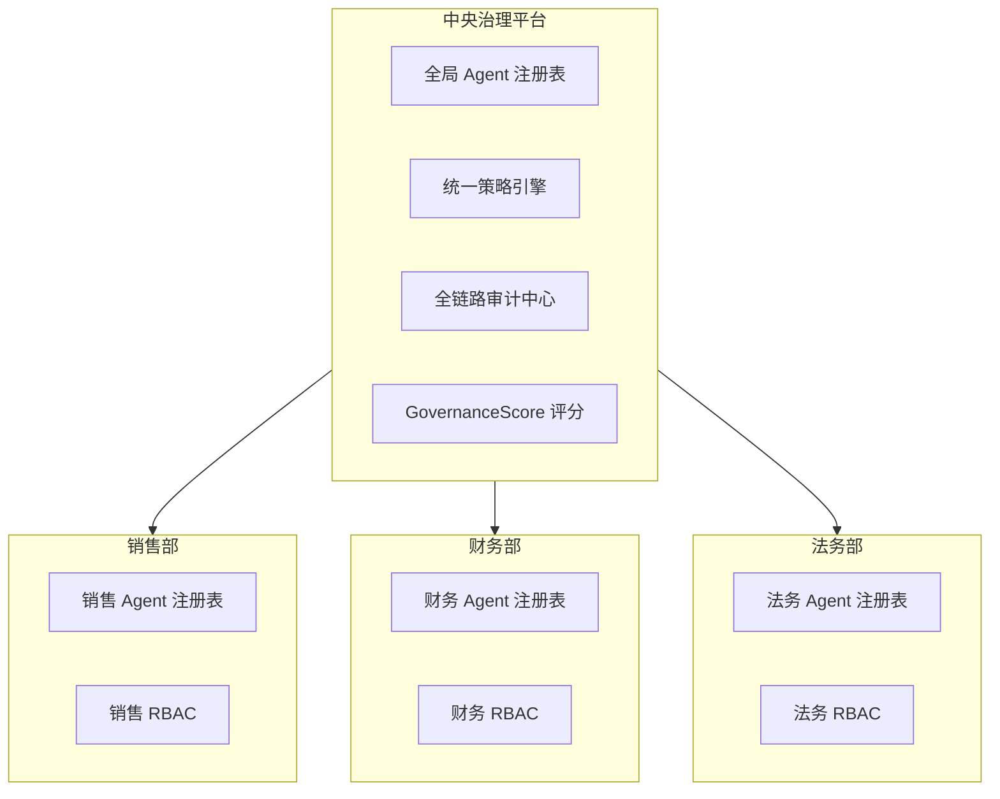
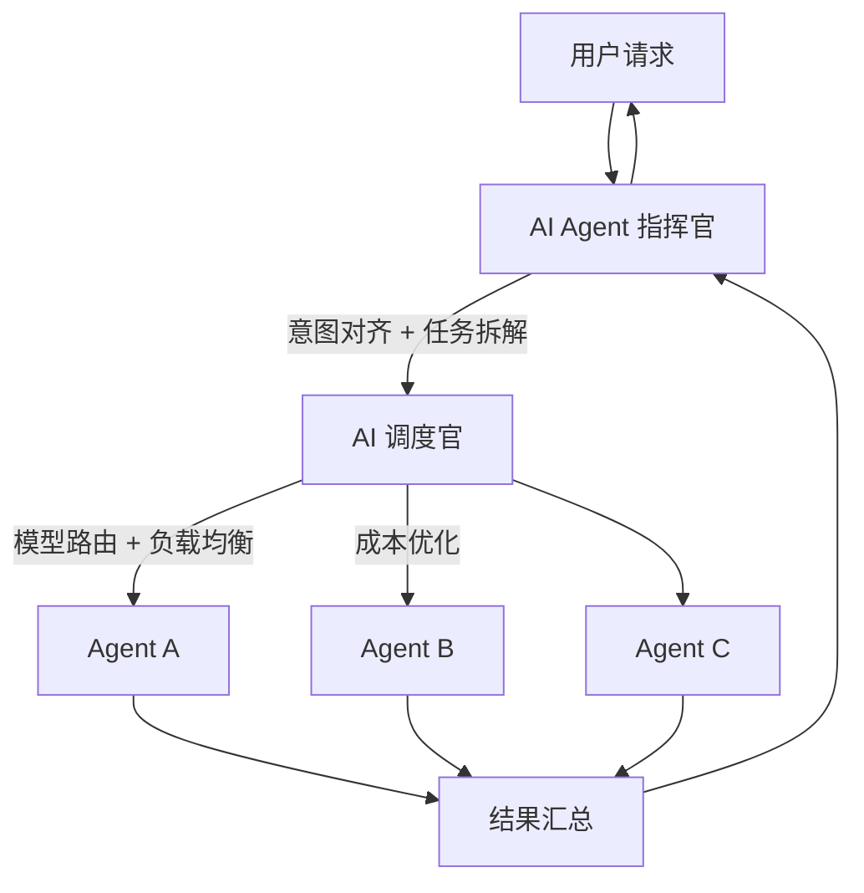
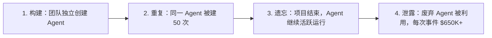
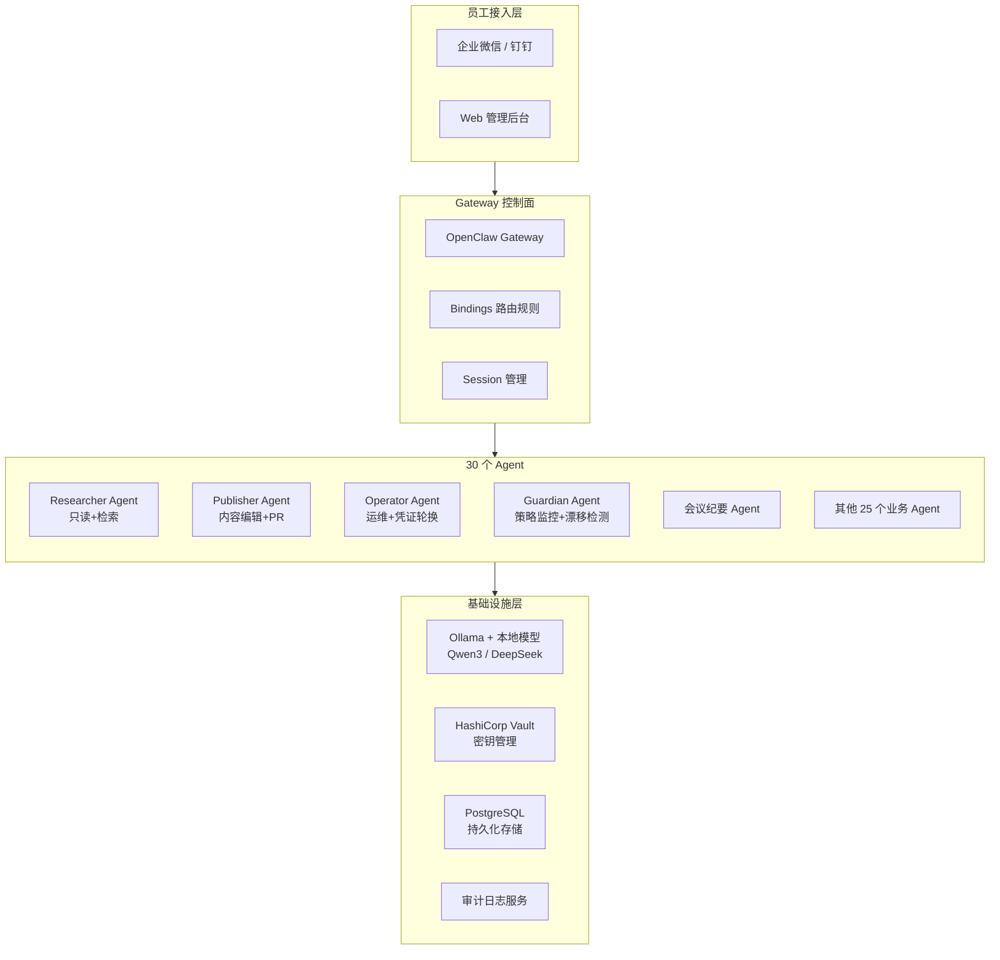
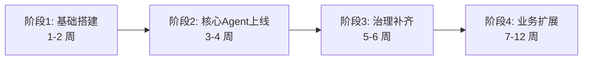

# AI Agent 治理体系与部署方案汇总

> 本文档汇总了国内企业部署 AI Agent 的主要方式、治理体系的概念与方案、以及集中式治理的详细方案，供项目演进规划参考。

---

## 一、企业部署 AI Agent 的主要方式

### 1.1 部署模式

#### SaaS 云端部署

- 通过厂商提供的云平台直接使用，按需付费，初始成本低
- 代表方案：腾讯云 ClawPro、阿里"悟空"（钉钉内置）、飞书 AI 等
- 适合：中小企业、对数据安全要求不极端的场景

#### 私有化部署（On-Premise）

- 在企业自有服务器或私有云上本地部署，数据完全自主掌控
- 支持信创适配（国产 CPU 如飞腾/海光，国产 OS 如麒麟/统信）
- 适合：金融、政务、军工等对数据合规有严格要求的行业
- 2026 年趋势：赛迪报告显示私有云增速连续三年超过公有云，私有化部署正成为越来越多企业的必选项

#### 模型聚合网关方案（性价比最优）

- 企业内网部署一个模型网关，统一接入多个大模型（DeepSeek、Qwen 等），动态路由任务
- 数据不出域，同时避免重复部署成本
- 适合：中等规模企业，兼顾安全与成本

| 维度 | 云端部署(SaaS) | 私有化部署 | 模型聚合网关 |
|------|----------------|----------|-------------|
| 数据安全性 | 相对较低 | 极高，数据自主掌控 | 高，数据不出域 |
| 响应速度 | 受网络波动影响 | 局域网环境，延迟低 | 内网延迟低 |
| 初始成本 | 低，按需付费 | 较高，需采购硬件 | 中等 |
| 信创适配 | 较难适配 | 原生支持国产系统 | 可适配 |
| 灵活性 | 高 | 中 | 高（多模型动态路由） |

### 1.2 接入方式

#### IM 工具集成（最主流的员工触达方式）

- 通过钉钉、企业微信、飞书、QQ 等员工日常使用的 IM 工具接入 Agent
- 员工无需额外安装软件，直接在聊天窗口与 Agent 交互
- 例如：阿里的"悟空"直接内置在钉钉中，覆盖 2000 万+企业组织

#### 业务系统嵌入

- 通过 API 集成 ERP、OA、CRM 等现有业务系统
- Agent 作为"数字员工"嵌入到具体业务流程中（如售前接待、私域运营、财务核算等）

#### 非侵入式屏幕语义理解（ISSUT 技术）

- 针对没有 API 的老旧系统，Agent 通过理解屏幕语义进行操作，无需改造现有系统

### 1.3 四层技术架构

| 层级 | 内容 |
|------|------|
| **硬件层** | 自有服务器/私有云；国产算力（7B 模型约 20GB 显存，70B 模型需 A100 多卡） |
| **模型层** | 开源模型本地部署 + 多模型聚合网关 |
| **应用层** | RAG 知识库、权限控制、API 集成 |
| **治理层** | 审计日志、内容合规、成本计量 |

### 1.4 典型落地案例

| 行业 | 案例 |
|------|------|
| 财税服务 | 慧算账为 500 名会计配备 AI 助理 |
| 家政服务 | 轻喜到家全链路智能化 |
| 零售电商 | AI 员工做售前接待 + 私域激活 |
| RPA+Agent | 九科信息深度融合 RPA 与大模型 |

### 1.5 中小企业上车路径

三个关键变化大幅降低了门槛：

1. **模型轻量化** — 18GB 内存即可运行 Qwen3.6-27B
2. **部署工具化** — 从数周降至数天
3. **政策补贴** — 地方 AI 服务券、工信部"智改数转"最高 1500 万补贴

---

## 二、治理体系的概念与方案

### 2.1 什么是治理体系

在企业 AI Agent 的语境下，**治理体系（Governance）** 指的是一套确保 Agent 在企业中安全、合规、可控、可审计地运行的制度与技术框架。核心目的是：

> **平衡 Agent 的自主性（让它能干活）与问责性（出了事能追责、能止损）。**

简单类比：治理体系就像给"AI 员工"配的规章制度 + 监控摄像头 + 上级审批流程——不是限制它不做事，而是确保它做事在框架内、可追溯、可纠正。

### 2.2 为什么需要治理体系

麦肯锡数据显示，85% 的组织已将 AI Agent 集成到至少一个工作流程，但 **88% 的部署处于或低于盈亏平衡点**，只有 **12% 达到 300%+ ROI**——这 12% 的共同特征就是有可度量的治理层。

核心挑战包括：

- Agent 具有"感知→决策→执行"闭环，可以自主操作跨系统（采购、审批等），风险链更长
- 多 Agent 协作形成层级体系（agent → supervisor → orchestrator → ecosystem），失控面更大
- 合规红线（《数据安全法》《个人信息保护法》等）要求操作可审计、可追溯

### 2.3 七大核心控制原语

| # | 控制项 | 含义 | 示例 |
|---|--------|------|------|
| 1 | **审计日志** | 每个 Agent 操作全程记录 | 谁、何时、做了什么、结果如何 |
| 2 | **策略执行** | 硬性规则不可违反 | 禁止访问薪资数据、禁止删除记录 |
| 3 | **速率限制** | 防止 Agent 疯狂调用资源 | 每分钟最多调用 API 50 次 |
| 4 | **深度/递归边界** | 防止 Agent 无限循环或嵌套调用 | 最多递归 5 层、最多串联 10 步 |
| 5 | **RBAC 权限** | 按角色限定 Agent 可操作的范围 | 普通员工 Agent 不能审批超过 5 万的订单 |
| 6 | **人在回路审批** | 关键决策必须人工确认 | 合同签署、贷款审批前弹出人工确认 |
| 7 | **成本上限** | 超预算自动停止 | 单次任务 Token 费用不超过 ¥50 |

### 2.4 三种组织模式

#### 集中式治理（Centralized）

- 企业统一设立 AI 治理委员会/平台团队，所有 Agent 的策略、审批、审计集中管理
- 适合：强合规行业（金融、政务）、初期部署阶段
- 优点：标准统一、风险可控
- 缺点：灵活性低、响应慢

#### 联邦式治理（Federated）

- 各业务部门自行管理本领域的 Agent，但遵循企业统一基线标准
- 适合：多业务线的大型集团
- 优点：兼顾统一与灵活
- 缺点：跨部门协作时的标准衔接较复杂

#### 混合模式（Hybrid）

- 基线策略（安全、合规、审计）集中管控；业务策略（技能配置、流程定制）各部门自治
- 适合：成熟期企业，Agent 已规模化部署
- 这是目前业界最推荐的路径

### 2.5 GAUGE 评估框架

一个企业可以用 GAUGE 六维评分（每项 0-100 分）来衡量自己的治理成熟度：

| 维度 | 衡量内容 |
|------|----------|
| **G**overnance maturity | 治理制度是否从口头规范落地为可执行的代码策略 |
| **A**ttack/threat modeling | 是否对 Agent 的越权、数据泄露、幻觉输出做了威胁建模 |
| **U**tility/ROI evidence | Agent 的投入产出是否有数据支撑，而非凭感觉 |
| **G**rowth/change management | Agent 更新、模型切换时是否有变更管控流程 |
| **E**cosystem/vendor lock-in | 是否依赖单一厂商，能否切换模型/平台 |
| **C**ompliance posture | 对 NIST AI RMF、ISO 42001、EU AI Act 等的遵从程度 |

### 2.6 国内合规相关要求

| 要求 | 内容 |
|------|------|
| **数据安全法** | Agent 处理的数据分类分级，敏感数据不出域 |
| **个人信息保护法** | Agent 涉及个人信息的处理需告知同意、最小必要 |
| **生成式 AI 管理暂行办法** | 输出内容需合规检测、不得生成违法信息 |
| **信创适配** | 政府/国企需适配国产 CPU、OS、数据库 |
| **内容审核** | Agent 输出需经过内容合规过滤 |

### 2.7 对智能会议系统的启示

如果为会议系统部署 Agent（如会议纪要生成、议题追踪、声纹识别等），治理体系至少需要覆盖：

1. **审计日志** — 会议数据被 Agent 访问/处理的每一步记录
2. **RBAC** — 不同角色（主持人/参会者/管理员）的 Agent 操作权限不同
3. **人在回路** — 会议纪要发布前需主持人确认
4. **内容合规检测** — 生成的纪要内容需过滤敏感/违规信息
5. **成本计量** — 每次会议的 AI 调用成本可追踪

---

## 三、集中式治理详细方案

集中式治理的本质是：**企业设立统一的治理平台/委员会，所有 Agent 的注册、策略、审批、审计都通过这个中央节点管理，不允许任何"野生"Agent 存在。**

Enterprise Connect 2026 的预测是，企业可能最终拥有"数十万"个 Agent。Gartner 报告称 98% 的组织已有未经批准的 AI 使用（影子 AI）。集中式治理就是要把这些散乱的 Agent 收编。

### 3.1 方案一：基于部门的分层治理（JieGou 模式）

将 Agent 按业务归属组织到 20 个部门，每个部门配备独立的注册表、RBAC 和治理评分，但所有部门受中央平台统一管控。



**关键机制：**

| 机制 | 说明 |
|------|------|
| **Agent 注册表** | 每个 Agent 必须注册，不允许"野生"Agent。中央有全局视图，各部门有局部视图 |
| **去重** | 同一个"线索资格审查 Agent"被销售、市场、支持分别独立构建 = 3 倍成本 + 3 倍攻击面。通过中央配方库，一个配方被多部门受治理地共享 |
| **GovernanceScore** | 8 因素量化指标（0-100 分），按部门和全组织范围统计蔓延风险 |
| **跨部门 RBAC** | 部门内共享配方，但各部门有自己的 RBAC 变体，防止跨部门越权访问 |
| **行业套件** | 医疗（HIPAA）、金融（SOX+中国墙）、政府（FedRAMP+数据主权）、专业服务（案件级隔离） |

### 3.2 方案二：RBAC + ABAC 混合权限管控（实在Agent 模式）

采用"身份-意图-动作-数据"四维一体的纵深防御，核心是 **静态角色 + 动态属性** 的混合授权。

**四级权限分级矩阵：**

| 权限等级 | 操作类型 | Agent 行为边界 | 审批机制 |
|----------|----------|----------------|----------|
| **L1 只读级** | 数据查询、报表导出 | 仅 GET 请求，不修改任何数据 | 自动授权，记录查询日志 |
| **L2 草稿级** | 生成文案、填写表单 | 可创建草稿，但禁止"发送/提交" | 无需审批，提交需人工确认 |
| **L3 受限执行级** | 批量打标签、状态更新 | 白名单规则内自动化操作 | 事前规则校验 + 事后抽检审计 |
| **L4 高危操作级** | 资金划拨、核心数据删除 | 涉及核心资产与资金流转 | **强制人工审批 + 多重身份验证** |

**关键机制：**

- **RBAC（角色）**：为 Agent 分配明确业务角色（"初级财务核算员"、"高级供应链分析师"），限定能访问的基础模块
- **ABAC（属性）**：根据环境属性动态调整权限——即使是"高级财务 Agent"，在非工作时间或处理千万级金额时，必须触发 Human-in-the-loop
- **数据沙箱**：不同 Agent 任务分配独立运行沙箱，防止 A 部门的 Agent 通过共享 LLM 缓存泄露 B 部门的敏感信息
- **动作白名单**：拦截任何未在预设范围内的 API 调用或高危 UI 点击

### 3.3 方案三：智能体中台架构（AIAgentforce 模式）

建设统一的 Agent 中台，所有 Agent 的构建、运行、运维集中在一个平台。

**三大核心模块：**

| 模块 | 功能 | 说明 |
|------|------|------|
| **低代码可视化构建** | Agent 开发平台 | 简单 Agent 10-30 分钟完成，复杂逻辑 5-15 天 |
| **多模态知识库与工具生态** | 统一知识管理 + 工具调用接口 | RAG 知识库、技能注册表、MCP 工具服务 |
| **企业级安全运维体系** | 治理与安全 | 敏感词拦截、数据去敏、国密加密、全链路追踪 |

**基础设施配置：**

| 配置 | CPU | 内存 | 硬盘 | GPU |
|------|-----|------|------|-----|
| 基础 | 64 核 | 128G | 2T | 24G |
| 推荐 | 128 核 | 256G | 4T | 48G+ |

### 3.4 方案四：指挥官 + 调度官双层管控（阿里云模式）

引入"AI Agent 指挥官"和"AI 调度官"的双层架构，实现任务编排与资源调度的集中治理。



| 角色 | 职责 |
|------|------|
| **指挥官（Orchestrator）** | 意图对齐、任务拆解、流程编排、结果汇总、合规校验 |
| **调度官（Dispatcher）** | 模型路由、负载均衡、成本优化、故障切换、速率控制 |

**关键：** 所有 Agent 不直接接收用户请求，必须经过指挥官和调度官双层关卡。这确保了集中管控的闭环。

### 3.5 方案五：商业化治理平台

目前市面上已有多个专业的集中式治理平台产品：

| 平台 | 核心能力 | 适用场景 |
|------|----------|----------|
| **SAP AI Agent Hub** | 厂商无关的中央指挥中心；Agent 注册表 + 评估验证 + 身份访问控制 + 会话追踪 + 组织影响映射 | 大型企业，已用 SAP 生态 |
| **Prufer** | 运行时策略执行 + 认证合规 + 策略设计工作室 + DLP + 风险登记 + 合规映射（EU AI Act / NIST / SOC 2 / ISO 42001） | 强合规行业 |
| **H2Om.AI GaaS** | 治理即服务；五阶段管道（意图声明→上下文丰富→策略评估→多Agent审议→决策审计）；常规操作 <100ms | 需要低延迟治理的中型企业 |
| **Kore.ai AMP** | Agent 生命周期管理 + 集中策略执行 + 实时可观测性 + 预部署评估 | 通用企业场景 |

### 3.6 方案六：集团级管控模式

适用于多子公司的大型集团：

| 管控性格 | 总部集权程度 | 适用场景 |
|----------|-------------|----------|
| **财务管控型** | 总部只管安全审计和成本计量，子公司高度自治 | 多元化集团 |
| **战略管控型** | 总部管数据标准 + 安全基线 + Agent 注册，子公司自主业务流程 | 相关多元化集团 |
| **运营管控型** | 总部统一平台、统一策略、统一审批 | 单一业务集团/国企 |

**共同要素：**

- 总部统一管控平台、数据标准、安全审计
- 建立 Agent 治理委员会（CTO + 法务 + 安全 + 业务代表）
- 子公司本地化 Agent 仍在总部注册表中有登记

### 3.7 蔓延生命周期防护

没有集中治理，企业会经历以下恶性循环：



集中治理在每个环节插入管控：

| 阶段 | 防护措施 |
|------|----------|
| **构建阶段** | 强制注册，不允许未登记 Agent |
| **重复阶段** | 中央配方库 + 去重 |
| **遗忘阶段** | 生命周期管理，项目结束自动退役 |
| **泄露阶段** | 审计日志 + DLP + 实时监控 |

### 3.8 方案对比总结

| 方案 | 核心特点 | 适合谁 | 实施难度 |
|------|----------|--------|----------|
| 部门分层治理 | 20 部门 + 配方去重 + GovernanceScore | 中大型企业 | 中 |
| RBAC+ABAC 四级权限 | 动态属性授权 + Human-in-the-loop | 强合规行业 | 中 |
| 智能体中台 | 低代码构建 + 统一运维 | 想统一平台的企业 | 高 |
| 指挥官+调度官 | 双层关卡 + 所有请求经中央 | 多 Agent 协作场景 | 高 |
| 商业化平台 | SAP/Prufer/GaaS/Kore.ai | 快速上车 | 低-中 |
| 集团级管控 | 总部+子公司分级 | 多子公司集团 | 高 |

---

## 四、对智能会议系统的建议

最务实的起步方案是 **RBAC+ABAC 四级权限 + 审计日志**，这是最小必要治理集，后续再逐步升级到中台或双层架构。

具体可落地的治理要点：

| 治理项 | 在会议系统中的落地 |
|--------|-------------------|
| 审计日志 | 会议数据被 Agent 访问/处理的每一步记录 |
| RBAC 权限 | 主持人/参会者/管理员不同 Agent 操作权限 |
| 人在回路 | 会议纪要发布前需主持人确认 |
| 内容合规检测 | 生成的纪要内容过滤敏感/违规信息 |
| 成本计量 | 每次会议的 AI 调用成本可追踪 |
| 速率限制 | 防止会议场景下的 Agent 调用资源过载 |

---

## 五、30 个 OpenClaw Agent 私有化部署可行方案

> 以下方案针对约 100 人规模企业，私有化部署约 30 个 OpenClaw Agent，采用集中式治理。

### 5.1 整体架构

采用 OpenClaw 官方推荐的 **单 Gateway + 多 Agent + 显式 bindings 路由** 标准架构。30 个 Agent 在同一台主机上由一个 Gateway 统一管控。



### 5.2 硬件配置

30 个 Agent 在单机运行，推荐配置：

| 项目 | 推荐配置 | 说明 |
|------|----------|------|
| CPU | 16 vCPU | 30 个 Agent 并发推理 + Gateway 路由 |
| 内存 | 32 GiB | 模型推理 + Agent workspace + Session 缓存 |
| 硬盘 | 500 GiB ESSD | Agent workspace + 日志 + 知识库 |
| GPU | 可选，无 GPU 用 Ollama CPU 模式 | 有 GPU (24G+) 可显著提升推理速度 |
| 操作系统 | Ubuntu 22.04 LTS / Debian 12 | OpenClaw 官方推荐 |

**预算估算：**

| 方案 | 月成本 | 说明 |
|------|--------|------|
| 阿里云 ECS (无 GPU) | ¥1,200 - ¥2,000 | 16C32G + 500G ESSD |
| 自购服务器 (无 GPU) | ¥8,000 - ¥15,000 一次性 | 同配置，3 年折旧 |
| 加 GPU (RTX 4090) | 附加 ¥3,000/月 或 ¥15,000 一次性 | 推理提速 3-5 倍 |

### 5.3 Agent 角色设计（4 种基础角色 + 26 个业务角色）

参考 OpenClaw 治理最佳实践，30 个 Agent 分为两类：

**4 种治理角色（必选）：**

| 角色 | 职责 | 工具权限 | 安全等级 |
|------|------|----------|----------|
| **Researcher** | 读取公开信息、汇总、起草 | 只读工具，无 git push，无密钥 | L1 只读级 |
| **Publisher** | 编辑内容、提交 PR | 文件写入 + git commit，需用户显式许可 | L2 草稿级 |
| **Operator** | 运维诊断、凭证轮换、故障排查 | 系统命令 + 凭证操作，严格审批 | L3 受限执行级 |
| **Guardian** | 监控其他 Agent 策略漂移、权限越界 | 只读审计日志 + 告警通知 | L1 只读级 |

**26 个业务角色（按部门分配）：**

| 部门 | Agent 数量 | 典型 Agent |
|------|-----------|------------|
| 销售 (4) | 线索资格审查、客户跟进提醒、报价草稿、合同审查 |
| 市场 (3) | 内容创作、社媒发布草稿、竞品情报 |
| 客服 (3) | 工单分发、FAQ 回复草稿、投诉分级 |
| 财务 (3) | 报表生成、报销审核草稿、发票校验 |
| 人力 (2) | 简历筛选草稿、考勤异常提醒 |
| 会议系统 (3) | 会议纪要生成、议题追踪、参会提醒 |
| 运维 (2) | 监控告警、日志诊断 |
| 法务 (2) | 合规审查草稿、风险关键词扫描 |
| 通用 (3) | 日程管理、知识检索、翻译 |

### 5.4 Gateway 配置与 bindings 路由

核心配置示例（简版，展示结构）：

```json
{
  "agents": {
    "list": [
      {
        "id": "meeting-minutes",
        "workspace": "~/.openclaw/workspace-meeting",
        "agentDir": "~/.openclaw/agents/meeting-minutes"
      },
      {
        "id": "researcher",
        "workspace": "~/.openclaw/workspace-research",
        "agentDir": "~/.openclaw/agents/researcher"
      },
      {
        "id": "guardian",
        "workspace": "~/.openclaw/workspace-guardian",
        "agentDir": "~/.openclaw/agents/guardian"
      }
    ]
  },
  "bindings": [
    {
      "agentId": "meeting-minutes",
      "match": {
        "channel": "wecom",
        "group": "meeting-group"
      }
    },
    {
      "agentId": "researcher",
      "match": {
        "channel": "wecom",
        "peer": { "kind": "direct" }
      }
    }
  ]
}
```

**关键原则：**

- 每个 Agent 使用独立 `workspace` 和 `agentDir`，避免认证与会话冲突
- `bindings` 规则必须足够具体，防止"路由命中漂移"
- 一台主机只运行一个 Gateway（官方架构约束）

### 5.5 Agent 间通信机制

同一 Gateway 内，Agent 间协作使用 OpenClaw 内生 session 工具：

| 工具 | 用途 | 特点 |
|------|------|------|
| `sessions_send` | 向另一个 session 发消息并等待结果 | 可超时控制，适合短任务协作 |
| `sessions_spawn` | 派生隔离子代理执行长任务 | 完成后回传摘要，适合耗时子任务 |

**三条硬规则：**

1. **幂等键** — 每个协作任务必须有业务 ID，重复投递可安全去重
2. **超时与降级** — `sessions_send` 必须设置 timeout 与 fallback
3. **上下文最小化** — 跨 Agent 只传"必要上下文 + 结构化结果"，不整段转发历史

### 5.6 模型层：私有化大模型

数据不出域，本地部署大模型：

| 方案 | 模型 | 显存/内存需求 | 适合场景 |
|------|------|-------------|----------|
| Ollama + Qwen3-7B | 7B 参数 | ~8GB 内存（CPU）或 ~20GB 显存（GPU） | 轻量任务（检索、摘要） |
| Ollama + DeepSeek-14B | 14B 参数 | ~40GB 显存 | 中等复杂任务（起草、分析） |
| 外部 API 网关 | 多模型聚合 | 无本地显存需求 | 复杂任务路由到不同模型 |

**推荐策略：** 本地部署 Qwen3-7B 处理 80% 的日常任务，复杂任务通过内部模型聚合网关路由到更大模型（可按需调用外部 API，但敏感数据仅在本地模型处理）。

### 5.7 密钥安全管理

使用 HashiCorp Vault 替代硬编码和明文存储：

| 控制项 | 做法 |
|--------|------|
| 密钥存储 | 所有 Agent 凭证存入 Vault，禁止硬编码 |
| 认证方式 | AppRole 认证，每个 Agent 独立角色和策略 |
| Token 生命周期 | 短期 Token + 自动轮换，敏感操作后强制轮换 |
| 访问审计 | Vault 审计日志记录每次密钥访问 |
| 权限粒度 | 每个 Agent 只能访问自己角色所需的密钥 |

### 5.8 治理控制清单

基于 OpenClaw 的治理六问，落实到 30 Agent 场景：

| 治理问题 | 控制措施 | 落地方式 |
|----------|----------|----------|
| **Agent 身份是什么？** | 每个 Agent 独立身份 + 独立 workspace | OpenClaw 原生隔离 |
| **它现在能做什么？** | RBAC 四级权限 + 工具白名单 | bindings + SOUL.md 角色约束 |
| **它能在哪里操作？** | 容器隔离 + 文件系统最小访问集 | Docker `--read-only` + `--cap-drop` |
| **谁批准了它？** | L4 操作强制 Human-in-the-loop | Operator/Publisher 需显式用户许可 |
| **它实际做了什么？** | 防篡改审计日志（时间+身份+工具调用） | OpenClaw session 日志 + 外部审计服务 |
| **能立即停止吗？** | Kill switch + Token 即时撤销 | Vault Token 立即吊销 + Gateway 停止 Agent |

**Guardian Agent 专项职责：**

- 监控其他 29 个 Agent 的策略漂移（权限范围是否悄悄扩大）
- 检测异常工具调用模式（如 Researcher 突然尝试 git push）
- 定期报告每个 Agent 的权限边界状态
- 发现越界行为时自动告警并建议 Token 撤销

### 5.9 分阶段实施路线



**阶段 1：基础搭建（1-2 周）**

| 任务 | 说明 |
|------|------|
| 服务器采购与部署 | 16C32G 服务器 + Ubuntu 22.04 |
| OpenClaw 安装与 Gateway 配置 | 单 Gateway + PostgreSQL |
| Ollama + Qwen3-7B 部署 | 本地模型推理可用 |
| HashiCorp Vault 部署 | 密钥管理基础设施 |
| 企业微信/钉钉渠道接入 | Gateway 连通 IM |

**阶段 2：核心 Agent 上线（3-4 周）**

| 任务 | 说明 |
|------|------|
| 4 个治理角色 Agent | Researcher + Publisher + Operator + Guardian |
| 3 个会议系统 Agent | 会议纪要 + 议题追踪 + 参会提醒 |
| bindings 路由配置 | 每个渠道绑定到正确 Agent |
| SOUL.md 编写 | 每个 Agent 的角色约束文档 |
| 基础审计日志 | Session 日志 + 外部审计服务 |

**阶段 3：治理补齐（5-6 周）**

| 任务 | 说明 |
|------|------|
| RBAC 四级权限落地 | L1-L4 权限矩阵配置到每个 Agent |
| 工具白名单 | 每个 Agent 角色的工具 allowlist |
| Human-in-the-loop | L4 操作配置人工审批节点 |
| 成本计量 | 每次推理的 Token/时间成本追踪 |
| Guardian 监控上线 | 策略漂移检测 + 异常告警 |

**阶段 4：业务扩展（7-12 周）**

| 任务 | 说明 |
|------|------|
| 剩余 23 个业务 Agent | 按部门逐步上线 |
| 知识库建设 | RAG 知识库按部门搭建 |
| 跨主机桥接（如需扩展） | 先渠道桥接，再升级 webhook/队列 |
| 持续优化 | 根据审计数据优化模型路由和成本 |

### 5.10 常见避坑清单

| 坑 | 影响 | 防范 |
|----|------|------|
| 多个 Agent 复用同一个 `agentDir` | 认证/会话冲突 | 每个 Agent 独立 workspace + agentDir |
| bindings 规则不够具体 | 路由命中漂移，消息被错误 Agent 处理 | 精确匹配 channel + peer + group |
| 跨主机协作当成同机 `sessions_send` | 通信链路设计不完整 | 先在单机跑顺，再引入桥接 |
| 没有幂等设计 | 重试时重复执行副作用（重复发消息/写库） | 每个任务带业务 ID |
| 没有统一状态模型 | 排障时看不到"任务卡在哪一跳" | 审计日志贯穿全链路 |
| Agent 凭证硬编码 | 被窃取后无法即时撤销 | 全部存入 Vault，短生命周期 Token |
| 权限边界悄悄扩大 | Guardian 检测不到策略漂移 | 定期权限审计 + Guardian 自动监控 |

### 5.11 多主机扩展预案

30 个 Agent 在单机可承载，但如后续扩展到 50+ Agent 或需要进程级隔离，可采用三种拓扑：

| 拓扑 | 适用场景 | 说明 |
|------|----------|------|
| **拓扑 A：渠道桥接** | 快速起步 | Host-A 通过 IM 渠道发任务，Host-B 接收处理并回发结果 |
| **拓扑 B：Webhook 桥接** | 平台化集成 | 结构化 JSON 事件投递，适合与后端系统集成 |
| **拓扑 C：Redis/Kafka 任务总线** | 企业级高吞吐 | 解耦编排与执行，治理能力最强 |

**扩展时机判断：** 当单机 CPU 利用率持续 >70% 或 Agent 响应延迟 >5s 时，考虑多主机部署。

---

## 参考资料

- OpenClaw 官方文档：Gateway Architecture — https://docs.openclaw.ai/concepts/architecture
- OpenClaw 官方文档：Multi-Agent Routing — https://docs.openclaw.ai/concepts/multi-agent
- OpenClaw 官方文档：Session Tools — https://docs.openclaw.ai/concepts/session-tool
- OpenClaw 治理最佳实践：The Claw Street Journal — http://theclawstreetjournal.com/2026/02/24/openclaw-governance-workforce.html
- Sanna 治理插件（宪法执行 + 加密收据） — https://github.com/sanna-ai/sanna-openclaw
- HashiCorp Vault 官方文档 — https://developer.hashicorp.com/vault/docs
- JieGou Agent 治理平台 — https://jiegou.ai/zh-CN/blog/enterprise-agent-sprawl-governance/
- 实在Agent 权限管控体系 — https://www.ai-indeed.com/encyclopedia/17733.html