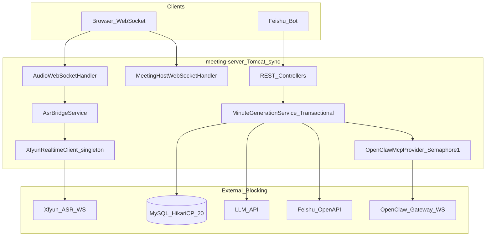

# smart-meeting-java 并发能力评估与改造方案

> 文档生成：2026-06-06  
> 评估范围：`meeting-server`、`meeting-admin-server`、`matter-progress-core`  
> 评估目标：10+ 用户 / 10+ 并发会议场景下的容量与瓶颈

---

## 1. 评估结论

| 场景 | 结论 | 说明 |
| ---- | ---- | ---- |
| **10 人同 1 场会议** | **可行** | 单场会议仅 1 路音频 WS、1 路 ASR、少量 DB 查询；Tomcat 默认 200 线程、HikariCP 20 连接足够 |
| **10 场会议同时并发** | **当前不可行** | 存在 3 个致命瓶颈：AI 调用全局串行、ASR 单例、事务内阻塞外部 API |
| **多实例水平扩展** | **当前不可行** | WebSocket 与会话状态均为 JVM 本地，未共享 |

**总体判断**：系统面向「单租户、单场或少量串行会议」设计；若需 10+ 场会议同时开、同时结束并走 AI/纪要链路，须按本文 **P0 → P1 → P2** 顺序改造后再上生产。

---

## 2. 架构与并发模型概览



**关键特征**：

- Spring Boot 3.2.5 + 嵌入式 **Tomcat**（未显式配置线程池，默认 max≈200）
- **同步阻塞** I/O：RestTemplate、OpenClaw WebSocket `connectBlocking` + `CountDownLatch.await`
- `@EnableAsync` 已配置，但纪要主链路仅 `LocalEventBus` 使用 `@Async`；核心服务方法仍为同步
- Kafka 默认 **关闭**（`meeting.kafka.enabled=false`），会后处理走本地线程池

---

## 3. 致命瓶颈（P0 必须解决）

### 3.1 瓶颈 A：OpenClaw Gateway 调用全局串行

**代码位置**：[`meeting-server/src/main/java/com/smartmeeting/service/agent/OpenClawMcpProvider.java`](../../meeting-server/src/main/java/com/smartmeeting/service/agent/OpenClawMcpProvider.java)

```java
/**
 * 全局串行：避免会序通报与纪要增强并发占用同一 Gateway 会话导致返回串台。
 */
private static final Semaphore GATEWAY_INVOKE_SEMAPHORE = new Semaphore(1, true);
```

**行为**：

- 会序通报（matter-progress）、纪要增强（minute-enhancement）等所有 MCP 调用均 `acquire()` 后执行
- 单次超时：`openclaw.timeout-seconds` 默认 **60s**（配置见 `application.yml`）
- 每次调用新建 WebSocket 连接，无连接池（[`OpenClawGatewayWsClient`](../../matter-progress-core/src/main/java/com/smartmeeting/matterprogress/openclaw/OpenClawGatewayWsClient.java)）

**影响**：

- 10 场会议同时触发 AI → 第 10 场最坏需排队 **9 × 60s ≈ 9 分钟**（实际常 30–120s/次）
- 与 `matter-progress-core` 中周报对比任务共用同一 Gateway 时，会中与会后任务互相阻塞

**改造方向**：

| 项 | 建议 | 工作量 |
| -- | ---- | ------ |
| 短期 | `Semaphore(1)` → `Semaphore(5~10)`，可配置化 `openclaw.max-concurrent-invokes` | 0.5h |
| 中期 | 按 `taskId` / `sessionKey` 隔离 + 连接池（避免每 call 新建 WS） | 1–2d |
| 长期 | 评估 Gateway 侧多会话并发能力，配合 Skill 输出校验防串台 | 与 OpenClaw 联调 |

---

### 3.2 瓶颈 B：讯飞实时 ASR 单例，仅支持 1 路

**代码位置**：[`meeting-server/src/main/java/com/smartmeeting/asr/XfyunRealtimeClient.java`](../../meeting-server/src/main/java/com/smartmeeting/asr/XfyunRealtimeClient.java)

```java
@Component
public class XfyunRealtimeClient {
    private WebSocketClient client;  // 单实例字段
    private String currentMeetingId;

    public synchronized boolean connect(String meetingId) {
        if (connected.get()) {
            log.warn("Already connected to Xfyun ASR");
            return false;  // 已有连接则拒绝
        }
        // ...
    }
}
```

**上层调用**：[`AsrBridgeService`](../../meeting-server/src/main/java/com/smartmeeting/service/AsrBridgeService.java) 注入同一 Bean；[`AudioWebSocketHandler`](../../meeting-server/src/main/java/com/smartmeeting/api/config/AudioWebSocketHandler.java) 每场会议 `startRealtimeAsr()` 时调用 `connect()`。

**影响**：

- **同一 JVM 内仅 1 场会议**可占用实时转写 WebSocket
- 第 2 场会议连接失败 → 前端收到 `asr_warning`，仅录音、无实时字幕
- 讯飞侧 error code **35006**（并发路数已满）已在代码中记录，还受 **讯飞账号并发配额** 限制

**说明**：默认配置 `meeting.asr.realtime-enabled=false`，多数部署仅离线 ASR；若开启实时转写且多场并行，此瓶颈立即生效。

**改造方向**：

| 项 | 建议 | 工作量 |
| -- | ---- | ------ |
| 结构 | `Map<meetingId, XfyunRealtimeClient>` 或独立 `XfyunRealtimeClientPool` | 1–2d |
| 配额 | 与讯飞确认 AST 并发路数；超限排队或降级离线 | 运维 |
| 配置 | 新增 `meeting.asr.max-concurrent-sessions` 与显式排队策略 | 0.5d |

---

### 3.3 瓶颈 C：`@Transactional` 内嵌 LLM / 飞书等长耗时调用

**代码位置**：[`meeting-server/src/main/java/com/smartmeeting/service/MinuteGenerationService.java`](../../meeting-server/src/main/java/com/smartmeeting/service/MinuteGenerationService.java)

```java
@Transactional
public void generateMinute(String meetingId, String audioPath) {
    // 1. DB 读会议、参会人、转写
    // 2. 离线 ASR 校正（可能 30–60s）
    // 3. LLM 生成纪要（RestTemplate 阻塞，配置 timeout 120s 但未应用到 RestTemplate）
    // 4. minuteAIEnhancer.enhanceMinute → OpenClaw/LLM（再 60–120s）
    // 5. feishuService.createDoc / updateDoc（30s+）
    // 6. DB 更新会议状态
}
```

**连接池配置**（[`application.yml`](../../meeting-server/src/main/resources/application.yml)）：

```yaml
spring.datasource.hikari:
  maximum-pool-size: 20
  minimum-idle: 5
  connection-timeout: 10000
```

**影响**：

- 单次会议纪要链路可 **占用 1 条 DB 连接 2–3 分钟**
- 10 场同时结束 → 10 连接长期占用 → 建会、签到、状态查询等 **10s 内拿不到连接**
- `meeting.minute.generation-enabled` 默认 **false**，开启后此问题在高峰更明显

**改造方向**（推荐三段式）：

```text
Phase1 @Transactional  读会议上下文、转写片段
Phase2 无事务          LLM、OpenClaw、飞书文档
Phase3 @Transactional  写纪要、更新 meeting 状态
```

| 项 | 建议 | 工作量 |
| -- | ---- | ------ |
| 拆事务 | `loadContext()` / `persistResult()` 两个小事务 | 0.5–1d |
| 池大小 |  interim：`maximum-pool-size: 40~50`（不能替代拆事务） | 5min |
| 异步 | 保持 `LocalEventBus`/`Kafka` 异步入口，避免 HTTP 线程阻塞 | 已有 |

---

## 4. 其他风险

### 4.1 RestTemplate 无超时

**代码位置**：[`meeting-server/src/main/java/com/smartmeeting/config/RestTemplateConfig.java`](../../meeting-server/src/main/java/com/smartmeeting/config/RestTemplateConfig.java)

- `builder.build()` 未设置 `connectTimeout` / `readTimeout`
- `meeting.llm.timeout-seconds: 120` 仅存在于配置，**未绑定到 HTTP 客户端**
- 飞书 OpenAPI 调用同样可能无限阻塞 Tomcat 线程

**建议**：统一 `RestTemplateBuilder`：`connect 5s`、`read 30–120s`（LLM 单独 Bean 亦可）。

### 4.2 异步线程池偏小

**代码位置**：[`AsyncConfig.java`](../../meeting-server/src/main/java/com/smartmeeting/api/config/AsyncConfig.java)

| 线程池 | core | max | queue |
| ------ | ---- | --- | ----- |
| meetingTaskExecutor | 4 | 8 | 100 |
| asrTaskExecutor | 2 | 4 | 50 |

`LocalEventBus.publishMeetingEvent` 使用 `meetingTaskExecutor`；10 场同时结束且每场纪要 >60s 时，**第 9 场起排队**。

**建议**：`core=16, max=32`（可配置化），并与拆事务、Gateway 并发 permits 联动压测。

### 4.3 JVM 本地会话状态（无法多实例）

| Store | 文件 | 多实例 |
| ----- | ---- | ------ |
| FeishuStartMeetingPendingStore | `session/FeishuStartMeetingPendingStore.java` | 否 |
| FeishuUserLastGroupChatStore | `session/FeishuUserLastGroupChatStore.java` | 否 |
| FeishuChatInstructionCardStore | `session/FeishuChatInstructionCardStore.java` | 否 |
| AudioWebSocketHandler.activeSessions | `api/config/AudioWebSocketHandler.java` | 否（设计如此） |

**影响**：负载均衡后多副本会导致飞书多步建会状态丢失；WebSocket 须 **sticky session** 或单实例。

**建议**：P2 将会话 Store 迁至 Redis；WebSocket 层保持单实例或 IP Hash。

### 4.4 无熔断 / 限流 / 重试

- 未引入 Resilience4j、Bucket4j 等
- `meeting.llm.max-retries: 2` 配置存在，**DirectLlmAgentProvider / MinuteGenerationService 未实现重试**
- Feishu 分页存在 `Thread.sleep(350/400)` 硬编码节流，无统一限流

### 4.5 admin-server

[`meeting-admin-server`](../../meeting-admin-server) 以轻量 CRUD 为主，**10+ 管理员并发风险低**；与 meeting-server 共库但独立进程，一般不是首要瓶颈。

---

## 5. 场景压测预期（改造前）

### 场景 A：10 人同 1 场会议

| 资源 | 用量 | 结论 |
| ---- | ---- | ---- |
| 音频 WS | 1 | OK |
| 主持 WS | ≤10 | OK |
| 讯飞 ASR | 1（realtime 开启时） | OK |
| DB 连接 | 2–3 | OK |
| Tomcat 线程 | 5–10 | OK |

### 场景 B：10 场会议同时进行中（realtime ASR 开启）

| 资源 | 预期 | 结论 |
| ---- | ---- | ---- |
| 实时 ASR | 仅 1 场成功 | **FAIL** |
| 音频 WS | 10 | OK |
| OpenClaw AI | 串行 | **严重排队** |

### 场景 C：10 场会议同时结束并生成纪要

| 资源 | 预期 | 结论 |
| ---- | ---- | ---- |
| HikariCP | 10 连接占 2–3min | **池耗尽风险** |
| meetingTaskExecutor | 8 线程满 + 队列 | **排队** |
| OpenClaw | 全局 Semaphore(1) | **严重排队** |

---

## 6. 改造方案（优先级与排期）

### P0 — 上线 10 场并发前必做（约 1 人日）✅ 2026-06-08 已落地

| # | 改动 | 文件/配置 | 预期效果 | 状态 |
| - | ---- | --------- | -------- | ---- |
| 1 | OpenClaw 并发 permits 可配置，默认 5 | `OpenClawMcpProvider.java` + `application.yml` | AI 调用并行度提升 | ✅ |
| 2 | RestTemplate 连接/读超时 | `RestTemplateConfig.java` | 避免线程永久挂死 | ✅ |
| 3 | `generateMinute` 拆事务 | `MinuteGenerationService.java` | DB 连接占用降至毫秒级 | ✅ |
| 4 | HikariCP `maximum-pool-size: 40`（临时） | `application-prod.yml` | 缓解池耗尽 | ✅ |

### P1 — 功能完整多会议并行（约 3–5 人日）✅ 核心项 2026-06-08 已落地

| # | 改动 | 预期效果 | 状态 |
| - | ---- | -------- | ---- |
| 5 | Xfyun ASR 按 meetingId 连接池 | 多路实时转写 | ✅ |
| 6 | `meetingTaskExecutor` 扩容 + 可配置 | 会后任务并行 | ✅ |
| 7 | OpenClaw WS 连接池或长连接复用 | 降低握手开销 | 部分（sessionKey 隔离已有；长连接池待 P2） |
| 8 | LLM/Feishu 简单重试 + 超时 | 提高成功率 | 待办 |

### P2 — 生产级多实例（约 1–2 周）

| # | 改动 | 预期效果 |
| - | ---- | -------- |
| 9 | Feishu 会话 Store → Redis | 多副本建会状态一致 |
| 10 | Resilience4j 熔断/舱壁 | 外部故障隔离 |
| 11 | 监控：Tomcat 线程、HikariCP、WS 连接数 | 可观测 |
| 12 | 可选：Kafka 默认开启，纪要/待办完全异步 | 与 HTTP 解耦 |

---

## 7. 验证建议

改造完成后建议执行：

1. **10 场并发建会 + 同时录音**（`realtime-enabled=true`）：统计 ASR 连接成功率
2. **10 场同时结束**：观察 HikariCP active connections、纪要完成 P99 延迟
3. **OpenClaw 并发 5 路**：确认无 Skill 输出串台（保留 `AgendaBriefingMarkdownValidator`）
4. **单实例压测通过后再测双实例**（仅 Redis 会话改造后）

---

## 8. 相关配置速查

| 配置项 | 默认值 | 与并发关系 |
| ------ | ------ | ---------- |
| `meeting.asr.realtime-enabled` | false | true 时 ASR 单例瓶颈生效 |
| `meeting.minute.generation-enabled` | false | true 时纪要链路占 DB/LLM |
| `openclaw.agent.provider` | mcp | mcp 时走 Semaphore + WS |
| `openclaw.timeout-seconds` | 60 | 单次 AI 最长阻塞 |
| `meeting.kafka.enabled` | false | false 时用 LocalEventBus |
| `spring.datasource.hikari.maximum-pool-size` | 20（prod 40） | 并发 DB 上限 |
| `openclaw.max-concurrent-invokes` | 5 | MCP 并行 invoke |
| `meeting.asr.max-concurrent-sessions` | 3 | 实时 ASR 并发路数 |
| `meeting.async.task-executor-core` / `max` | 16 / 32 | 会后异步并行度 |

详见 [开关手册.md](../开关手册.md)。

---

## 9. 文档维护

- 代码变更涉及 Semaphore、ASR 池、事务边界时，同步更新本文 §3、§6。
- 发版规划可引用本文于 [版本迭代历史.md](../版本迭代历史.md) 对应里程碑。
