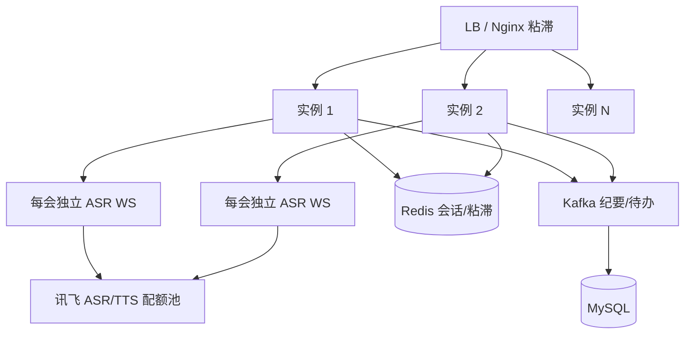

# 智能会议系统 —— 生产环境与 10+ 并发技术可行性评估

> **编制日期**：2026-05-15  
> **评估对象**：`smart-meeting-java` / `meeting-server`（基于仓库源码与 `application*.yml`、`docker-compose.yml`）  
> **评估问题**：当前实现能否**上生产**并稳定支撑 **10+ 并发**？  
> **方法论**：按「并发定义 → 架构容量 → 代码级瓶颈 → 外部配额 → 资源估算 → 改造路径」逐项判定；不含任何生产密钥。

---

## 一、总体结论

| 维度 | 判定 |
|------|------|
| **能否直接上生产并支撑 10+ 场会议同时录音转写** | **否** — 实时 ASR 为进程级单例，同一 JVM **同时仅 1 路**讯飞 WebSocket |
| **10+ 并发是否在技术上可实现** | **是** — 属已知工程改造（按会议独立 ASR 连接、状态外置、线程池与配额对齐），非算法瓶颈 |
| **当前生产 profile 与 compose 栈是否一致** | **否** — `application-prod.yml` 关闭 Redis/Kafka，与 `docker-compose.yml` 仍拉起二者，需统一部署策略 |
| **建议上线节奏** | **先修 P0 阻塞项 → 压测 10 路并行录音 → 再扩实例**；未压测前不建议对外承诺 10+ 并发 SLA |

**一句话**：业务闭环在单会场景已可运行；**10+ 并发录音/主持**在架构上可行，但**以当前代码直接生产扩容不可行**，需约 **1～2 周工程改造 + 压测验收**后方可承诺。

---

## 二、并发口径定义

本报告采用两种口径，避免「10+ 并发」歧义：

| 口径 | 含义 | 本报告重点 |
|------|------|------------|
| **A. 10+ 场会议同时「录音中」** | 至少 10 个 `meetingId` 同时推 PCM、走实时 ASR | **主评估目标**（最难） |
| **B. 10+ 用户同时在线** | 含飞书卡片、REST、主持页浏览、非重叠会议 | 次要；Tomcat 默认线程通常够用 |

以下若无特别说明，**「10+ 并发」= 口径 A**。

---

## 三、当前生产部署画像

### 3.1 运行形态（据配置）

- **单实例 Spring Boot**，端口 8765；`docker-compose` 对 `smart-meeting` 限制 **2 CPU / 4 GiB**。
- **生产 profile**（`application-prod.yml`）：
  - **排除** `KafkaAutoConfiguration`、`RedisAutoConfiguration`；
  - `meeting.kafka.enabled: false` → 会后纪要链走 **`LocalEventBus`（进程内 `@Async`）**；
  - 飞书、讯飞、LLM、MySQL 直连生产库。
- **HikariCP**：`maximum-pool-size: 20`（继承自 `application.yml`，prod 未覆盖）。
- **异步线程池**（`AsyncConfig`）：`meetingTaskExecutor` 核心 4 / 最大 8 / 队列 100；`asrTaskExecutor` 核心 2 / 最大 4（**代码中未见 `@Async("asrTaskExecutor")` 引用**）。

### 3.2 与目标能力的差距

| 能力 | 10+ 并发需求 | 当前实现 |
|------|----------------|----------|
| 实时转写 | 每会一路讯飞 WS | **全局 1 个 `XfyunRealtimeClient`** |
| 主持状态 | 可多会并行 | 进程内 `ConcurrentHashMap`，**不可跨实例** |
| 会后纪要 | 多会同时结束 | `LocalEventBus` 最多 **8 并行**生成，队列 100 |
| 会话粘滞 | WebSocket 需固定实例 | **无** Redis 会话、无 LB 粘滞配置 |
| 飞书限流 | 429 退避 | **无** 重试/限流处理 |

---

## 四、分层容量分析

### 4.1 实时 ASR（P0 — 硬阻塞）

`XfyunRealtimeClient` 为 Spring **单例 `@Component`**，内部仅维护 **一个** `WebSocketClient` 与 `currentMeetingId`：

```65:69:meeting-server/src/main/java/com/smartmeeting/asr/XfyunRealtimeClient.java
    public synchronized boolean connect(String meetingId) {
        if (connected.get()) {
            log.warn("Already connected to Xfyun ASR");
            return false;
        }
```

`AsrBridgeService` 注入同一 Bean；第二路会议在 `connect` 失败，且 `sendAudioFrame` 仅当 `meetingId` 等于 `getCurrentMeetingId()` 时才上行：

```90:93:meeting-server/src/main/java/com/smartmeeting/asr/AsrBridgeService.java
        if (!xfyunClient.isConnected() || !meetingId.equals(xfyunClient.getCurrentMeetingId())) {
            return;
        }
        xfyunClient.sendAudio(pcmData);
```

**影响**：

- 同一进程 **任意时刻只有 1 场会议**能完成实时转写；
- 多实例水平扩展**不能**在同实例上叠加多路，除非 **每实例仍只有 1 路**（会议分片部署），或改为 **按会议实例化 ASR 客户端**。

**附加缺陷**（影响质量，非仅并发）：

- `speakerCounters` 未递增，且未使用讯飞 `rl` 说话人字段 → 多说话人场景下转写标签失真；
- `featureIdsConfig` 为全局配置，多会并发时声纹鉴权参数无法按会隔离。

**改造方向（约 2～3 人日）**：

1. `Map<meetingId, XfyunRealtimeClient>` 或 **prototype/factory** 每会一条 WS；
2. `connect(meetingId, List<featureId>)` 按参会人动态传参；
3. `endRealtimeAsr` 仅关闭对应会议连接，避免 `synchronized` 全局锁争用。

**外部配额**：讯飞实时 ASR 并发路数受 **商务套餐** 约束，改造后须与厂商确认 **≥10 路** 授权。

---

### 4.2 WebSocket 层（口径 A 下为中等风险）

| 通道 | 实现 | 10+ 并发评估 |
|------|------|----------------|
| `/ws/audio/{meetingId}` | `ConcurrentHashMap`，**每会 1 连接**（新连接顶掉旧连接） | 结构可支撑多会；受 ASR 单例限制 |
| `/ws/host/{meetingId}` | `CopyOnWriteArraySet`，**每会多 Tab** | 可支撑；广播为 O(订阅数) |

Tomcat 未显式配置 `max-threads`（Boot 默认约 200），**不是当前主瓶颈**。

**多实例**：会话表在内存，**必须** LB 会话粘滞（cookie/IP hash）或改造为 Redis Pub/Sub 推送。

---

### 4.3 AI 主持 + TTS（口径 A 下为中等风险）

`MeetingHostSessionService`：

- 全会话状态在 **`runtimes`（ConcurrentHashMap）**；
- 全局 **`ScheduledThreadPoolExecutor(2)`** 驱动所有会议的 1 Hz `tick`；
- TTS 经 `CompletableFuture.supplyAsync` → **默认 `ForkJoinPool.commonPool()`**，每段主持话术新建讯飞 TTS WebSocket。

**10 场同时主持 + 播报**时：

- 2 线程调度器可能排队，但 tick 逻辑轻量，**短期可接受**；
- **10+ 路 TTS WebSocket 同时合成**更可能触达讯飞 QPS/连接数上限；
- 主持 TTS 未使用已定义的 `asrTaskExecutor` / `meetingTaskExecutor`，线程来源不可控。

**建议**：专用 `ttsTaskExecutor`（有界队列 + 拒绝策略）；与讯飞确认 TTS 并发配额。

---

### 4.4 会后纪要链（口径 A 结束瞬间的尖峰）

生产关闭 Kafka 时，`LocalEventBus.publishMeetingEvent` 使用 `@Async("meetingTaskExecutor")`：

- **最大 8 线程**并行执行 `MinuteGenerationService.generateMinute`（含离线 ASR、LLM、飞书写文档）；
- 若 10 场在同一分钟结束 → **2 场排队**；单场纪要链耗时可达 **数分钟**（LLM `timeout-seconds: 120`）。

启用 Kafka 后（`meeting.kafka.enabled: true` + 取消 Redis/Kafka exclude）：

- `listener.concurrency: 3` → 单消费者组 **3 并行分区消费**，仍可能低于 10 路尖峰，需按 topic 分区数与消费者实例数扩展。

**判定**：10 场**错开结束**时当前线程池勉强可扛；**同时结束**需加大线程池或 Kafka 分区 + 多 consumer。

---

### 4.5 数据库（MySQL）

- 连接池 **20**；10 路录音每帧写 `int_transcript_segment`（最终结果落库），峰值 INSERT QPS 取决于 ASR 返回频率（通常 **< 50 QPS/会**）。
- 10 会并行 ≈ 数百 QPS 量级边缘，**20 连接在索引正常时一般够用**；建议 prod 显式配置 `maximum-pool-size: 30～50` 并监控等待时间。
- `int_transcript_segment(meeting_id, start_time_ms)` 索引已存在（生产库实测），**合理**。

---

### 4.6 飞书 Open API

`FeishuService` 使用默认 `RestTemplate`，**无连接池调优、无 429 退避**。10 会同时发卡片/写文档时可能触发 **应用级频率限制**。

**建议**：统一 HTTP 客户端（连接池）、指数退避、租户级 QPS 监控；主持期 `MeetingHostFeishuMuteRegistry` 可减噪但非配额方案。

---

### 4.7 磁盘与内存（单实例粗算）

| 资源 | 单会议（4h 上限） | 10 会并行 |
|------|-------------------|-----------|
| PCM 磁盘 | 16 kHz × 16 bit mono ≈ **32 KB/s** → 4h ≈ **460 MB** | ≈ **4.6 GB**（需卷 `meeting-data` 或 `cache-dir` 容量规划） |
| JVM 堆 | 主持状态 + WS 缓冲 + 线程栈 | 建议 **≥2 GiB 堆**，容器 limit 4 GiB 偏紧 |
| 日志 | `max-size: 100MB` × 保留天数 | 10 会 DEBUG 时 I/O 上升 |

配置项 `meeting.audio.max-duration-hours`、`queue-maxsize` **在 YAML 中存在，代码侧未见强制校验** — 生产需补 enforcement 或运维告警。

---

## 五、10+ 并发目标架构（建议态）



| 组件 | 建议 |
|------|------|
| ASR | **每会议一条连接**，连接池上限 = 商务授权路数 |
| 状态 | Redis：主持 runtime、飞书 pending、WS 路由 |
| 异步 | 生产 **开启 Kafka**；`LocalEventBus` 仅 dev/test |
| 部署 | 2+ 实例 + 粘滞；或 **shard by meetingId** 到固定实例 |
| 资源 | 单实例 **4 CPU / 8 GiB** 起（10 路 PCM 写盘）；compose limit 上调 |
| 可观测 | ASR 连接数、WS 数、Hikari 等待、纪要队列深度、讯飞/飞书 429 |

---

## 六、阻塞项与优先级

| 级别 | 项 | 影响 | 预估工时 |
|------|-----|------|----------|
| **P0** | `XfyunRealtimeClient` 单例 | **无法 2+ 路实时转写** | 2～3 人日 |
| **P0** | 生产 profile 与 Redis/Kafka 策略不一致 | 多实例必乱；纪要链不可扩展 | 0.5 人日（配置+验证） |
| **P1** | WebSocket / 主持状态仅内存 | 多实例需粘滞或 Redis | 3～5 人日 |
| **P1** | 会后纪要 `meetingTaskExecutor` 仅 8 并行 | 10 会同时结束排队 | 1 人日（池+Kafka） |
| **P1** | 讯飞/飞书配额未与产品对齐 | 改造后仍可能被厂商限流 | 商务+联调 |
| **P2** | TTS 走 commonPool | 主持高峰线程饥饿 | 1 人日 |
| **P2** | `speakerCounters` / `rl` 未用 | 说话人标签错误 | 0.5 人日 |
| **P2** | `XfyunIsvClient` 内 `HashMap` 缓存非线程安全 | 高并发注册声纹风险 | 0.5 人日 |
| **P2** | 音频时长/队列配置未 enforcement | 磁盘打满 | 1 人日 |
| **P3** | `MinuteGenerationService` 声纹步骤 TODO | 纪要说话人质量 | 见既有评估报告 |
| **Ops** | `application-prod.yml` 含明文密钥 | 安全风险，应迁 `.env`/密钥管理 | 0.5 人日 |

---

## 七、压测与上线验收标准（建议）

在宣称「支持 10+ 并发」前，建议至少完成：

1. **10 路并行录音脚本**：10 个 `meetingId` 同时推 16 kHz PCM（可用录制文件循环），持续 **30 min**；
2. **指标**：ASR 连接成功率 100%、转写延迟 P95 < 3 s、无 OOM、磁盘增长符合理论值；
3. **尖峰**：10 路同时 `结束会议` → 纪要 15 min 内全部完成或进入可查询失败状态；
4. **主持**：3 路同时 AI 主持 + TTS 播报，无 tick 堆积、无 Feishu 429 未处理；
5. **故障**：单实例重启后会话可恢复或明确失败提示（依赖 Redis 后测）。

---

## 八、结论与建议

### 8.1 可行性判定

| 场景 | 当前代码 | 完成 P0+P1 改造 + 压测后 |
|------|----------|---------------------------|
| 单会生产试用 | **可行**（已有 prod 部署实践） | 可行 |
| 10+ 用户错峰使用（非同时录音） | **基本可行** | 可行 |
| **10+ 场同时录音转写** | **不可行** | **可行**（依赖讯飞 ≥10 路授权） |
| 多实例无粘滞扩容 | **不可行** | 需 Redis + 粘滞或分片 |

### 8.2 建议行动（按周）

| 阶段 | 内容 |
|------|------|
| **第 1 周** | P0：按会议 ASR 客户端；prod 统一 Kafka/Redis 策略；密钥出仓 |
| **第 2 周** | P1：主持/WS 状态 Redis 化或粘滞部署；纪要链 Kafka + 池化调优；10 路压测 |
| **第 3 周** | P2 质量项 + 监控告警 + 飞书/讯飞限流策略；形成 SLA 文档 |

### 8.3 与既有文档关系

- 功能完成度、单会闭环缺陷：见 [智能会议系统-评估报告.md](./智能会议系统-评估报告.md)、[智能会议系统-技术可行性评估.md](./智能会议系统-技术可行性评估.md)；
- 库表与生产漂移：见 [数据库表结构冗余与字段合理性分析.md](../数据库表结构冗余与字段合理性分析.md)。

---

*本文档路径：`docs/assessments/智能会议系统-生产环境与10+并发技术可行性评估.md`*
