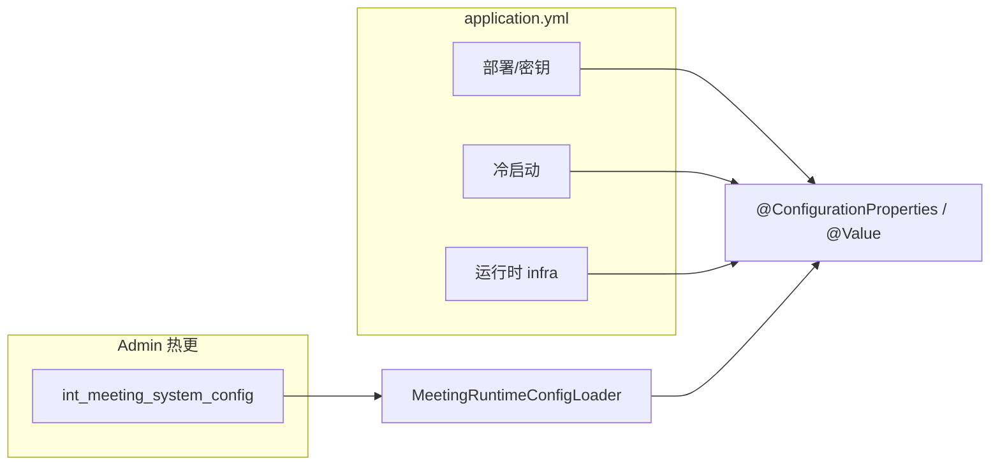

# 配置参数取值范围索引

文档版本：2026-06-08  
与 Admin 系统参数 Descriptor、`@ConfigurationProperties` 出厂默认、`meeting-runtime-defaults-prod.sql` seed 对齐。

**三层模型**

| 层级 | Admin 标识 | 存储 | 变更方式 |
|------|------------|------|----------|
| Admin 热更 | **可热加载**（绿标） | `int_meeting_system_config` | 管理后台「系统参数」保存 + reload |
| 冷启动 | **冷启动**（灰标） | `application.yml` / profile / env | 改 yml 或环境变量后重启；Admin 只读 mirror |
| 部署/密钥 | 不在 Admin | 仅 YAML | 连接、鉴权、路径；见 `application.yml` `[部署/密钥]` 段 |

完整可热加载键见 [开关手册.md](./开关手册.md) §8；下文按 **category** 列 **取值范围**（`min–max` 或 bool）。

---

## 冷启动键完整清单（Admin 只读，共 16 项）

改 `application.yml` / 环境变量后**须重启** meeting-server；Admin **系统参数** infra 分支灰标展示当前 YAML 值。

| config_key | 说明 |
|------------|------|
| `meeting.kafka.enabled` | Kafka 异步 vs LocalEventBus |
| `meeting.todo.reminder-enabled` | 待办到期提醒 Cron |
| `meeting.cache.refresh-enabled` | 会务预设 Redis 缓存定时刷新 |
| `meeting.recording.timeout-check-enabled` | 录音超时自动结束（4h） |
| `openclaw.agent.provider` | Agent 实现（mcp \| llm） |
| `meeting.scheduler.scan-ms` | 会前调度扫描周期（毫秒） |
| `meeting.audio.sample-rate` | PCM 采样率 Hz |
| `meeting.audio.max-duration-hours` | 单场录音最长时长（小时） |
| `meeting.audio.cache-retention-hours` | 本地 PCM 保留时长（小时） |
| `meeting.host.runtime.tts-chunk-bytes` | 主持 TTS WebSocket 单帧字节上限 |
| `meeting.voiceprint.register.min-duration-sec` | 声纹注册页最短录音秒数 |
| `meeting.session.feishu-start-pending-ttl-minutes` | 飞书建会多步会话 TTL（分钟） |
| `openclaw.prompt-max-chars` | Agent prompt 转写截断字符数 |
| `matter-progress.fetch.max-sheets` | 电子表格拉取最多工作表数 |
| `meeting.feishu.doc.block-batch-size` | 飞书 docx 块批量写入大小 |
| `meeting.asr.realtime.post-open-wait-max-ms` | 实时 ASR post-open-wait 上限 ms |

Descriptor 源：[RestartRequiredConfigDescriptors.java](../meeting-admin-server/src/main/java/com/smartmeeting/admin/system/RestartRequiredConfigDescriptors.java)、[InfraYamlReadonlyDescriptors.java](../meeting-admin-server/src/main/java/com/smartmeeting/admin/system/InfraYamlReadonlyDescriptors.java)。

---

## 部署/密钥（不在 Admin）

仅 `application.yml` / 环境变量；**不出现在** Admin 系统参数页。主要段落：

| YAML 段落 | 示例键 |
|-----------|--------|
| `spring.datasource` / `spring.data.redis` / `spring.kafka.bootstrap-servers` | 库、缓存、消息连接 |
| `meeting.base-url` / `meeting.notification.bot-base-url` | 对外 URL |
| `meeting.asr.xfyun.*` / `meeting.llm.*` | 讯飞、LLM 鉴权 |
| `meeting.feishu.app-id` / `app-secret` / `jwt.secret` | 飞书、JWT |
| `openclaw.gateway-url` / `auth-token` | OpenClaw Gateway |

详见 [application.yml](../meeting-server/src/main/resources/application.yml) 文件头 `[部署/密钥]` 注释。

---

## asr（Admin 热更）

| config_key | 层级 | 范围 | 默认 |
|------------|------|------|------|
| `meeting.asr.realtime-enabled` | Admin热更 | bool | false |
| `meeting.asr.offline-enabled` | Admin热更 | bool | true |
| `meeting.asr.offline-role-enabled` | Admin热更 | bool | true |
| `meeting.asr.offline-role-mode` | Admin热更 | auto / blind / voiceprint | auto |
| `meeting.asr.offline-role-num-hint-enabled` | Admin热更 | bool | true |
| `meeting.asr.offline-ist-max-role-num` | Admin热更 | 0–10 | 10 |
| `meeting.asr.offline-ist-max-feature-ids` | Admin热更 | 1–64 | 64 |
| `meeting.asr.offline-poll-max-retries` | Admin热更 | 10–120 | 60 |
| `meeting.asr.offline-poll-interval-ms` | Admin热更 | 1000–30000 | 5000 |
| `meeting.asr.realtime.post-open-wait-max-ms` | 冷启动 | 0–120000 | 60000 |

## voiceprint / isv（Admin 热更）

| config_key | 层级 | 范围 | 默认 |
|------------|------|------|------|
| `meeting.voiceprint.offline-label-enabled` | Admin热更 | bool | true |
| `meeting.voiceprint.offline-min-slice-ms` | Admin热更 | 1000–30000 | 3000 |
| `meeting.voiceprint.offline-max-slice-ms` | Admin热更 | 3000–60000 | 10000 |
| `meeting.voiceprint.offline-max-speakers` | Admin热更 | 1–20 | 8 |
| `meeting.voiceprint.offline-vote-slices` | Admin热更 | 1–10 | 3 |
| `meeting.voiceprint.offline-segment-relabel-enabled` | Admin热更 | bool | true |
| `meeting.voiceprint.offline-split-cluster-enabled` | Admin热更 | bool | true |
| `meeting.voiceprint.offline-split-min-segments` | Admin热更 | 1–10 | 2 |
| `meeting.voiceprint.offline-min-slice-floor-ms` | Admin热更 | 500–10000 | 1000 |
| `meeting.isv.enabled` | Admin热更 | bool | false |
| `meeting.isv.match-score-threshold` | Admin热更 | 0.0–1.0 | 0.6 |
| `meeting.isv.search-top-k-max` | Admin热更 | 1–10 | 10 |
| `meeting.isv.search-top-k-min` | Admin热更 | 1–10 | 3 |
| `meeting.isv.min-slice-bytes` | Admin热更 | 800–32000 | 1600 |
| `meeting.isv.min-segment-ms-for-slice` | Admin热更 | 100–5000 | 500 |

运行时超过讯飞 API 实际上限时由 `ConfigValueClamp` clamp 并打 warn 日志。

### ISV 1:N 与参会人（2026-06-08）

- **IST 分轨**：`participant.feature_id` 优先；为空时按 `user_id` 联查 `int_voiceprint` 补全 IST `featureIds`（`offline-ist-max-feature-ids` 上限）。`auto` 模式下 ≥2 条可走声纹辅助分离，否则盲分。
- **ISV 命名**：**全库** `searchFea` 1:N，**不按参会人表白名单过滤**；`search-top-k-max`（1–10，讯飞硬顶）为请求 topK，与参会人数无关。
- **阈值**：`match-score-threshold` 在 topK 结果中取最高分过线者；大库（50+）建议 0.65–0.75，200+ 建议拆 `groupId` 并 0.75+。
- **场景**：确定参会人 / 临时加人 / 零名单临时会共用同一 ISV 路径；临时列席只要在组织声纹库已注册即可标名。未注册保持 `speaker_N`。
- **姓名**：`resolveDisplayName` 先本场 participant，再声纹库；命中非参会人时打 warn 仍可能写库中姓名。

---

## infra — meeting.audio（冷启动 + Admin 只读）

| 键 | 层级 | 范围 | 默认 |
|----|------|------|------|
| `meeting.audio.sample-rate` | 冷启动 | 8000–48000 | 16000 |
| `meeting.audio.max-duration-hours` | 冷启动 | 1–24 | 4 |
| `meeting.audio.cache-retention-hours` | 冷启动 | 1–720 | 72 |
| `meeting.audio.bit-depth` | 部署/密钥 | — | 16 |
| `meeting.audio.channels` | 部署/密钥 | — | 1 |

## infra — meeting.host.runtime（冷启动 + Admin 只读）

| 键 | 层级 | 范围 | 默认 |
|----|------|------|------|
| `meeting.host.runtime.tts-chunk-bytes` | 冷启动 | 1000–32000 | 6000 |
| `meeting.host.runtime.tts-playback-tail-ms` | 部署/密钥 | — | 600 |
| `meeting.host.runtime.roll-call-arm-extra-ms` | 部署/密钥 | — | 300 |
| `meeting.host.runtime.roll-call-window-floor-sec` | 部署/密钥 | — | 5 |
| `meeting.host.runtime.roll-call-online-inventory-floor-sec` | 部署/密钥 | — | 15 |
| `meeting.host.runtime.host-reminder-toast-ms` | 部署/密钥 | — | 3000 |

## infra — 其它 meeting-server（YAML）

| 键 | 层级 | 范围 | 默认 |
|----|------|------|------|
| `meeting.voiceprint.register.min-duration-sec` | 冷启动 | 10–120 | 35 |
| `meeting.voiceprint.register.max-duration-sec` | 部署/密钥 | — | 90 |
| `meeting.voiceprint.register.gateway-safe-bytes` | 部署/密钥 | — | 921600 |
| `meeting.voiceprint.lifecycle.expire-years` | 部署/密钥 | — | 10 |
| `meeting.voiceprint.lifecycle.expiring-warning-hours` | 部署/密钥 | — | 48 |
| `meeting.session.feishu-start-pending-ttl-minutes` | 冷启动 | 5–120 | 30 |
| `meeting.session.feishu-user-last-group-chat-ttl-hours` | 部署/密钥 | — | 48 |
| `meeting.api.*-limit-max` | 部署/密钥 | — | 30/100/500 |
| `meeting.feishu.doc.block-batch-size` | 冷启动 | 1–100 | 50 |
| `meeting.feishu.doc.block-batch-sleep-ms` | 部署/密钥 | ≥0 | 400 |
| `meeting.async.task-executor-queue-floor` | 部署/密钥 | ≥1 | 10 |
| `openclaw.prompt-max-chars` | 冷启动 | 500–8000 | 2000 |
| `openclaw.gateway.history-fetch-*` | 部署/密钥 | 见 yml | 24×250 / 16×500 |

## matter-progress-core（YAML `matter-progress.fetch.*`）

| 键 | 层级 | 范围 | 默认 |
|----|------|------|------|
| `matter-progress.fetch.max-sheets` | 冷启动 | 1–50 | 20 |
| `matter-progress.fetch.default-max-rows` | 部署/密钥 | — | 200 |
| `matter-progress.fetch.default-max-cols` | 部署/密钥 | — | 26 |
| `matter-progress.fetch.abs-max-rows` | 部署/密钥 | — | 500 |
| `matter-progress.fetch.abs-max-cols` | 部署/密钥 | — | 50 |

---

## feishu-scheduled-bot（YAML `feishu.*`）

已绑定 `FeishuConfig`；均为 **部署/密钥**，不在 meeting-server Admin。

| 键 | 默认 | 说明 |
|----|------|------|
| `feishu.rate-limit.permits-per-second` | 50 | 全局限流 |
| `feishu.push.batch-max-size` | 50 | 批量推送上限 |
| `feishu.read.list-max-size` | 500 | 已读列表上限 |
| `feishu.read.max-age-days` | 7 | 轮询窗口 |
| `feishu.log.retention-days` | 30 | 日志保留 |

## jq-openclaw（Node 环境变量 / registry JSON）

| 项 | 配置 | 默认 |
|----|------|------|
| 飞书 RPM 限流 | `FEISHU_RPM_LIMIT` | 0（关闭） |
| Gateway / 路由 | `openclaw.json`、`registry/*.json` | 见各 README |

---

## YAML 必要性审计（meeting-server）

文档版本：2026-06-08  
范围：`meeting-server/src/main/resources/application.yml` 基线 + `application-dev.yml` / `application-prod.yml` profile 覆盖。  
**只读结论**：不修改 yml / Java；对照 `@ConfigurationProperties`、`@Value`、`@ConditionalOnProperty` 与 [`MeetingRuntimeConfigLoader`](../meeting-server/src/main/java/com/smartmeeting/config/MeetingRuntimeConfigLoader.java)。

### 审计方法

1. 以 `application.yml` 为基线，合并 dev/prod **profile 覆盖项**。
2. 逐段对照 Properties 类（20+）、散落 `@Value`、条件装配 Bean。
3. **Admin 热更键**若在 profile YAML 出现：`Loader.resetToFactoryDefaults()` 于 `@PostConstruct reload()` 重置为 Java 出厂默认，再被 `int_meeting_system_config` 覆盖 → **YAML 值不持久生效**（Profile 失效项）。
4. 基线 `application.yml` 已正确**移除** `host.*` / `minute.*` / `pipeline.*` 等业务开关重复项（注释 `[Admin热更]` 指向 seed / Admin）。

### 必须保留

下列键在 meeting-server 进程启动或运行时有明确代码引用（Properties 绑定、`@Value`、`@ConditionalOnProperty` 或 `@Scheduled` placeholder）。**运维上**部署段应优先走环境变量，但 YAML 占位仍属必要结构。

#### Spring 基础设施

| YAML 键 | 层级 | 代码引用 | 结论 |
|---------|------|----------|------|
| `server.port` / `server.servlet.context-path` / `server.servlet.encoding.*` | 部署/密钥 | Spring Boot 内置 | 必须 |
| `spring.application.name` / `spring.profiles.active` | 部署/密钥 | Spring Boot | 必须 |
| `spring.servlet.multipart.max-*` | 部署/密钥 | 声纹上传等 multipart 接口 | 必须 |
| `spring.datasource.*` | 部署/密钥 | JDBC / MyBatis | 必须 |
| `spring.data.redis.*` | 部署/密钥 | `RedisConfig`、`MeetingPresetCacheService` | 必须 |
| `spring.sql.init.mode` | 部署/密钥 | 禁止启动覆盖 seed | 必须 |
| `spring.kafka.*`（整段） | 部署/密钥 | `KafkaConfig`（`meeting.kafka.enabled=true` 时） | 必须；dev/prod 常 exclude 自动配置但块仍须保留 |
| `spring.web.resources.static-locations` | 部署/密钥 | 静态页 `/rec`、`/host` 等 | 必须 |
| `logging.*` | 部署/密钥 | Logback | 必须 |
| `mybatis-plus.*`（dev/prod profile） | 部署/密钥 | MyBatis-Plus 自动配置 | 必须 |

#### 冷启动（16 项，与上文 §冷启动键完整清单 一致）

| YAML 键 | 代码引用 | 结论 |
|---------|----------|------|
| `meeting.kafka.enabled` | `LocalEventBus`、`KafkaConfig`、`KafkaProducer`、各 Consumer | 必须 |
| `meeting.cache.refresh-enabled` | `PresetCacheRefreshScheduler` | 必须 |
| `meeting.todo.reminder-enabled` | `TodoReminderScheduler` | 必须 |
| `meeting.recording.timeout-check-enabled` | `RecordingTimeoutChecker` | 必须 |
| `openclaw.agent.provider` | `OpenClawMcpProvider` / `DirectLlmAgentProvider` | 必须 |
| `meeting.scheduler.scan-ms` | `MeetingScheduler` `@Scheduled(fixedDelayString=…)` | 必须 |
| `meeting.audio.sample-rate` / `max-duration-hours` / `cache-retention-hours` | `MeetingAudioProperties`、`RecordingTimeoutChecker`、`MeetingHostSessionService` | 必须 |
| `meeting.host.runtime.tts-chunk-bytes` | `MeetingHostRuntimeProperties` | 必须 |
| `meeting.voiceprint.register.min-duration-sec` | `MeetingVoiceprintRegisterProperties` | 必须 |
| `meeting.session.feishu-start-pending-ttl-minutes` | `MeetingSessionProperties` | 必须 |
| `openclaw.prompt-max-chars` | `OpenClawProperties` → Agent prompt 截断 | 必须 |
| `matter-progress.fetch.max-sheets` | `MatterProgressFetchProperties` → `FeishuService` | 必须 |
| `meeting.feishu.doc.block-batch-size` | `MeetingFeishuDocProperties` + Admin infra mirror | 必须（Properties 已绑定，业务读点待接） |
| `meeting.asr.realtime.post-open-wait-max-ms` | `MeetingAsrProperties.Realtime` → `XfyunRealtimeClient` | 必须 |

#### 部署 / 密钥与运行时 infra（`meeting.*` / `openclaw.*` / `matter-progress.*`）

| YAML 段落 / 键 | 层级 | 代码引用 | 结论 |
|----------------|------|----------|------|
| `meeting.base-url` | 部署/密钥 | `MeetingWebPageUrls` `@Value` | 必须 |
| `meeting.database.validate-seed-on-startup` | 部署/密钥 | `DatabaseSeedStartupValidator` | 必须 |
| `meeting.notification.bot-base-url` / `scheduled-bot-apikey` | 部署/密钥 | `MeetingNotificationProperties` | 必须（Properties 绑定；推送集成占位） |
| `meeting.agenda-material.*` | 部署/密钥 | `AgendaMaterialProperties` → `AgendaMaterialStorageService` | 必须 |
| `meeting.audio.*`（除冷启动三键外） | 部署/密钥 | `MeetingAudioProperties`、PCM 写盘 / WebSocket | 必须 |
| `meeting.host.runtime.*`（除 `tts-chunk-bytes`） | 部署/密钥 | `MeetingHostRuntimeProperties` | 必须 |
| `meeting.voiceprint.register.max-*` / `lifecycle.*` | 部署/密钥 | `MeetingVoiceprintRegisterProperties`、`MeetingVoiceprintLifecycleProperties` | 必须 |
| `meeting.session.feishu-user-last-group-chat-ttl-hours` | 部署/密钥 | `MeetingSessionProperties` | 必须 |
| `meeting.asr.primary` | 部署/密钥 | `AsrBridgeService` `@Value` | 必须 |
| `meeting.asr.max-concurrent-sessions` | 部署/密钥 | `MeetingAsrProperties` | 必须 |
| `meeting.asr.xfyun.*` | 部署/密钥 | `XfyunRealtimeClient`、`XfyunOfflineClient`、`XfyunIsvClient` | 必须 |
| `meeting.tts.*` | 部署/密钥 | `XfyunOnlineTtsSynthesizeService` `@Value` | 必须 |
| `meeting.cache.preset-ttl-hours` / `refresh-cron` | 部署/密钥 | `MeetingPresetCacheService`、`PresetCacheRefreshScheduler` | 必须 |
| `meeting.internal.reload-*` | 部署/密钥 | `InternalReloadProperties` → `InternalApiAuth` | 必须 |
| `meeting.llm.*` | 部署/密钥 | `DirectLlmAgentProvider` `@Value` | 必须 |
| `meeting.feishu.app-*` / `verification-token` / `encrypt-key` / `base-url` / `token-cache-seconds` | 部署/密钥 | `FeishuService` `@Value` | 必须 |
| `meeting.feishu.bot-ux.*` | 部署/密钥 | `MeetingFeishuBotUxProperties` → `FeishuCommandHandler` | 必须 |
| `meeting.feishu.doc.block-batch-sleep-ms` | 部署/密钥 | `MeetingFeishuDocProperties` | 必须 |
| `meeting.jwt.*` | 部署/密钥 | `JwtUtil` `@Value` | 必须 |
| `meeting.async.task-executor-*` | 部署/密钥 | `MeetingAsyncProperties` → `AsyncConfig` | 必须 |
| `matter-progress.fetch.*`（除 `max-sheets`） | 部署/密钥 | `MatterProgressFetchProperties` | 必须 |
| `openclaw.gateway-url` / `agent-session-key` / `auth-token` / `device-token` | 部署/密钥 | `OpenClawMcpProvider` `@Value` | 必须 |
| `openclaw.gateway.history-fetch-*` | 部署/密钥 | `OpenClawProperties.Gateway` → `OpenClawGatewayWsClient` | 必须 |

**基线设计正确**：`application.yml` 不含 `meeting.host.enabled`、`meeting.minute.*`、`meeting.pipeline.*` 等 Admin 热更业务键；运行时由 Java 出厂 + DB + `MeetingRuntimeConfigLoader` 生效。`application-prod.yml` 相对干净，无 pipeline/scheduler 业务覆盖。

### Profile 失效项（不应再写业务开关）

[`application-dev.yml`](../meeting-server/src/main/resources/application-dev.yml) 中下列块属于 **Admin 热更** 或会被 Loader 重置的字段；`reload()` 后以 **Java 出厂默认 + `int_meeting_system_config`** 为准，**profile YAML 对运行时无持久影响**：

| YAML 路径（dev profile） | 原因 | 建议 |
|--------------------------|------|------|
| `meeting.pipeline.pre-on-create-enabled` | Loader `resetToFactoryDefaults()` 重置 `MeetingPipelineProperties` | 改 seed + Admin |
| `meeting.pipeline.post-auto-trigger.enabled` / `template-code` | 同上 | 改 seed + Admin |
| `meeting.scheduler.pre-enabled` | Admin 热更；Loader 重置 | 改 seed + Admin |
| `meeting.scheduler.pre-24h-template-code` / `pre-10m-template-code` | 同上 | 改 seed + Admin |
| `meeting.isv.enabled` / `match-score-threshold` | Admin 热更；Loader `copyBean` 重置 | 改 seed + Admin |

**仍有效的 dev 冷启动覆盖**（保留合理）：`meeting.recording.timeout-check-enabled: false`、`meeting.scheduler.scan-ms: 60000`、`meeting.kafka.enabled: false`。

[`application-prod.yml`](../meeting-server/src/main/resources/application-prod.yml) **无**上述 pipeline/scheduler/isv 业务覆盖；`isv` 段仅 infra 字段（`group-id`、timeout 等）。

**dev/prod 与基线同值的冗余复制**（非错误，可删可留）：`meeting.audio.*` 整段、`meeting.heartbeat.*` 整段、`asr.lang`/`role-type` 等与基线相同项。

### 疑似冗余（删 YAML 不影响当前行为）

| YAML 键 | 依据 | 说明 |
|---------|------|------|
| `meeting.asr.fallback` | 仅 `meeting.asr.primary` 在 `AsrBridgeService` 使用 | 无 fallback 分支 |
| `meeting.asr.lang` / `role-type` / `eng-speaker-match` / `audio-encode` | `XfyunRealtimeClient` / `XfyunOfflineClient` 硬编码 `autodialect`、`roleType` 等 | YAML 值不生效 |
| `meeting.asr.mock-enabled` | 全仓库无 Java 引用 | 历史联调占位 |
| `meeting.isv.group-id` | ISV HTTP 使用 `meeting.asr.xfyun.isv-group-id`（`XfyunIsvClient` `@Value`） | Properties 字段无 getter 调用 |
| `meeting.isv.search-min-audio-sec` / `api-timeout` / `register-timeout` / `debug-log` / `ttl-years` | `MeetingIsvProperties` 绑定，业务无 getter 调用 | 保留仅作文档/未来扩展 |
| `meeting.api.*-limit-max` | `MeetingApiProperties` 在 meeting-server **未注入** | admin-server 使用；server 侧零读点 |
| `meeting.heartbeat.interval` / `frontend-ws-close-timeout` | YAML 三份文件有定义，**Java 零引用** | 前端硬编码或未接线 |
| `meeting.feishu.doc.block-batch-size`（运行时读点） | Properties + Admin mirror 存在，**尚无业务 getter 调用** | 冷启动项仍须保留于 YAML |
| dev/prod 重复 `audio.*` / `heartbeat.*` | 与基线默认值相同 | 冗余复制 |

### 易误解项

| 项 | 说明 |
|----|------|
| `spring.kafka.*` 整段 | 当前 `meeting.kafka.enabled=false` 且 dev/prod exclude `KafkaAutoConfiguration`；切换 `KAFKA_ENABLED=true` 时无需补结构 |
| `meeting.isv` YAML 段 | 热更字段（`enabled`/`threshold`/`topK`/…）**禁止写 profile YAML**；走 Admin |
| 基线内嵌 DB/密钥默认值 | 运维应走 env，属部署占位，不是「可删配置项」 |
| `openclaw.prompt-max-chars` | YAML 基线 3000，Java 出厂默认 2000；**冷启动以 YAML/env 为准**（非 Admin 热更） |

---

## 一致性约定

1. **Java 出厂 = Descriptor `defaultValue()`**（`RuntimeConfigFactoryDefaultsTest` 断言）。
2. **prod seed** 可刻意偏离出厂默认，须在 seed 注释或本文档注明。
3. Admin 保存越界时 schema `min/max` + `settings.js` 客户端校验拒绝。
4. 每个 Descriptor 须 **`requiresRestart` 与 `hotReloadable` 互斥且必居其一**（`SystemConfigDescriptorTierTest` 断言）。
