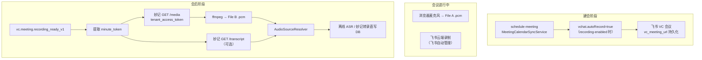

# 飞书 VC 云端录制接入设计（修订版）

> 文档版本：2026-06-28  
> 状态：**P1-P4 已落地（File B 音视频路径）**；File C 妙记转录直写与 A+B 合并暂不实施  
> 关联：[开关手册.md](开关手册.md) §3.4、[USER-MANUAL.md](USER-MANUAL.md) §2.1  
> 前置问题：浏览器麦克风无法采集飞书会议中远程参会人的语音  
> 修订说明：原 v2026-06-10 方案经 API 文档验证存在 3 个致命缺陷，本版改为「日历自动录制 + 妙记 API」路径  
> 2026-06-28 修订：明确范围仅为 File B（妙记音视频），不做 File C（妙记转录直写）与 A+B 合并

---

## 1. 背景与问题

当前 meeting-server 的音频采集链路为：

```
浏览器 getUserMedia() → 本机麦克风 → WebSocket /ws/audio/{meetingId}
  → AudioCacheService.writeAudioChunk() → {cache-dir}/{date}/{meetingId}.pcm
  → (可选) AsrBridgeService → 讯飞实时 ASR
```

**核心问题**：浏览器 `getUserMedia()` 只能采集本机物理麦克风的输入。当用户同时参加飞书视频会议时：

- 飞书会议的语音走飞书客户端内部的 RTC 通道，浏览器无法访问
- `echoCancellation: true` 会主动消除扬声器回放的远程人声音
- 远程参会人的语音**不会**出现在浏览器录音文件中

即：当前系统只能录到「现场声音」，丢失了「飞书线上声音」。

### 1.1 原方案（v2026-06-10）致命缺陷

原方案拟通过 `vc.v1.meetingRecording.start/stop/get` 直接控制云端录制，经飞书官方文档验证**不可行**：

| # | 缺陷 | 原方案假设 | 官方文档实际 |
|---|------|-----------|-------------|
| 1 | **鉴权** | 使用 `tenant_access_token` 调用录制 API | 开始/停止录制 API **仅支持** `user_access_token`，且操作者须为会中主持人 |
| 2 | **事件名** | 订阅 `vc.recording.completed_v1` | 正确事件名为 **`vc.meeting.recording_ready_v1`** |
| 3 | **文件下载** | 回调 `url` 为可 HTTP 下载的 MP4/M4A | 回调 `url` 为妙记页面链接（如 `https://meetings.feishu.cn/minutes/{token}`），须通过妙记 API 获取媒体 |

此外原方案未说明：`meeting_id` 获取链路、`recording_ready` 事件**仅对 Open API 预约的会议触发**等前提。

---

## 2. 方案概述（修订版）

**核心思路**：不主动调用 VC Recording 控制 API，改为：

1. **建会时**：通过现有日历同步链路创建飞书 VC 会议，并在 `vchat.meeting_settings.auto_record=true` 时由飞书自动开启云录制
2. **会后**：订阅 `vc.meeting.recording_ready_v1` 事件，从回调 URL 提取 `minute_token`
3. **取数**：通过飞书妙记（Minutes）Open API（**支持 `tenant_access_token`**）下载音频或导出转录文本

```
音频源 A（保留）：浏览器麦克风 → 现场声音 → {meetingId}.pcm
音频源 B（新增）：妙记 /media → 下载音视频 → ffmpeg → {meetingId}_vc.pcm
音频源 C（可选）：妙记 /transcript → 飞书原生转录文本（可跳过讯飞离线 ASR）
离线 ASR / 纪要：AudioSourceResolver 按场景选最优源
```

### 2.1 架构总览



### 2.2 与现有建会路径的关系

| 建会路径 | 触发入口 | 是否创建飞书 VC | 是否可触发 recording_ready |
|---------|---------|----------------|---------------------------|
| **预约会议** | `POST /api/v1/dashboard/schedule-meeting` → `MeetingCalendarSyncService.syncScheduledMeeting` | 是（默认 `vchat.vc_type=vc`） | **是**（Open API 日历预约） |
| **即时开始** | `POST /api/v1/dashboard/create-meeting` → `FeishuMeetingStartCoordinator` | 否 | **否** |
| **Pipeline** | `pre-calendar-create` 步骤 → `syncFromPipeline` | 按步骤配置 | 是（若创建日历事件） |

**结论**：本方案主要覆盖**预约会议 / Pipeline 日历同步**路径。即时开始路径仍仅依赖 File A，除非后续扩展为即时建会也创建日历事件。

---

## 3. 录音文件分析

### 3.1 三份数据源

| 标识 | 来源 | 存储路径 / 形态 | 内容 |
|------|------|----------------|------|
| **File A** | 浏览器麦克风 PCM | `{cache-dir}/{date}/{meetingId}.pcm` | 主持人/操作者 + 同房间现场人 |
| **File B** | 妙记 `/media` 下载后转码 | `{cache-dir}/{date}/{meetingId}_vc.pcm` | 飞书 VC 云端录制混音（全体入会者） |
| **File C** | 妙记 `/transcript` 导出 | 内存 / 临时文件（txt/srt） | 飞书 ASR 转录文本（含可选说话人、时间戳） |

### 3.2 各文件覆盖范围

**File A — 浏览器麦克风**：

- 采集源：本机物理麦克风
- 覆盖：现场人（主持人 + 同房间其他人）
- 不覆盖：远程参会人（echoCancellation 会消除扬声器回放声）
- 简言之 ≈ **现场声音**

**File B — 飞书 VC 云端录制（经妙记 media）**：

- 采集源：飞书服务端对各入会设备音频流的混音
- 覆盖：所有入飞书会议的人
- 不覆盖：未入飞书的纯现场人
- 特殊情况：主持人从飞书客户端入会 + 共享麦克风 → File B **已包含全体**
- 简言之 ≈ **飞书线上声音**

**File C — 妙记原生转录**：

- 来源：飞书妙记 ASR，非讯飞 IST
- 优势：无需 ffmpeg、无需等待讯飞离线任务；含飞书侧说话人分段
- 劣势：与现有 ISV 声纹标注链路不直接兼容；Basic 版有语音转写配额，超额后新妙记可能无转录文本
- 适用：`meeting.vc.prefer-minutes-transcript=true` 且转录导出成功时，可跳过 `XfyunOfflineClient`

### 3.3 混合会场景下 File B 的完整性

混合会中，若主持人从飞书客户端入会且使用共享麦克风：

```
飞书服务端混音
├── 主持人设备麦克风流 → 共享麦克风 → 采集到 主持人 + 全体现场人
└── 远程参会人各自的设备麦克风流 → 采集到 远程参会人
= 全体参会人
```

**结论**：此场景下 File B 已包含所有人，可直接用于离线转写，无需与 File A 合并。质量风险来自物理收音（共享麦克风距离），属现场设备问题。

---

## 4. 混合会判断逻辑

采用两层判断，缺一不可：

| 层 | 判断条件 | 含义 |
|---|---------|------|
| 注册层 | `int_meeting_participant` 中同时存在 `attendanceMode=ONLINE` 和 `OFFLINE` | 会议**预期**是混合会 |
| 运行层 | 收到 `vc.meeting.recording_ready_v1` 且 `vc_minute_token` 已写入 | 飞书云端录制**实际**完成且妙记可拉取 |

仅凭注册层不够——线上人可能未入会；仅凭运行层不够——纯线上会可能碰巧有 offline 注册人。

**事件触发前提**（飞书官方）：`vc.meeting.recording_ready_v1` **仅对通过 Open API 预约的会议产生**。用户手动在飞书客户端建会/开录制，系统**不会**收到该事件。

---

## 5. 离线 ASR 音频源选择策略

### 5.1 场景矩阵

| 场景 | 优先数据源 | 理由 |
|------|-----------|------|
| 纯现场会（无妙记回调） | File A | 唯一音频源 |
| 纯线上会 | File B 或 File C | 唯一完整源 |
| 混合会，主持人入飞书 + 共享麦克风 | **File B**（或 File C） | 已包含全体 |
| 混合会，主持人未入飞书 | File A + File B **合并** | 各缺一半，需混音 |
| 任意（开关开启且 File C 可用） | **File C** | `prefer-minutes-transcript=true` 时跳过离线 ASR |

第四种场景概率低，但设计上必须覆盖。

### 5.2 合并与时间对齐

File A 从 WebSocket 连接建立时写入；File B 从飞书云录制实际开始时刻起算。两者起始时间通常不对齐。

**合并策略（P3 实现）**：

- 记录 `actualStartTime`（系统已有）与 `vc_recording_ready` 事件中的 `duration`
- ffmpeg 合并时使用 `adelay` 或裁剪较长轨的前导静音，尽量对齐
- **优先避免合并**：混合会场景下若主持人已入飞书，直接用 File B

合并命令示例：

```bash
ffmpeg -i file_a.pcm -i file_b.pcm -filter_complex amix=inputs=2:duration=longest -f s16le -ar 16000 -ac 1 merged.pcm
```

（实际实现须根据时间差加 `adelay`，上式仅为占位。）

### 5.3 选择策略流程

```
会议结束 → PostMeetingOrchestrator
  → prefer-minutes-transcript=true 且 vc_minute_token 已有？
      ├─ 是 → 拉 File C → audio_source=minutes_transcript → 直写 int_transcript_segment
      └─ 否 → 检查 vc_minute_token / 等待 recording_ready（超时 callback-timeout-min）
           ├─ 无 token → File A（browser）
           └─ 有 token → 下载 media → File B
                → 有 OFFLINE 参会人？
                   ├─ 无 → File B（vc_recording）
                   └─ 有 → 主持人是否入飞书？（event.meeting 参会人或业务规则）
                        ├─ 是 → File B
                        └─ 否 → ffmpeg 合并 A+B → merged
```

**超时兜底**：等待 `recording_ready` 超过 `meeting.vc.callback-timeout-min`（默认 15 分钟）后，用 File A 继续会后链路，不阻塞纪要生成。回调迟到且离线 ASR 已完成时，默认**不自动重跑**（可后续手动「重新生成纪要」）。

---

## 6. 详细设计

### 6.1 新增服务类

| 类 | 职责 |
|----|------|
| `FeishuMinutesService` | 妙记 API：`GET /minutes/{token}` 元数据、`/media` 取 download_url、`/transcript` 导出转录、`/artifacts`（可选）AI 摘要 |
| `FeishuMinutesCallbackHandler` | 处理 `vc.meeting.recording_ready_v1`；解析 `minute_token`；触发 media 下载 + ffmpeg 转码；更新 `int_meeting` |
| `AudioSourceResolver` | 按 §5 解析 `audio_source` 与最终 `audio_path` |

**对接现有代码**：

- [`FeishuService.java`](../meeting-server/src/main/java/com/smartmeeting/service/FeishuService.java)：`getTenantToken()` + `RestTemplate`，新增妙记 HTTP 封装
- [`FeishuWebhookController.java`](../meeting-server/src/main/java/com/smartmeeting/api/controller/FeishuWebhookController.java)：`handleWebhook` 事件分支（约第 156–168 行 `else if` 链）
- [`PostMeetingOrchestrator.java`](../meeting-server/src/main/java/com/smartmeeting/service/PostMeetingOrchestrator.java)：`resolveAudioPath()` 前插入 `AudioSourceResolver`
- [`MeetingCalendarSyncService.java`](../meeting-server/src/main/java/com/smartmeeting/service/MeetingCalendarSyncService.java)：日历创建/更新时传入带 `autoRecord` 的 `CalendarVchatOptions`

### 6.2 会议表新增字段

| 字段 | 类型 | 说明 |
|------|------|------|
| `vc_meeting_url` | `VARCHAR(512)` | 飞书 VC 入会链接（日历 `vchat.meeting_url`，建会时持久化） |
| `vc_minute_token` | `VARCHAR(64)` | 妙记 token（从 `recording_ready` 的 `event.url` 后缀提取，通常 24 字符） |
| `vc_recording_url` | `VARCHAR(512)` | 妙记页面 URL（与回调 `event.url` 一致，便于人工核对） |
| `audio_source` | `VARCHAR(32)` | 实际采用的数据源：`browser` / `vc_recording` / `merged` / `minutes_transcript` |

**不再使用**原方案的 `vc_meeting_id`、`vc_recording_id`：妙记 API 以 `minute_token` 为主键；`meeting.id` 仅在事件体 `event.meeting.id` 中用于关联，可选冗余存储。

`roomId` 继续存储飞书日历 `event_id`（现有语义不变）。

### 6.3 录制文件下载与转码

```
vc.meeting.recording_ready_v1 回调
  → 解析 event.url，例如 https://meetings.feishu.cn/minutes/obcn37dxcftoc3656rgyejm7
  → minute_token = URL 路径最后一段
  → 写入 int_meeting.vc_minute_token、vc_recording_url
  → GET /open-apis/minutes/v1/minutes/{minute_token}/media
       Authorization: Bearer {tenant_access_token}
  → 响应 data.download_url（有效期约 1 天）
  → HTTP GET download_url → 保存临时 mp4/m4a
  → ffmpeg -i input -f s16le -acodec pcm_s16le -ar 16000 -ac 1 {meetingId}_vc.pcm
  → 更新 audio_source 候选为 vc_recording
  → 若 PostMeetingOrchestrator 仍在等待，唤醒离线 ASR
```

**妙记转录（File C）**：

```
GET /open-apis/minutes/v1/minutes/{minute_token}/transcript
  ?need_speaker=true&need_timestamp=true&file_format=txt
  → 响应为二进制 txt/srt 流（非 JSON）
  → 解析后写入 int_transcript_segment（字段映射见实现阶段设计）
```

**错误处理**：

- `2091003`（minute not ready）：指数退避重试，最多 N 次
- media 下载失败：重试 3 次；仍失败则回退 File A
- download_url 过期：重新调用 `/media` 刷新

大文件下载须使用**独立 RestTemplate**（读超时 ≥ 10 分钟），勿复用默认 60s 超时。

### 6.4 日历自动录制配置

[`CalendarVchatOptions.java`](../meeting-server/src/main/java/com/smartmeeting/service/CalendarVchatOptions.java) 当前默认 `autoRecord=false`（第 29 行）。实施时：

- 新增 `MeetingVcProperties`（`meeting.vc.*`）
- `MeetingCalendarSyncService` / `FeishuService.createCalendarEvent` 在 `recording-enabled=true` 且 `auto-record=true` 时，构造 `CalendarVchatOptions` 并设置 `autoRecord=true`
- 日历创建成功后，将 `extractVcMeetingUrl()` 返回值写入 `vc_meeting_url`

[`FeishuService.buildVchatBody`](../meeting-server/src/main/java/com/smartmeeting/service/FeishuService.java) 已支持 `meeting_settings.auto_record` 字段映射（约第 520–523 行）。

### 6.5 与现有离线 ASR 链路的对接

当前链路：

```
RecordingService.stopRecording()
  → PostMeetingOrchestrator.dispatchAfterMeetingEnded()
  → OfflineAsrRequestedEvent → OfflineAsrService → XfyunOfflineClient
```

改造点：

1. `dispatchAfterMeetingEnded` 内、`resolveAudioPath` 之前调用 `AudioSourceResolver.resolve(meetingId)`
2. 若需 File B 且 `vc_minute_token` 为空 → 注册等待（内存 / DB 标志），阻塞离线 ASR 直至回调或超时
3. 若 `audio_source=minutes_transcript` → 不发布 `OfflineAsrRequestedEvent`，改由 `FeishuMinutesService` 写转录后直接进入纪要链路
4. 否则将 `meeting.audio_path` 更新为选定 PCM 路径，后续逻辑不变

`triggerRegenerateMinutes`（飞书「重新生成纪要」）同样须走 `AudioSourceResolver`。

### 6.6 飞书 Webhook 事件路由

在 [`FeishuWebhookController.handleWebhook`](../meeting-server/src/main/java/com/smartmeeting/api/controller/FeishuWebhookController.java) 现有 `else if` 链末尾（约第 167 行后）新增：

```java
} else if ("vc.meeting.recording_ready_v1".equals(eventType)) {
    JsonNode finalBody = body;
    CompletableFuture.runAsync(() -> feishuMinutesCallbackHandler.handleRecordingReady(finalBody));
}
```

`/callback` 端点的 delegated 事件分支（约第 597–624 行）亦需同步添加，与 `im.message.receive_v1` 等保持一致。

**事件体关键字段**（schema 2.0）：

| 路径 | 说明 |
|------|------|
| `header.event_type` | `vc.meeting.recording_ready_v1` |
| `event.meeting.id` | 飞书 VC meeting_id（可用于反查 int_meeting，需建立映射策略） |
| `event.url` | 妙记链接，含 minute_token |
| `event.duration` | 录制时长（毫秒） |

**meeting 关联策略**：优先用日历 `roomId`（event_id）+ 时间窗口匹配；或建会时写入 `vc_meeting_url` 与回调 URL 域名+会议主题辅助匹配。实现阶段须在 P2 明确唯一映射规则。

### 6.7 录制生命周期（修订版）

| 时机 | 动作 |
|------|------|
| 预约建会 | `recording-enabled=true` 且存在 ONLINE 参会人 → 日历 `auto_record=true` → 持久化 `vc_meeting_url` |
| 会议进行中 | 飞书自动云录制；浏览器并行写 File A |
| 会议结束 | `PostMeetingOrchestrator` 启动；若启用 VC 则等待 `recording_ready`（带超时） |
| 录制完成回调 | 写 `vc_minute_token` → 下载 media / 可选 transcript → 触发 ASR 或直写转录 |
| 开关关闭 | 不修改 vchat、不订阅处理逻辑，行为与现网一致 |

**不再**调用 `vc.v1.meetingRecording.start/stop`。

### 6.8 系统依赖

- **ffmpeg**：部署环境须可执行；`recording-enabled=true` 时启动检测，不可用则告警并回退 File A
- **tenant_access_token**：沿用 [`FeishuService.getTenantToken()`](../meeting-server/src/main/java/com/smartmeeting/service/FeishuService.java)，**无需** user OAuth

---

## 7. 需要申请的飞书权限

| 权限 | Scope | 用途 |
|------|-------|------|
| 获取会议信息 | `vc:meeting:readonly` 或 `vc:meeting.meetingevent:read` | 订阅 `recording_ready` 事件 |
| 妙记基础信息 | `minutes:minutes.basic:read` | 读取妙记元数据 |
| 妙记转录导出 | `minutes:minutes.transcript:export` | File C / 转录直写 |
| 妙记媒体导出 | `minutes:minutes.media:export` | File B 音频下载 |
| 妙记 AI 产物（可选） | `minutes:minutes.artifacts:read` | 摘要/章节/待办，供纪要增强 |

**事件订阅**：`vc.meeting.recording_ready_v1`（**非** `vc.recording.completed_v1`）

**不再申请**：`vc:recording`（原方案用于 start/stop API，本方案不需要）

---

## 8. 开关设计

| 配置键 | 默认值 | 作用 |
|--------|--------|------|
| `meeting.vc.recording-enabled` | `false` | 飞书 VC 云端录制总开关 |
| `meeting.vc.auto-record` | `true` | 日历事件是否设置 `auto_record`（`recording-enabled=true` 时生效） |
| `meeting.vc.callback-timeout-min` | `15` | 等待 `recording_ready` 超时（分钟），超时回退 File A |
| `meeting.vc.prefer-minutes-transcript` | `false` | 优先使用妙记原生转录，跳过讯飞离线 ASR |

接入方式：新建 `MeetingVcProperties` + [`MeetingRuntimeConfigLoader`](../meeting-server/src/main/java/com/smartmeeting/config/MeetingRuntimeConfigLoader.java) 增加 `case` + `int_meeting_system_config` 种子行。详见 [开关手册.md](开关手册.md) §3.4。

---

## 9. 测试验收标准

1. **纯现场会（即时开始）**：无日历、无 `recording_ready`，离线 ASR 使用 File A，与现网一致
2. **纯线上会（预约 + auto_record）**：回调后 File B 或 File C 可用，转写含全部线上参会人
3. **混合会（主持人入飞书 + 共享麦克风）**：使用 File B/C，含现场+远程
4. **混合会（主持人未入飞书）**：ffmpeg 合并 A+B，`audio_source=merged`
5. **回调超时**：超过 `callback-timeout-min` 后回退 File A，不阻塞纪要
6. **妙记未就绪**：`/media` 返回 2091003 时重试；最终失败回退 File A
7. **开关关闭**：`recording-enabled=false` 时不改 vchat、不处理 VC 事件，与现网一致
8. **妙记转录直取**：`prefer-minutes-transcript=true` 时跳过 XfyunOfflineClient，转写来自 File C

---

## 10. 与现有麦克风拾音的关系

浏览器麦克风 → WebSocket → PCM 缓存链路**完整保留**，不做任何改动。

各数据源并行独立：

- File A：会议进行中实时写入
- File B / File C：飞书录制完成后异步拉取
- 会后链路按策略选择，用户无感

---

## 11. 实施优先级

| 阶段 | 内容 | 状态 |
|------|------|------|
| P0 | 文档修订（本文档） | ✅ 已完成 |
| P1 | 飞书权限申请（妙记 4 scope + `recording_ready` 事件订阅） | ✅ 妙记 scope 已开 + 数据权限全员已配；⚠️ `vc.meeting.recording_ready_v1` 事件订阅待用户在开发者后台操作 |
| P2 | `FeishuMinutesService` + 回调处理 + ffmpeg 转码 + meeting 关联 | ✅ 已落地（`FeishuMinutesService`、`FeishuMinutesCallbackHandler`、`FeishuWebhookController` 事件分支） |
| P3 | `AudioSourceResolver` + 离线 ASR 对接 | ✅ 已落地（有 File B 用 B，无则 A，不阻塞等待，不合并） |
| P4 | 日历 `autoRecord` 联动 + 开关热更 + 生产验证 | ✅ 已落地（`MeetingVcProperties` + `MeetingRuntimeConfigLoader` 热更 + `syncScheduledMeeting` 联动） |
| P5 | （可选）妙记转录直取 + artifacts 纪要增强 | ⏸️ 暂不实施（当前仅需 File B 音视频） |

---

## 附录 A：原方案致命缺陷与修正对照

| 缺陷 | 原方案（v2026-06-10） | 修订方案（本文档） |
|------|----------------------|-------------------|
| 鉴权 | `tenant_access_token` 调 VC Recording API | 妙记 API 支持 `tenant_access_token`；录制由飞书 `auto_record` 自动管理 |
| 事件名 | `vc.recording.completed_v1` | `vc.meeting.recording_ready_v1` |
| 文件下载 | 回调 URL 直接 HTTP 下载 MP4 | 回调 URL → `minute_token` → 妙记 `/media` → `download_url` |
| meeting_id | 缺失获取链路 | 日历同步已创建 VC；回调含 `event.meeting.id` |
| 事件触发前提 | 未说明 | 仅 Open API 预约会议触发；即时开始不覆盖 |
| 服务类 | `FeishuVcRecordingService` | `FeishuMinutesService` + 日历 `autoRecord` |

## 附录 B：妙记 API 速查

| 能力 | HTTP | 鉴权 |
|------|------|------|
| 元数据 | `GET /open-apis/minutes/v1/minutes/:minute_token` | tenant 或 user token |
| 转录导出 | `GET .../minutes/:minute_token/transcript` | 同上 |
| 媒体下载 | `GET .../minutes/:minute_token/media` | 同上 |
| AI 产物 | `GET .../minutes/:minute_token/artifacts` | 同上 |

官方文档：[视频会议概述](https://open.feishu.cn/document/server-docs/vc-v1/video-conferencing-overview)、[完成录制事件](https://open.feishu.cn/document/server-docs/vc-v1/meeting/events/recording_ready)
