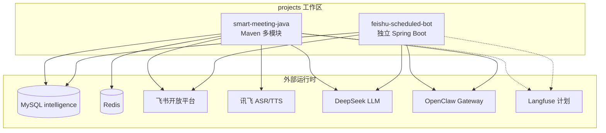
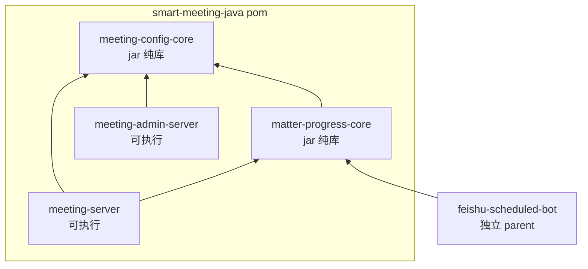
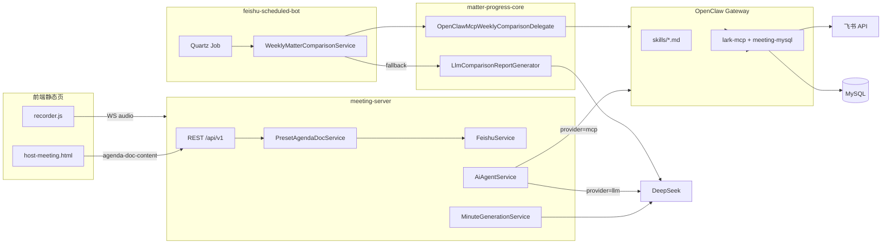
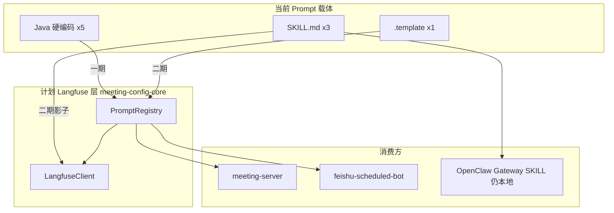

# Langfuse 集成开发方案

> 版本：v0.1 · 2026-05-26  
> 状态：规划中（未落地代码）  
> 关联：[`MCP+Skill改造方案.md`](MCP+Skill改造方案.md)、[`weekly-matter-comparison.md`](weekly-matter-comparison.md)

---

## 一、现状盘点

项目有 **10 个 prompt 入口点**，分布在 3 种载体中：

| 载体 | 数量 | 热更新 | 版本管理 | Trace |
|------|------|--------|----------|-------|
| Java 硬编码字符串 | 5 个 | 需部署 | Git（diff 噪音大） | 无 |
| `.template` 文件 | 2 个 | 需部署 | Git | 无 |
| `SKILL.md` 文件 | 3 个 | 需重启 Gateway | Git | 无 |

### 具体入口清单

| # | Prompt 用途 | 文件 | 载体 | 调用方式 |
|---|------------|------|------|----------|
| 1 | 纪要生成 | `meeting-server/.../MinuteGenerationService.java` L289 | 硬编码 | DeepSeek Chat |
| 2 | 待办提取 | `meeting-server/.../TodoExtractionService.java` L185 | 硬编码 | DeepSeek Chat |
| 3 | 事项进度通报 | `meeting-server/.../DirectLlmAgentProvider.java` L51 | 硬编码 | DeepSeek Chat |
| 4 | 纪要增强 | `meeting-server/.../DirectLlmAgentProvider.java` L76 | 硬编码 | DeepSeek Chat |
| 5 | 对比报告 fallback | `matter-progress-core/.../LlmComparisonReportGenerator.java` L81 | 硬编码 | DeepSeek Chat |
| 6 | 对比报告 legacy | `matter-progress-core/.../OpenClawComparisonReportGenerator.java` L119 | 硬编码 | Gateway WS |
| 7 | 对比全委托 | `matter-progress-core/.../OpenClawMcpWeeklyComparisonDelegate.java` | `.template` | Gateway WS |
| 8 | 事项进度 Skill | `skills/matter-progress/SKILL.md` | SKILL.md | Gateway → Agent |
| 9 | 纪要增强 Skill | `skills/minute-enhancement/SKILL.md` | SKILL.md | Gateway → Agent |
| 10 | 进度分析 Skill | `skills/progress-analysis/SKILL.md` | SKILL.md | Gateway → Agent |

---

## 二、项目结构图

### 2.1 工作区总览



| 仓库 | 进程 | 默认端口 | 职责 |
|------|------|----------|------|
| **meeting-server** | Spring Boot | 8765 | 会议、录音、主持、纪要、飞书资料内嵌 |
| **meeting-admin-server** | Spring Boot | 8766 | 预设会序、资料绑定、系统配置 |
| **feishu-scheduled-bot** | Spring Boot | 8764 | 定时推送、会前对比 Job、写 `generated_report_url` |

### 2.2 Maven 模块依赖



- **meeting-config-core**：会序合并、飞书 URL 解析、系统配置模型；**计划**新增 `com.smartmeeting.config.prompt.*`
- **matter-progress-core**：会前对比流水线、OpenClaw WS、飞书 Doc 读写
- **meeting-server**：主业务，依赖上述两库
- **meeting-admin-server**：仅依赖 meeting-config-core
- **feishu-scheduled-bot**：独立工程，通过 `mvn install` 引入 matter-progress-core

### 2.3 目录结构（逻辑树）

```
projects/
├── smart-meeting-java/
│   ├── meeting-config-core/
│   │   └── config/agenda|feishu|system|admin/
│   │       └── prompt/                 # 【计划】PromptRegistry
│   ├── matter-progress-core/
│   │   ├── comparison/
│   │   ├── openclaw/
│   │   ├── feishu/
│   │   └── resources/
│   │       ├── weekly-comparison-mcp-instructions.template
│   │       └── weekly-comparison-mcp-output-ref.snippet
│   ├── meeting-server/               # :8765
│   ├── meeting-admin-server/         # :8766
│   ├── skills/                       # matter-progress, minute-enhancement, progress-analysis
│   └── mcp-servers/
├── feishu-scheduled-bot/             # :8764
```

### 2.4 运行时数据流（会中 + 会前）



### 2.5 Prompt 分布与 Langfuse 落点



| Prompt | 当前位置 | Langfuse 阶段 |
|--------|----------|---------------|
| 纪要生成 / 待办提取 | meeting-server | 一期 |
| 事项通报 / 纪要增强 | DirectLlmAgentProvider | 一期 |
| 对比 LLM fallback | LlmComparisonReportGenerator | 一期 |
| weekly-comparison 执行手册 | `.template` | 二期 |
| matter-progress 等 Skill | `skills/*.md` | 二期影子（Gateway 仍读本地） |

---

## 三、Langfuse Java 生态关键事实

| 维度 | 现状 |
|------|------|
| **Prompt API 客户端** | `com.langfuse:langfuse-java:0.2.0` — 无缓存、无 `{{var}}` 编译 |
| **Tracing** | 推荐 `langfuse-otel-spring-boot-starter:0.1.1`（社区）或 OTLP |
| **Prompt 缓存** | Java 需自建 Caffeine（60s TTL） |
| **自托管** | v3 需 6 容器，最低 4C/16G |

---

## 四、整体架构

见 §2.5 与 PromptRegistry 设计：`meeting-server` / `feishu-scheduled-bot` 经 `PromptRegistry` 拉取 prompt；OpenClaw Gateway 仍读本地 `skills/*.md`。

**设计原则：**

- 直调 LLM prompt（#1–#5）→ Langfuse，`name + label`
- `.template`（#7）→ Langfuse chat prompt，classpath 作 fallback
- SKILL.md（#8–#10）→ 影子 prompt 仅追溯，运行时仍由 Gateway 加载

---

## 五、核心组件设计

### PromptRegistry（`meeting-config-core`）

- `getPrompt(name, label, fallback)` — Caffeine 缓存 + Langfuse HTTP
- `getCompiledPrompt(name, label, vars, fallback)` — `{{key}}` 替换

### 配置

```yaml
langfuse:
  enabled: ${LANGFUSE_ENABLED:false}
  public-key: ${LANGFUSE_PUBLIC_KEY:}
  secret-key: ${LANGFUSE_SECRET_KEY:}
  host: ${LANGFUSE_HOST:http://localhost:3000}
  cache-ttl-seconds: 60
```

---

## 六、分期实施计划

| 期 | 目标 | 范围 |
|----|------|------|
| **一期** | PromptRegistry + trace | 5 个硬编码 prompt、Langfuse Cloud 或自托管 |
| **二期** | template + legacy | `weekly-comparison-mcp-instructions`、SKILL 影子 |
| **三期** | Eval / A/B | 可选 |

### 一期验收

- [ ] Langfuse 可见 5 个 `production` prompt
- [ ] 改 prompt 后 60s 内生效
- [ ] Trace 含 model/input/output/tokens
- [ ] Langfuse 宕机时 fallback 仍可用

---

## 七、自托管部署规格

首期推荐 **Langfuse Cloud 免费层**；生产再 Docker Compose（web/worker/PG/Redis/ClickHouse/MinIO）。

---

## 八、风险评估

| 风险 | 缓解 |
|------|------|
| langfuse-java 不稳定 | Caffeine + 硬编码 fallback |
| 社区 OTEL starter | 首期手动 trace |
| 6 容器运维 | 首期 Cloud |
| SKILL 影子漂移 | CI 同步 SKILL.md → Langfuse |

---

## 九、新增/改造文件清单

完整版（含 Java 代码示例、绝对路径链接）与 Cursor 计划文件 `langfuse_prompt_管理集成方案_0339320e.plan.md` 保持同步；本文档为仓库内可维护副本。

| 新增 | 模块 |
|------|------|
| `PromptRegistry` / `LangfuseAutoConfiguration` | meeting-config-core |
| `docker/langfuse/docker-compose.yml` | 运维（二期） |

| 改造（一期） | 说明 |
|-------------|------|
| `MinuteGenerationService` / `TodoExtractionService` | `getPrompt()` |
| `DirectLlmAgentProvider` | `getPrompt()` + trace |
| `LlmComparisonReportGenerator` | `getPrompt()` + trace |
