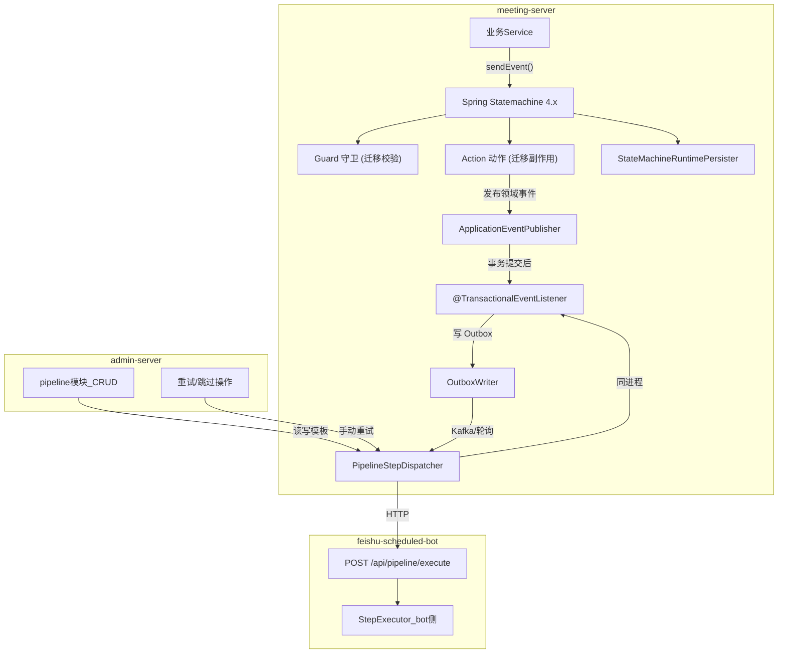
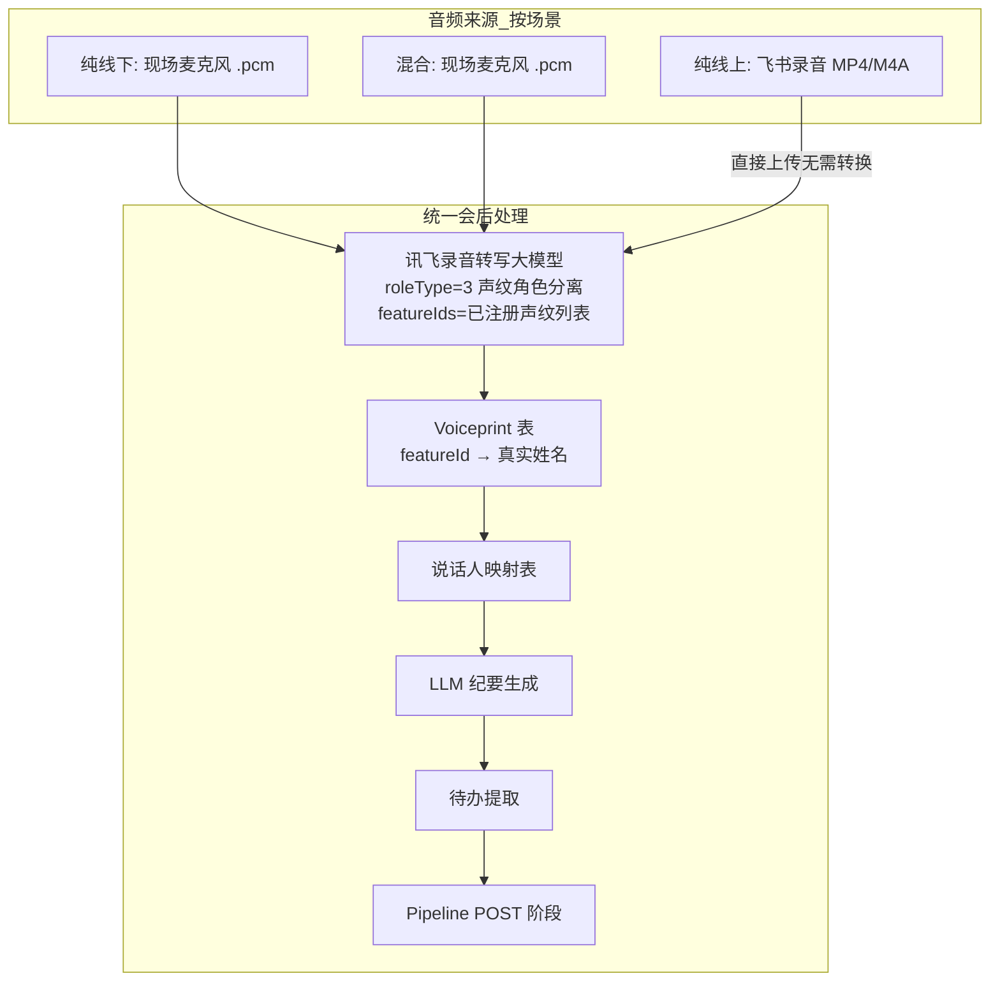
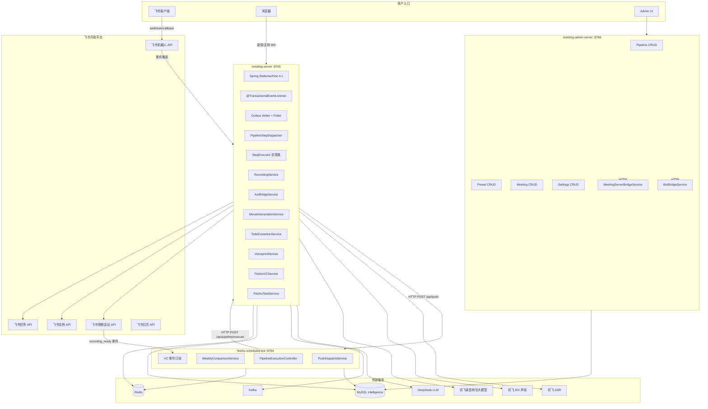
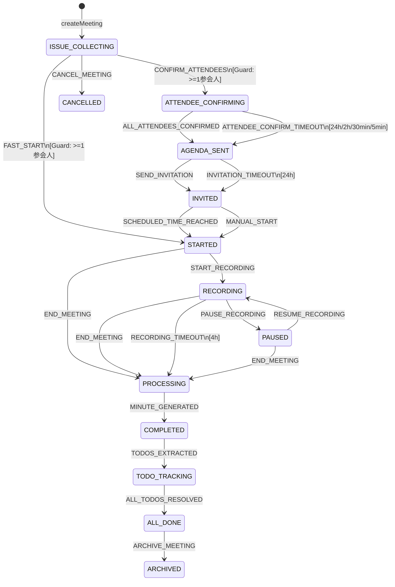
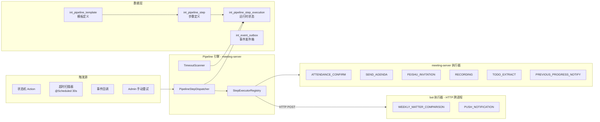
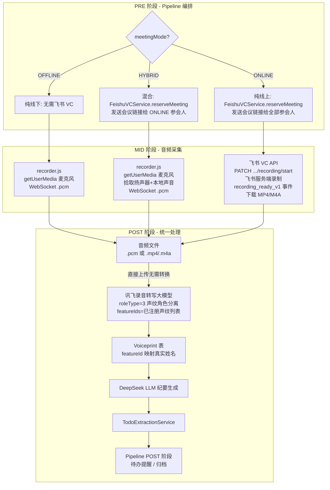
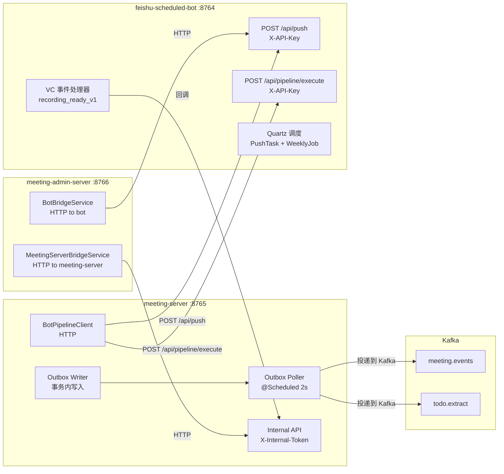
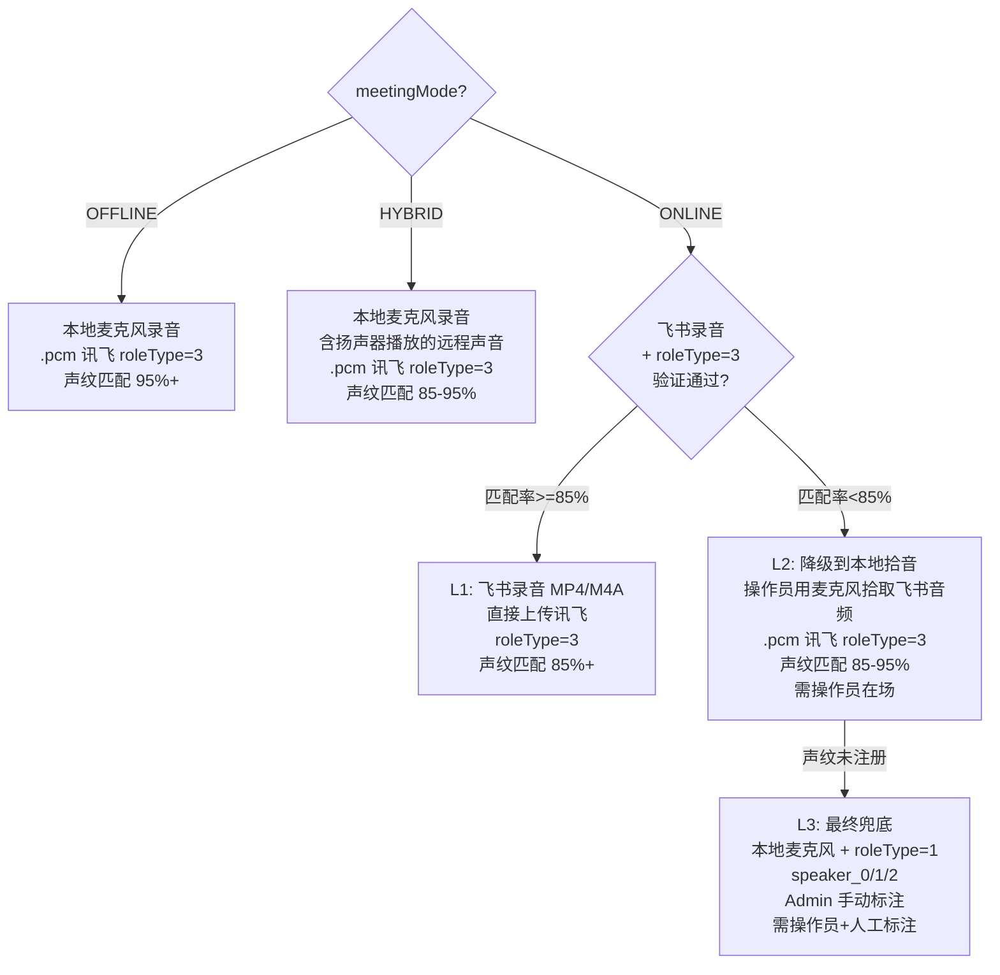
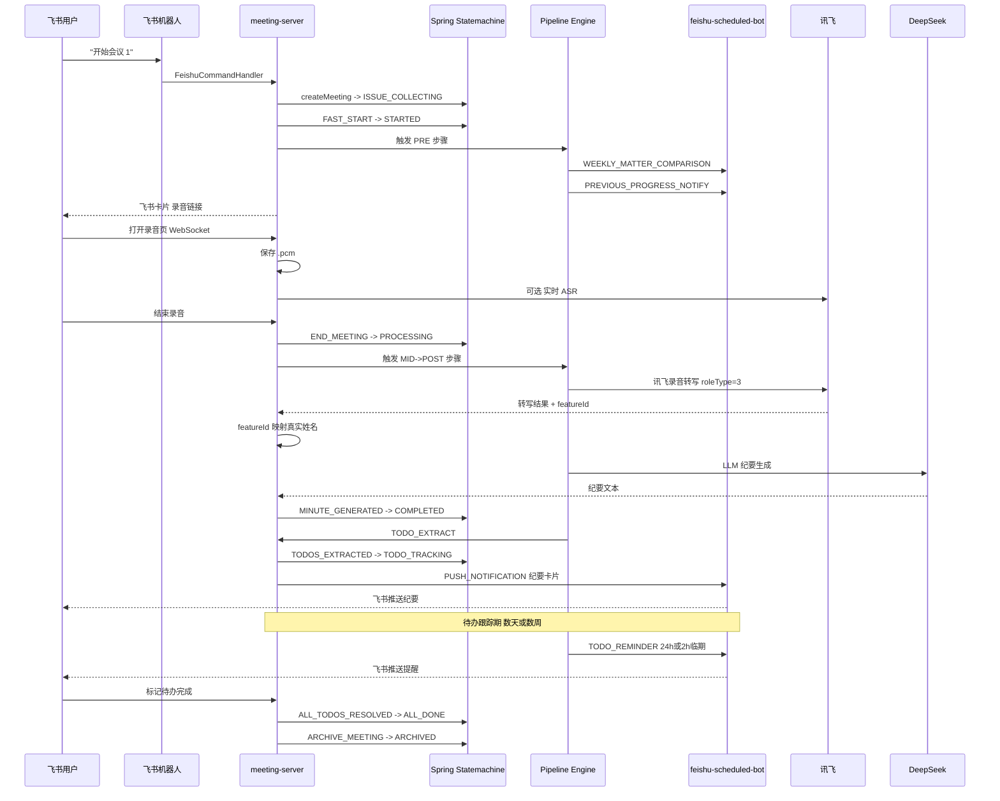

# PRD 二期 — 事件驱动架构重构 + Admin 流水线

## 核心问题诊断

### 当前架构的 7 类耦合（代码实证）

| # | 耦合类型 | 现状 | 危害 |
|---|----------|------|------|
| C1 | **状态耦合** | `setStatus()` 散落在 4 个 Service 的 8+ 处调用，无守卫，无校验 | 6/13 个状态从未被设置；`ISSUE_COLLECTING→STARTED` 跳过 PRD 3 步 |
| C2 | **事件耦合** | `LocalEventBus` 用 `@Async` 直调 Service 方法；Kafka 消费者 `catch` 后 `ack`（静默丢消息） | 失败无重试、无死信、无补偿；Kafka 模式 `TodoExtractMessage.participants` 永远为空 |
| C3 | **跨进程耦合** | meeting-server→bot 单向 REST（`POST /api/push`）；bot→meeting-server 不存在 | 无法实现 bot 侧步骤回调 |
| C4 | **DB 耦合** | `host_agenda` JSON 被 meeting-server（写会序）和 bot（写对比报告 URL）同时改，无乐观锁 | 并发写同一 JSON 列可能覆盖 |
| C5 | **同步/异步混合** | 同步步骤（录音开始）和长等待步骤（参会确认 24h、待办跟踪数周）用同一套调用链 | 无法区分"执行失败重试"和"等待外部输入超时" |
| C6 | **接口契约** | `sourceEventType` 是自由字符串（`MINUTE_READY`/`TODO_SYNC`），非枚举；跨进程 DTO 各自定义 | 改了名字没人知道 |
| C7 | **错误处理** | `MinuteGenerationService` 完全失败仍标记 `COMPLETED`；`FeishuMeetingStartCoordinator` 发飞书卡片失败后无补偿 | 数据不一致但无人知晓 |

---

## 目标架构



**核心原则**：
- Service **不直接 setStatus()**，只通过 `StateMachine.sendEvent()` 请求迁移
- **Guard** 校验迁移合法性（如：至少 1 个参会人才能进入 ATTENDEE_CONFIRMING）
- **Action** 执行迁移副作用（如：发飞书卡片、写 Outbox）
- **StateMachineRuntimePersister** 自动持久化状态到 DB，支持故障恢复
- 事件处理在 **事务提交后** 异步执行（`@TransactionalEventListener` + `@Async`）
- 跨进程通信通过 **Outbox + Poller**，不直接 HTTP 调用
- 每个步骤有 **独立的状态行**（`int_pipeline_step_execution`），支持重试/跳过/超时
- 长等待步骤用 `timeout_at` + 定时扫描器，不阻塞线程

---

## 领域事件模型（Phase 2 核心交付）

### 事件基类

```java
// 所有领域事件继承此基类
public abstract class DomainEvent {
    private String eventId;           // UUID
    private String meetingId;         // 聚合根 ID
    private Instant occurredAt;       // 发生时间
    private String correlationId;     // 链路追踪 ID（贯穿 PRE→MID→POST）
}
```

### 会前事件（对应 PRD 3.1）

| 事件类 | 触发时机 | 关键载荷 | 监听者（谁响应） |
|--------|----------|----------|-----------------|
| `MeetingCreatedEvent` | `createMeeting()` 成功后 | presetTypeCode, creatorId, chatId | `AttendanceStepHandler`：推送参会确认卡片 |
| `AttendeeConfirmedEvent` | 单个参会人确认 | userId, status(CONFIRMED/DECLINED) | `AttendeeStepHandler`：更新确认率 |
| `AllAttendeesConfirmedEvent` | 全部 required=true 参会人确认 | confirmRate | `AgendaSender`：推送议程 |
| `AttendeeConfirmTimeoutEvent` | `timeout_at` 到达仍有未确认 | unconfirmedUserIds | `AttendeeStepHandler`：超时默认确认 |
| `AgendaSentEvent` | 议程卡片全部推送成功 | agendaJson | `InvitationSender`：发送正式邀约 |
| `MeetingInvitedEvent` | 邀约发送成功 | recordingUrl, scheduledTime | `ProgressNotifier`：查询上次待办 |

### 会中事件（对应 PRD 3.2）

| 事件类 | 触发时机 | 关键载荷 | 监听者 |
|--------|----------|----------|--------|
| `MeetingStartedEvent` | `startMeeting()` 成功后 | previousMeetingId | `PreviousProgressHandler`：生成通报卡片 |
| `RecordingStartedEvent` | 录音 WebSocket 连接成功 | meetingId | `AsrBridgeService`：启动 ASR |
| `RecordingStoppedEvent` | 录音结束 | audioPath, durationSeconds | `MinuteGenerationHandler`：投递到 Outbox |
| `MinuteGeneratedEvent` | 纪要生成 + 飞书文档创建成功 | docUrl, minuteText | `TodoExtractionHandler`：投递待办提取 |
| `MinuteGenerationFailedEvent` | 纪要生成失败 | errorType, retryCount | `RetryScheduler`：按策略重试 |

### 会后事件（对应 PRD 3.3）

| 事件类 | 触发时机 | 关键载荷 | 监听者 |
|--------|----------|----------|--------|
| `TodosExtractedEvent` | 待办提取完成 | todoCount, assignees | `TodoSyncHandler`：同步飞书任务 |
| `TodoStatusChangedEvent` | 待办状态变更（完成/延期/取消） | todoId, newStatus, oldStatus | `TodoBoardHandler`：更新看板 |
| `AllTodosResolvedEvent` | 全部待办 COMPLETED 或 CANCELLED | meetingId | 状态机发送 `ALL_TODOS_RESOLVED` 事件 → 自动迁移到 `ALL_DONE` |
| `TodoReminderDueEvent` | `deadline - 24h` 或 `deadline - 2h` | todoId, assigneeUserId | `BotPipelineDispatcher`：调 bot push |
| `PreviousProgressReportedEvent` | 上次待办统计卡片发送成功 | reportUrl | 无（终端事件） |

### 事件流全图

```mermaid
flowchart LR
  subgraph pre [会前]
    Created[MeetingCreated] --> AttendeeConf[AttendeeConfirmed_xN]
    AttendeeConf --> AllConf[AllAttendeesConfirmed]
    AllConf --> AgendaSent[AgendaSent]
    AgendaSent --> Invited[MeetingInvited]
  end

  subgraph mid [会中]
    Started[MeetingStarted] --> PrevProgress[PreviousProgressReported]
    Started --> RecStart[RecordingStarted]
    RecStart --> RecStop[RecordingStopped]
    RecStop --> MinGen[MinuteGenerated]
    MinGen --> TodoExtr[TodosExtracted]
  end

  subgraph post [会后]
    TodoExtr --> TodoStatus[TodoStatusChanged_xN]
    TodoStatus --> AllResolved[AllTodosResolved]
    AllResolved --> Archived[MeetingArchived]
  end

  Invited -.->|scheduledTime到达| Started
```



---

## 命令模型（跨进程通信）

### 设计原则

- **事件（Event）**：描述已发生的事，不可变，一对多广播
- **命令（Command）**：请求执行某事，有明确的执行者，一对一

### Command 定义（共享 DTO，放 `meeting-config-core` 或新 `pipeline-api`）

```java
// 跨进程命令基类
public record PipelineCommand(
    String commandId,           // UUID，幂等键
    String meetingId,
    String stepType,            // 枚举值
    String targetProcess,       // "meeting-server" | "bot"
    Map<String, Object> params, // 步骤参数
    Instant issuedAt,
    String correlationId
) {}
```

| commandId | stepType | targetProcess | params | 谁发 | 谁执行 |
|-----------|----------|---------------|--------|------|--------|
| C1 | `SEND_ATTENDANCE_CARD` | meeting-server | participantList, confirmDeadline | PipelineDispatcher | meeting-server |
| C2 | `SEND_AGENDA_CARD` | meeting-server | agendaJson, allUserIds | PipelineDispatcher | meeting-server |
| C3 | `SEND_INVITATION` | meeting-server | recordingUrl, scheduledTime | PipelineDispatcher | meeting-server |
| C4 | `TRIGGER_WEEKLY_COMPARISON` | bot | jobId | PipelineDispatcher | bot |
| C5 | `SEND_PUSH_NOTIFICATION` | bot | pushTaskId, meetingId, targets | PipelineDispatcher | bot |
| C6 | `SYNC_TODO_TO_FEISHU` | meeting-server | todoList (id+content+assignee+deadline) | PipelineDispatcher | meeting-server |
| C7 | `SEND_TODO_REMINDER` | bot | pushTaskId, todoId, assigneeUserId | PipelineDispatcher | bot |
| C8 | `PREVIOUS_PROGRESS_NOTIFY` | meeting-server | previousMeetingId, chatId | PipelineDispatcher | meeting-server |

### 命令回调（执行结果）

```java
public record CommandResult(
    String commandId,
    String meetingId,
    CommandStatus status,       // SUCCESS / FAILED / TIMEOUT
    String errorCode,           // 失败原因码
    Map<String, Object> output, // 执行结果（如 docUrl）
    Instant finishedAt
) {}
```

执行方将 `CommandResult` 写回 Outbox 或 HTTP 回调到 admin-server。

---

## 核心接口契约

### 1. Spring Statemachine 配置（Phase 1 首要交付）

```java
@Configuration
@EnableStateMachineFactory
public class MeetingStateMachineConfig 
    extends StateMachineConfigurerAdapter<MeetingStatus, MeetingEvent> {
    
    @Autowired
    private StateMachineRuntimePersister<MeetingStatus, MeetingEvent, String> persister;
    
    @Override
    public void configure(StateMachineConfigurationConfigurer<MeetingStatus, MeetingEvent> config) {
        config.withPersistence().runtimePersister(persister);
    }
    
    @Override
    public void configure(StateMachineStateConfigurer<MeetingStatus, MeetingEvent> states) {
        states.withStates()
            .initial(MeetingStatus.ISSUE_COLLECTING)
            .states(EnumSet.allOf(MeetingStatus.class));
    }
    
    @Override
    public void configure(StateMachineTransitionConfigurer<MeetingStatus, MeetingEvent> transitions) {
        transitions
            // 会前阶段
            .withExternal()
                .source(MeetingStatus.ISSUE_COLLECTING)
                .target(MeetingStatus.ATTENDEE_CONFIRMING)
                .event(MeetingEvent.CONFIRM_ATTENDEES)
                .guard(hasAtLeastOneAttendee())
                .action(sendConfirmationCards())
                .and()
            .withExternal()
                .source(MeetingStatus.ISSUE_COLLECTING)
                .target(MeetingStatus.STARTED)
                .event(MeetingEvent.FAST_START)
                .guard(hasAtLeastOneAttendee())
                .action(sendMeetingStartedCard())
                .and()
            .withExternal()
                .source(MeetingStatus.ATTENDEE_CONFIRMING)
                .target(MeetingStatus.AGENDA_SENT)
                .event(MeetingEvent.ALL_ATTENDEES_CONFIRMED)
                .action(sendAgenda())
                .and()
            .withExternal()
                .source(MeetingStatus.ATTENDEE_CONFIRMING)
                .target(MeetingStatus.AGENDA_SENT)
                .event(MeetingEvent.ATTENDEE_CONFIRM_TIMEOUT)
                .action(sendAgendaWithDefaults())
                .and()
            .withExternal()
                .source(MeetingStatus.AGENDA_SENT)
                .target(MeetingStatus.INVITED)
                .event(MeetingEvent.SEND_INVITATION)
                .action(sendInvitation())
                .and()
            .withExternal()
                .source(MeetingStatus.AGENDA_SENT)
                .target(MeetingStatus.INVITED)
                .event(MeetingEvent.INVITATION_TIMEOUT)
                .action(sendInvitationWithDefaults())
                .and()
            .withExternal()
                .source(MeetingStatus.INVITED)
                .target(MeetingStatus.STARTED)
                .event(MeetingEvent.SCHEDULED_TIME_REACHED)
                .action(sendPreviousProgressCard())
                .and()
            .withExternal()
                .source(MeetingStatus.INVITED)
                .target(MeetingStatus.STARTED)
                .event(MeetingEvent.MANUAL_START)
                .action(sendPreviousProgressCard())
                .and()
            // 会中阶段
            .withExternal()
                .source(MeetingStatus.STARTED)
                .target(MeetingStatus.RECORDING)
                .event(MeetingEvent.START_RECORDING)
                .action(startAsrBridge())
                .and()
            .withExternal()
                .source(MeetingStatus.RECORDING)
                .target(MeetingStatus.PAUSED)
                .event(MeetingEvent.PAUSE_RECORDING)
                .action(pauseAsrBridge())
                .and()
            .withExternal()
                .source(MeetingStatus.PAUSED)
                .target(MeetingStatus.RECORDING)
                .event(MeetingEvent.RESUME_RECORDING)
                .action(resumeAsrBridge())
                .and()
            .withExternal()
                .source(MeetingStatus.RECORDING)
                .target(MeetingStatus.PROCESSING)
                .event(MeetingEvent.END_MEETING)
                .action(publishRecordingStoppedEvent())
                .and()
            .withExternal()
                .source(MeetingStatus.PAUSED)
                .target(MeetingStatus.PROCESSING)
                .event(MeetingEvent.END_MEETING)
                .action(publishRecordingStoppedEvent())
                .and()
            .withExternal()
                .source(MeetingStatus.STARTED)
                .target(MeetingStatus.PROCESSING)
                .event(MeetingEvent.END_MEETING)
                .action(publishRecordingStoppedEvent())
                .and()
            // 会后阶段
            .withExternal()
                .source(MeetingStatus.PROCESSING)
                .target(MeetingStatus.COMPLETED)
                .event(MeetingEvent.MINUTE_GENERATED)
                .action(publishMinuteGeneratedEvent())
                .and()
            .withExternal()
                .source(MeetingStatus.COMPLETED)
                .target(MeetingStatus.TODO_TRACKING)
                .event(MeetingEvent.TODOS_EXTRACTED)
                .action(publishTodosExtractedEvent())
                .and()
            .withExternal()
                .source(MeetingStatus.TODO_TRACKING)
                .target(MeetingStatus.ALL_DONE)
                .event(MeetingEvent.ALL_TODOS_RESOLVED)
                .action(publishAllDoneEvent())
                .and()
            .withExternal()
                .source(MeetingStatus.ALL_DONE)
                .target(MeetingStatus.ARCHIVED)
                .event(MeetingEvent.ARCHIVE_MEETING)
                .action(lockMeetingForViewing())
                .and()
            // 异常路径
            .withExternal()
                .source(MeetingStatus.ISSUE_COLLECTING)
                .target(MeetingStatus.CANCELLED)
                .event(MeetingEvent.CANCEL_MEETING)
                .action(notifyCancellation())
                .and()
            .withExternal()
                .source(MeetingStatus.RECORDING)
                .target(MeetingStatus.ABORTED)
                .event(MeetingEvent.RECORDING_TIMEOUT)
                .action(notifyRecordingTimeout())
                ;
    }
}
```

**Spring Statemachine 核心概念**：

| 概念 | 说明 | 示例 |
|------|------|------|
| **State** | 状态枚举 | `MeetingStatus.ISSUE_COLLECTING` |
| **Event** | 事件枚举 | `MeetingEvent.CONFIRM_ATTENDEES` |
| **Guard** | 守卫条件（迁移前校验） | `hasAtLeastOneAttendee()`：至少 1 个参会人 |
| **Action** | 动作（迁移时执行） | `sendConfirmationCards()`：发送确认卡片 |
| **Persister** | 持久化 | `StateMachineRuntimePersister`：自动保存到 DB |

**使用方式**：

```java
@Service
public class MeetingService {
    
    @Autowired
    private StateMachineService<MeetingStatus, MeetingEvent> stateMachineService;
    
    public void confirmAttendees(String meetingId) {
        StateMachine<MeetingStatus, MeetingEvent> sm = stateMachineService.acquireStateMachine(meetingId);
        
        // 发送事件，触发状态迁移
        sm.sendEvent(Mono.just(MessageBuilder.withPayload(MeetingEvent.CONFIRM_ATTENDEES).build()))
            .subscribe();
        
        // Guard 自动校验，Action 自动执行，Persister 自动保存
    }
}
```

**合法迁移表**（从 PRD 4.3.1 提取）：

| 源状态 | 事件 | 目标状态 | Guard | Action |
|--------|------|----------|-------|--------|
| ISSUE_COLLECTING | CONFIRM_ATTENDEES | ATTENDEE_CONFIRMING | hasAtLeastOneAttendee | sendConfirmationCards |
| ISSUE_COLLECTING | FAST_START | STARTED | hasAtLeastOneAttendee | sendMeetingStartedCard |
| ATTENDEE_CONFIRMING | ALL_ATTENDEES_CONFIRMED | AGENDA_SENT | - | sendAgenda |
| ATTENDEE_CONFIRMING | ATTENDEE_CONFIRM_TIMEOUT | AGENDA_SENT | - | sendAgendaWithDefaults |
| AGENDA_SENT | SEND_INVITATION | INVITED | - | sendInvitation |
| AGENDA_SENT | INVITATION_TIMEOUT | INVITED | - | sendInvitationWithDefaults |
| INVITED | SCHEDULED_TIME_REACHED | STARTED | - | sendPreviousProgressCard |
| INVITED | MANUAL_START | STARTED | - | sendPreviousProgressCard |
| STARTED | START_RECORDING | RECORDING | - | startAsrBridge |
| RECORDING | PAUSE_RECORDING | PAUSED | - | pauseAsrBridge |
| PAUSED | RESUME_RECORDING | RECORDING | - | resumeAsrBridge |
| RECORDING/PAUSED/STARTED | END_MEETING | PROCESSING | - | publishRecordingStoppedEvent |
| PROCESSING | MINUTE_GENERATED | COMPLETED | - | publishMinuteGeneratedEvent |
| COMPLETED | TODOS_EXTRACTED | TODO_TRACKING | - | publishTodosExtractedEvent |
| TODO_TRACKING | ALL_TODOS_RESOLVED | ALL_DONE | - | publishAllDoneEvent |
| ALL_DONE | ARCHIVE_MEETING | ARCHIVED | - | lockMeetingForViewing |

**迁移要点**：
- 所有 8 处 `setStatus()` 调用**逐步替换**为 `sm.sendEvent()`
- Guard 校验失败时，状态机**不迁移**，Action **不执行**
- Action 执行失败时，状态机**回滚**到源状态（事务级别）
- Persister 自动保存状态到 `int_meeting.status`，支持故障恢复

### 2. StepExecutor SPI（Phase 3 交付）

```java
public interface StepExecutor {
    String stepType();                    // 枚举值
    String preferredProcess();            // "meeting-server" | "bot"

    /**
     * 执行步骤。同步返回结果（短步骤）或 SCHEDULED 状态（长等待步骤）。
     */
    StepResult execute(StepContext ctx);

    /**
     * 检查长等待步骤是否可推进（如：所有参会人已确认）。
     * 由 timeout 扫描器定期调用。
     */
    default boolean checkCompletion(StepContext ctx) { return true; }

    /**
     * 超时时的补偿动作（如：全部默认确认）。
     */
    default StepResult onTimeout(StepContext ctx) { return StepResult.failed("TIMEOUT"); }
}
```

### 3. PipelineStepDispatcher（Phase 3 交付）

```java
public interface PipelineStepDispatcher {

    /**
     * 按会议类型加载模板，触发下一阶段所有 pending 步骤。
     */
    void advance(String meetingId, MeetingStatus currentStatus);

    /**
     * 处理命令执行结果，推进下一步或标记失败。
     */
    void onCommandResult(CommandResult result);

    /**
     * 扫描所有 SCHEDULED 状态步骤，检查 timeout_at 到期。
     */
    void scanTimeouts();
}
```

### 4. Outbox 接口（Phase 1 交付）

```java
public interface OutboxWriter {
    /**
     * 在业务事务内写入 Outbox 行（与业务数据同一事务，保证原子性）。
     */
    void write(String aggregateId, String eventType, String payload, String targetProcess);
}

public interface OutboxPoller {
    /**
     * 定时扫描 published=false 的 Outbox 行，投递到 Kafka 或 HTTP。
     * 投递成功后标记 published=true。
     */
    void poll();
}
```

---

## 数据库设计

### Outbox 表（Phase 1）

```sql
CREATE TABLE int_event_outbox (
    id              BIGINT AUTO_INCREMENT PRIMARY KEY,
    aggregate_id    VARCHAR(36)  NOT NULL COMMENT '会议 ID 或其他聚合根 ID',
    event_type      VARCHAR(64)  NOT NULL COMMENT '领域事件类型枚举值',
    event_payload   JSON         NOT NULL COMMENT '事件载荷',
    target_process  VARCHAR(32)  NULL     COMMENT '目标进程：meeting-server / bot / broadcast',
    published       TINYINT      NOT NULL DEFAULT 0 COMMENT '0=待投递 1=已投递',
    retry_count     INT          NOT NULL DEFAULT 0 COMMENT '投递重试次数',
    max_retries     INT          NOT NULL DEFAULT 5,
    next_retry_at   DATETIME     NULL     COMMENT '下次重试时间（指数退避）',
    created_at      DATETIME     NOT NULL DEFAULT CURRENT_TIMESTAMP,
    published_at    DATETIME     NULL,
    error_message   VARCHAR(500) NULL,
    INDEX idx_unpublished (published, next_retry_at),
    INDEX idx_aggregate (aggregate_id, created_at)
) COMMENT '事件发件箱：保证事件与业务数据同事务写入，异步投递';
```

### 流水线模板表（Phase 3）

```sql
CREATE TABLE int_pipeline_template (
    id                INT AUTO_INCREMENT PRIMARY KEY,
    preset_type_code  INT          NOT NULL COMMENT '关联会务类型 1-5',
    template_name     VARCHAR(100) NOT NULL,
    enabled           TINYINT      NOT NULL DEFAULT 1,
    version           INT          NOT NULL DEFAULT 1,
    created_at        DATETIME     NOT NULL DEFAULT CURRENT_TIMESTAMP,
    updated_at        DATETIME     NOT NULL DEFAULT CURRENT_TIMESTAMP ON UPDATE CURRENT_TIMESTAMP,
    UNIQUE KEY uk_preset_version (preset_type_code, version)
) COMMENT '流水线模板：按会务类型绑定 PRE/POST 步骤序列（会中由 host_agenda 定义）';

CREATE TABLE int_pipeline_step (
    id              INT AUTO_INCREMENT PRIMARY KEY,
    template_id     INT          NOT NULL,
    phase           VARCHAR(8)   NOT NULL COMMENT 'PRE 或 POST（MID 由 host_agenda 定义）',
    step_type       VARCHAR(48)  NOT NULL COMMENT 'StepExecutor 枚举值',
    order_index     INT          NOT NULL DEFAULT 0 COMMENT '阶段内执行顺序',
    enabled         TINYINT      NOT NULL DEFAULT 1,
    trigger_type    VARCHAR(16)  NOT NULL DEFAULT 'ON_STATUS' COMMENT 'ON_STATUS / CRON / ON_EVENT / MANUAL',
    trigger_config  JSON         NULL     COMMENT '触发条件参数（如 status=INVITED 或 cron 表达式）',
    config_ref      JSON         NULL     COMMENT '引用已有配置（如 weekly_job_id 或 push_task_id）',
    timeout_seconds INT          NULL     COMMENT '长等待步骤的超时时间（秒），NULL=无超时',
    retry_max       INT          NOT NULL DEFAULT 3,
    retry_backoff   VARCHAR(32)  NOT NULL DEFAULT 'EXPONENTIAL' COMMENT 'LINEAR / EXPONENTIAL / FIXED',
    target_process  VARCHAR(32)  NOT NULL COMMENT 'meeting-server / bot',
    created_at      DATETIME     NOT NULL DEFAULT CURRENT_TIMESTAMP,
    INDEX idx_template_phase (template_id, phase, order_index),
    FOREIGN KEY (template_id) REFERENCES int_pipeline_template(id)
) COMMENT '流水线步骤定义：每步绑定执行器、触发条件、超时策略';
```

### 运行时表（Phase 3）

```sql
CREATE TABLE int_pipeline_step_execution (
    id              BIGINT AUTO_INCREMENT PRIMARY KEY,
    meeting_id      VARCHAR(36)  NOT NULL COMMENT '会议实例 ID',
    step_id         INT          NOT NULL COMMENT '引用的步骤定义 ID',
    step_type       VARCHAR(48)  NOT NULL COMMENT '冗余 step_type（方便查询）',
    phase           VARCHAR(8)   NOT NULL,
    status          VARCHAR(16)  NOT NULL DEFAULT 'PENDING' COMMENT 'PENDING / RUNNING / SCHEDULED / SUCCESS / FAILED / TIMEOUT / SKIPPED',
    command_id      VARCHAR(36)  NULL     COMMENT '关联的 Command ID（幂等键）',
    input_context   JSON         NULL     COMMENT '步骤输入参数快照',
    output_context  JSON         NULL     COMMENT '步骤输出结果',
    error_code      VARCHAR(48)  NULL,
    error_message   VARCHAR(500) NULL,
    retry_count     INT          NOT NULL DEFAULT 0,
    max_retries     INT          NOT NULL DEFAULT 3,
    timeout_at      DATETIME     NULL     COMMENT 'SCHEDULED 状态的超时截止时间',
    started_at      DATETIME     NULL,
    finished_at     DATETIME     NULL,
    created_at      DATETIME     NOT NULL DEFAULT CURRENT_TIMESTAMP,
    INDEX idx_meeting_status (meeting_id, status),
    INDEX idx_timeout_scan (status, timeout_at),
    INDEX idx_command_id (command_id),
    FOREIGN KEY (step_id) REFERENCES int_pipeline_step(id)
) COMMENT '步骤运行时：每次会议每个步骤一行，记录执行状态、重试、超时';
```

### 处理命令去重表（Phase 3）

```sql
CREATE TABLE int_processed_command (
    command_id      VARCHAR(36) PRIMARY KEY COMMENT '命令幂等键',
    meeting_id      VARCHAR(36) NOT NULL,
    step_type       VARCHAR(48) NOT NULL,
    processed_at    DATETIME    NOT NULL DEFAULT CURRENT_TIMESTAMP,
    INDEX idx_meeting (meeting_id)
) COMMENT '命令幂等去重：防止重复执行同一命令';
```

---

## 五期迁移路径

### Phase 1 — Spring Statemachine 集成 + Outbox（2~3 周，不改业务流程）

**目标**：引入 Spring Statemachine 4.x 替换硬编码 `setStatus()`，实现声明式状态守卫 + 自动持久化 + Outbox 事件投递。

**交付物**：
1. `spring-statemachine-starter` 4.0.0 依赖（单 GAV，BOM 已管理版本）
2. `MeetingEvent` 枚举（17 个事件：会前 8 + 会中 5 + 会后 4）
3. `MeetingStateMachineConfig`：声明式配置 16 条迁移规则 + Guard + Action
4. `StateMachineRuntimePersister`：自动持久化到 `int_meeting.status`
5. 替换 8 处 `setStatus()` 为 `sm.sendEvent()`（逐步替换，每处单独验证）
6. `int_event_outbox` DDL + `OutboxWriter` + `OutboxPoller`（`@Scheduled fixedDelay=2000`）
7. 单元测试：合法迁移、Guard 失败、非法迁移全覆盖

**验证**：
- 现有 `mvn test` 全部通过（行为不变）
- Guard 校验失败时（如无参会人），状态不迁移
- 非法迁移（如 `COMPLETED→STARTED`）被状态机拒绝
- Action 自动执行（迁移副作用：发卡片、发布事件）
- 状态自动持久化到 DB（故障恢复：重启后状态机从 DB 恢复）
- Outbox 表有写入（Poller 可暂不投递到 Kafka）

**不改动**：
- 飞书建会流程不变（`FAST_START` 事件保持一键 create+start 旁路）
- Kafka 消费者不变
- LocalEventBus 不变

### Phase 2 — 事件总线（1.5 周）

**目标**：将 Service 间的直调改为事件驱动，修复 Kafka 消费者 bug。

**交付物**：
1. `DomainEvent` 基类 + 5 个会中事件类（`MeetingStartedEvent`、`RecordingStartedEvent`、`RecordingStoppedEvent`、`MinuteGeneratedEvent`、`MinuteGenerationFailedEvent`）
2. 状态机 Action 内自动 `publishEvent()`（替代原 `MeetingStatusService.transitionWithEvent()`）
3. `@TransactionalEventListener` 替换 `LocalEventBus` 的 `@Async` 直调
4. Kafka 消费者修复：
   - `catch` 后**不** `ack`，改为 `nack(backoff)`（Spring Kafka 2.8+）
   - 配置 `DefaultErrorHandler` + `FixedBackOff` + DLT Topic
5. 三层重试策略：
   - L1：自动重试（指数退避，3 次）
   - L2：写入 Outbox `retry_count` 超标行，admin 可手动重试
   - L3：admin 手动触发补偿动作

**验证**：
- 状态机 Action 发布 `RecordingStoppedEvent` → `@TransactionalEventListener` 写 Outbox → Poller 投递
- Kafka 消费者处理失败 → nack → 退避后重试 → 3 次后 DLT
- 现有集成测试通过（行为等价）

**不改动**：
- 飞书建会流程不变
- bot 通信不变

### Phase 3 — Pipeline 引擎（2~3 周）

**目标**：建立可配置的步骤编排引擎 + Admin 流水线 UI。

**交付物**：
1. DDL：`int_pipeline_template` / `int_pipeline_step` / `int_pipeline_step_execution` / `int_processed_command`
2. `StepExecutor` SPI + `StepExecutorRegistry`（Spring 自动发现）
3. `PipelineStepDispatcher`：按会议类型加载模板 → 查下一阶段 pending 步骤 → 触发执行
4. 超时扫描器：`@Scheduled fixedDelay=30000` 扫描 `status=SCHEDULED AND timeout_at < NOW()`
5. 跨进程通信：
   - meeting-server 侧：`BotPipelineClient` HTTP 调 bot
   - bot 侧：`PipelineExecutionController`（`POST /api/pipeline/execute`）
6. Admin `pipeline` 模块：
   - 两列卡片布局（PRE / POST），上下箭头排序
   - 步骤卡片跳转到已有编辑器（presets / weekly-jobs / push-bot）
   - 运行时视图：按 meetingId 查看步骤执行状态

**首批 StepExecutor（4 个，全部复用已有能力）**：

| stepType | 执行位置 | 实现方式 |
|----------|----------|----------|
| `WEEKLY_MATTER_COMPARISON` | bot | 调 bot `POST /api/weekly-comparison/jobs/{id}/execute` |
| `PUSH_NOTIFICATION` | bot | 调 bot `POST /api/push` |
| `PREVIOUS_PROGRESS_NOTIFY` | meeting-server | 调已有 `previousMeetingId` 查询 + 飞书卡片 |
| `TODO_EXTRACT` | meeting-server | 调已有 `TodoExtractionService` |

**验证**：
- Admin 上为「周例会」配好 PRE 步骤（weekly comparison + push）
- 创建会议后，pipeline 自动触发 PRE 步骤，运行时表有记录
- 步骤失败可在 admin 手动重试

**不改动**：
- 飞书建会流程不变（pipeline 仅作为"旁路"运行）

### Phase 4 — 会前渐进流程（3~4 周）

**目标**：实现 PRD 会前 6 步渐进流程，利用 Phase 1 已建成的 Spring Statemachine。

**交付物**：
1. 拆分 `FeishuMeetingStartCoordinator.createMeetingStartAndNotifyFeishu()`：
   - `createMeetingOnly()` → 状态机初始状态 `ISSUE_COLLECTING`
   - `fastStart()` → 发送 `FAST_START` 事件（保留一键开始旁路）
   - 渐进路径：发送 `CONFIRM_ATTENDEES` 事件 → Guard 校验 → Action 发卡片 → ... → `INVITED` → `STARTED`
2. 补实现飞书卡片回调（已有桩，`confirm_attend` / `decline_attend`）→ 发送状态机事件
3. 新 StepExecutor（3 个）：
   - `ATTENDANCE_CONFIRM`（长等待步骤，`timeout_at` = 24h/2h/30min/5min 可配）
   - `FEISHU_INVITATION`（短步骤，发卡片后立即 SUCCESS）
   - `SEND_AGENDA`（短步骤）
4. 超时扫描器处理 `ATTENDANCE_CONFIRM`：到期未确认 → 发送 `ATTENDEE_CONFIRM_TIMEOUT` 事件
5. Admin `ATTENDANCE_CONFIRM` 步骤可配超时规则 JSON

**风险与缓解**：
- 风险：拆 create/start 后飞书入口体验变差
- 缓解：保留 `FAST_START` 事件旁路（"开始会议 1" 命令走快速路径，新 UI 提供渐进路径）
- 产品需确认（见 D1）

### Phase 5 — 会后闭环（3~4 周）

**目标**：实现 PRD 会后阶段全部能力。

**交付物**：
1. `FeishuTaskService`（meeting-server）：调用飞书任务 API 创建/更新/完成
2. `TodoSyncService`：`TodosExtractedEvent` 监听者 → 调 `FeishuTaskService`
3. 待办提醒：复用 bot push_task（EVENT 触发），新 StepExecutor `TODO_REMINDER`
4. 补实现 `complete_todo` 卡片回调
5. `ALL_DONE` 自动迁移：`TodoService.updateStatus()` 检测全部完成 → 发送 `ALL_TODOS_RESOLVED` 事件 → 状态机自动迁移到 `ALL_DONE`
6. Admin 看板：`meetings` 模块新增待办统计面板
7. `int_meeting_system_config` 新增 `meeting.pipeline.post-reminder-cron` 等参数

**并行**：Phase 3 期间提交飞书任务 API 权限申请，Phase 5 开始前获批。

---

## Admin 流水线 UI 设计（Phase 3）

### 模块结构

```
pipeline.js（新增模块）
├── 模板列表页
│   └── 按 preset_type_code 筛选（1-5）
├── 模板编辑页
│   ├── PRE 列：步骤卡片列表（上下箭头排序）
│   │   └── 卡片点击 → 跳转已有编辑器（presets / weekly-jobs / push-bot）
│   ├── [会中] 链接跳转到 presets 模块
│   └── POST 列：步骤卡片列表
└── 运行时视图
    └── 输入 meetingId → 展示步骤时间线（PENDING/RUNNING/SUCCESS/FAILED/TIMEOUT）
        └── FAILED 行可点「重试」/「跳过」
```

### API

| Method | Path | 用途 |
|--------|------|------|
| GET | `/api/v1/admin/pipeline/templates` | 列表 |
| POST | `/api/v1/admin/pipeline/templates` | 新建模板（绑定 preset_type_code） |
| GET | `/api/v1/admin/pipeline/templates/{id}` | 详情（含步骤列表） |
| PUT | `/api/v1/admin/pipeline/templates/{id}/steps` | 批量更新步骤（全量替换） |
| GET | `/api/v1/admin/pipeline/executions?meetingId=` | 查询运行时 |
| POST | `/api/v1/admin/pipeline/executions/{id}/retry` | 手动重试 |
| POST | `/api/v1/admin/pipeline/executions/{id}/skip` | 标记跳过 |

---

## 并行工作：飞书权限审批

| API | 所需 scope | 审批周期 | 何时提交 |
|-----|-----------|----------|----------|
| 飞书任务 `/open-apis/task/v2/tasks` | `task:task:write`, `task:task:read` | 1~2 周 | Phase 3 期间 |
| 飞书日历 `/open-apis/calendar/v4/*` | `calendar:calendar`, `calendar:calendar.event:write` | 1~2 周 | Phase 4 期间（P1，非阻塞） |

---

## 产品决策点

| # | 决策 | 影响 | 建议 |
|---|------|------|------|
| D1 | 飞书「开始会议」是否保留一键开始？ | Phase 4 拆 create/start 的范围 | 保留 fastStart 旁路，新 UI 提供渐进路径 |
| D2 | PipelineTemplate 粒度 | 同类型不同部门是否需不同流程 | 初期一对一（preset_type_code → template），后续按需扩 |
| D3 | 待办提醒走 bot push 还是 Redis ZSet | Phase 5 实现方式 | 推荐 bot push（复用去重/限流/日志） |
| D4 | 飞书任务 API 权限能否获批 | F-POST-01 是否走飞书任务系统 | 先提交申请，不批则仅内部 `int_meeting_todo` |
| D5 | `PREVIOUS_PROGRESS_NOTIFY` 与 weekly 对比是否合并 | 两套并行通报合并策略 | 合并为一个步骤，数据源可配（weekly job 或直接查上次待办） |

---

## 框架选型评估（新增）

### 评估背景

当前项目已引入的依赖：
- **Spring Boot** 3.2.5 / 3.3.6（meeting-server / feishu-scheduled-bot）
- **Spring Kafka** 3.1.x（meeting-server 事件总线）
- **Spring Data Redis** 3.2.5（缓存 + 分布式锁）
- **MyBatis-Plus** 3.5.6（meeting-server 数据访问）
- **Quartz** 2.3.2（bot 定时任务）
- **Redisson** 3.36.0（bot 分布式锁/限流）

**关键发现**：项目中**没有任何状态机、工作流、CQRS 或事件溯源框架**。

### 成熟框架对比

| 框架 | 定位 | 架构匹配 | 运维成本 | 学习曲线 | 重构成本 | 问题解决 | **推荐度** |
|------|------|---------|---------|---------|---------|---------|-----------|
| **Spring Statemachine 4.x** | 轻量级状态机库 | ✅ 精准 | ✅ 零 | ✅ 低 | ✅ 低 | ✅ 精准 | ⭐⭐⭐⭐⭐ |
| **Axon Framework 4/5** | CQRS + Event Sourcing | ⚠️ 中等 | ⚠️ 中等 | ⚠️ 中等 | ⚠️ 中等 | ⚠️ 过度 | ⭐⭐⭐ |
| **Flowable** | 嵌入式 BPMN 引擎 | ⚠️ 中等 | ✅ 低 | ⚠️ 中高 | ⚠️ 中等 | ⚠️ 过度 | ⭐⭐ |
| **Temporal** | Durable Execution Engine | ❌ 过重 | ❌ 高 | ❌ 高 | ❌ 高 | ❌ 过度 | ⭐ |
| **Camunda 8** | 云原生 BPMN 引擎 | ❌ 过重 | ❌ 高 | ❌ 高 | ❌ 高 | ❌ 过度 | ⭐ |

### 评估结论

**推荐方案**：**Spring Statemachine 4.x**（短期） + **自研事件总线**（中期）

**理由**：
1. **精准匹配需求**：PRD 定义了 13 个状态和迁移规则，当前用硬编码实现；Spring Statemachine 完美解决状态机守卫和持久化
2. **零运维成本**：Spring Boot starter，无需独立部署（Temporal/Camunda 需要独立集群）
3. **低学习曲线**：Spring 生态，API 简洁，文档完善
4. **渐进式集成**：可逐步引入，不影响现有功能
5. **避免过度设计**：Temporal/Camunda/Axon 解决的是更复杂的问题，当前项目不需要

### 不推荐的框架

| 框架 | 不推荐原因 |
|------|-----------|
| **Temporal** | 需要独立部署 Temporal Server + PostgreSQL，运维复杂度高；学习曲线陡峭；解决"分布式事务+长时运行工作流"问题，但当前项目是单体应用，不需要这么重的方案 |
| **Camunda 8** | 需要独立部署 Zeebe broker + Operate UI；BPMN 建模复杂度高；解决"企业级流程编排"问题，但当前项目流程简单 |
| **Axon Framework** | CQRS + Event Sourcing 理念与计划吻合，但当前事件模型简单（4-5 个事件），不需要 Axon 的完整能力；5.x 版本刚发布（2026年），Saga 被废弃，API 不稳定；4.x 稳定但即将过时 |
| **Flowable** | 可嵌入 Spring Boot，但偏重企业级 BPMN 流程；BPMN 2.0 标准学习成本高；解决"业务流程编排"问题，但当前需求是简单状态机 |

---

## 技术栈总结

### Phase 1-2：Spring Statemachine + 自研事件总线

| 组件 | 选型 | 说明 |
|------|------|------|
| **状态机** | Spring Statemachine 4.x | Spring Boot starter，Guard/Action/Persistence 原生支持 |
| **领域事件** | `ApplicationEventPublisher` + `@TransactionalEventListener` | Spring Framework 自带 |
| **Outbox** | JdbcTemplate + `@Scheduled` | 自研，保证事件与业务数据同事务 |
| **Kafka DLT** | Spring Kafka 2.8+ `DefaultErrorHandler` | 现有依赖 |
| **Admin UI** | vanilla JS | 与现有 8 个模块一致 |

### Phase 3+：Pipeline 引擎（自研）

| 组件 | 选型 | 说明 |
|------|------|------|
| **Pipeline 模板** | `int_pipeline_template` / `int_pipeline_step` | 自研 DDL |
| **运行时** | `int_pipeline_step_execution` | 自研，支持重试/跳过/超时 |
| **跨进程通信** | Outbox + Kafka + HTTP | 复用现有基础设施 |
| **超时扫描** | `@Scheduled` + DB 查询 | 自研 |

### 未来升级路径（如果业务复杂度增长）

**触发条件**：
- 事件模型复杂度增长（>20 个事件类型）
- 需要完整的事件溯源和回放能力
- 引入更多微服务，需要分布式事务协调

**升级选项**：
- 评估 **Axon Framework**（如果团队熟悉 DDD）
- 评估 **Temporal**（如果需要分布式工作流）
- 保持 **Spring Statemachine + 自研事件总线**（如果复杂度可控）

---

## Phase 6 — 多场景支持：纯线下 / 混合 / 纯线上

### 核心策略

**策略 1（推荐）**：飞书 VC 做音频传输管道 + 本地端录音/ASR/纪要全部自己完成。

| 场景 | 音频传输 | 音频采集 | 实时 ASR | 声纹识别 | 纪要生成 |
|------|---------|---------|---------|---------|---------|
| **纯线下** | 无需 | 现场麦克风 | 可选开关 | 会后批量（讯飞 ISV） | 我们的 LLM |
| **混合** | 飞书 VC | 现场麦克风（拾取扬声器+本地） | 可选开关 | 会后声纹角色分离 | 我们的 LLM |
| **纯线上** | 飞书 VC | 飞书 VC API 录制 | 不支持 | 讯飞声纹角色分离（roleType=3） | 我们的 LLM |

### 关键设计原则

1. **声纹识别全部会后做**：代码现状已是如此（`VoiceprintService.identifySpeaker()` 在 `MinuteGenerationService` 中调用）
2. **实时 ASR 作为可选开关**：已有 `meeting.asr.realtime-enabled` 配置项，关闭后走 `OfflineCorrectionService` 离线转写
3. **飞书 VC 不做录制/转写**（除纯线上场景外）：不消耗妙记额度，零额外成本

### 成本分析

| 场景 | 飞书版本需求 | 妙记额度消耗 | API 调用消耗 | 月成本 |
|------|------------|------------|------------|--------|
| **纯线下** | 免费版 | 0 | 0 | 0 元 |
| **混合** | 免费版 | 0 | 3-5 次/会议 | 0 元 |
| **纯线上** | 免费版可用 | 会议时长分钟/场 | 5-8 次/会议 | 0 元（轻度）/ 2,500 元（商业版） |

**飞书免费版额度**：
- 妙记语音转文字：300 分钟/用户/月（50 人企业 = 15,000 分钟/月）
- API 调用：2026年5月限时 100 万次/月（常规 10,000 次/月）

---

### 场景 A：纯线下（现有架构，无改动）

**当前状态**：已完整支持。

```
现场麦克风 → recorder.js (getUserMedia)
    → WebSocket → AsrBridgeService → 保存 .pcm
    → [可选] 实时 ASR（讯飞）→ 实时字幕 / 检点
    → 会后：离线 ASR → 声纹识别（讯飞 ISV）→ LLM 纪要 → Pipeline POST
```

| 组件 | 状态 |
|------|------|
| `recorder.js` | 不需要改动 |
| `AsrBridgeService` | 不需要改动 |
| `VoiceprintService` | 不需要改动（已是会后调用） |
| `MinuteGenerationService` | 不需要改动 |
| Pipeline | 不需要改动 |

**实时 ASR 关闭时的影响**：

| 功能 | 影响 | 替代方案 |
|------|------|---------|
| 实时字幕 | 不可用 | 会后生成 |
| 线下点名答到 | 不可用 | 手动确认或飞书卡片签到 |
| 议题到时提醒 | 不受影响 | 基于计时器，不依赖 ASR |
| 会后纪要 | 走离线 ASR | `OfflineCorrectionService`（已有） |

---

### 场景 B：线上线下混合（飞书 VC 传输 + 本地麦克风）

**架构**：

```
远程参会人 ──→ 飞书视频会议（音频传输管道）
                     ↓
              现场设备扬声器播放飞书 VC 音频
                     ↓
              房间麦克风拾取（本地 + 远程声音）
                     ↓
              recorder.js (getUserMedia) → WebSocket → 保存 .pcm
                     ↓
              会后处理：
              ├─ 离线 ASR 转写 → Speaker 0/1/2...（无姓名）
              ├─ 讯飞 ISV 声纹识别 → Speaker N ↔ 参会人姓名
              ├─ LLM 纪要生成
              ├─ 待办提取
              └─ Pipeline POST 阶段
```

**飞书 VC 在本场景的角色**：仅做音频传输管道，不需要录制/转写 API。

**代码改动**：

| 组件 | 改动 | 工作量 |
|------|------|--------|
| `FeishuVCService`（新建） | 创建飞书会议 + 发送会议链接 | 1 周 |
| `Meeting.meetingMode` | 新增枚举字段（OFFLINE/HYBRID/ONLINE） | 0.5 天 |
| Pipeline `JOIN_FEISHU_VC` 步骤 | PRE 阶段：创建飞书会议 → 发送链接给 ONLINE 参会人 | 0.5 周 |
| `recorder.js` | 不需要改动 | 0 |
| `AsrBridgeService` | 不需要改动 | 0 |
| `MinuteGenerationService` | 不需要改动 | 0 |
| `VoiceprintService` | 不需要改动 | 0 |

**说话人识别策略**：

| 参会人类型 | 识别方式 | 精度 |
|-----------|---------|------|
| 线下（现场） | 讯飞 ISV 声纹（会后批量） | 95%+（近距离麦克风，音质好） |
| 线上（远程） | 讯飞 ISV 声纹（会后批量） | 70-85%（扬声器→麦克风失真） |

**说话人识别增强方案（可选，Phase 6B）**：

如果混合场景的远程说话人识别精度不可接受，可启用飞书逐字稿对齐：

```
会后处理（增强模式）：
  Step 1: 离线 ASR 转写 .pcm → Speaker 0/1/2...
  Step 2: 获取飞书逐字稿（含真实说话人 + 时间戳）
  Step 3: 时间戳对齐（±2秒容差）→ Speaker N ↔ 参会人姓名
  Step 4: 替换 ASR 结果中的 Speaker N → 真实姓名
  Step 5: 未匹配的 Speaker N → 回退到声纹识别
```

| 增强方案效果 | 精度 |
|-------------|------|
| 线上参会人（飞书已知身份） | 99%+ |
| 线下参会人（仅声纹） | 95%+ |
| 飞书逐字稿不可用时（降级） | 70-85%（全部回退到声纹） |

**成本**：增强模式需 `vc:meeting.artifact.verbatim:read` 权限 + 消耗妙记额度。

**权限需求（基础模式，不消耗妙记）**：

| 权限 | 用途 |
|------|------|
| `vc:reserve` | 预约飞书会议 |
| `vc:meeting.meetingevent:read` | 获取会议链接和详情 |

**权限需求（增强模式，消耗妙记）**：

| 权限 | 用途 |
|------|------|
| `vc:record` | 开始录制（触发逐字稿生成） |
| `vc:record:readonly` | 获取录制文件 |
| `vc:meeting.artifact.verbatim:read` | 获取逐字稿（含说话人） |
| `minutes:minutes.transcript:export` | 导出逐字稿文本 |

---

### 场景 C：纯线上（飞书 VC 录制 + 讯飞录音转写大模型）

**架构**：

```
所有参会人 → 飞书视频会议
                    ↓
         飞书服务端录制（API 控制开始/停止）
                    ↓
         会议结束 → recording_ready_v1 事件
                    ↓
         下载飞书录音文件（MP4/M4A，1天有效期链接）
                    ↓
         讯飞录音转写大模型（roleType=3 声纹角色分离）
         ├─ 直接上传 MP4/M4A（无需 ffmpeg 转换）
         ├─ 传入 featureIds（会议参会人已注册声纹）
         └─ 返回转写结果 + 每段对应 featureId
                    ↓
         featureId → Voiceprint 表 → 真实姓名
                    ↓
         LLM 纪要生成（带正确说话人标注）
                    ↓
         待办提取 → Pipeline POST 阶段
```

**关键技术突破**：讯飞录音转写大模型（`https://office-api-ist-dx.iflyaisol.com/v2/upload`）**原生支持 MP4/M4A 格式**，且提供 `roleType=3`（声纹角色分离）模式，可直接传入已注册的声纹 ID 列表，一步完成转写 + 说话人识别。

| 讯飞 API 参数 | 值 | 说明 |
|--------------|---|------|
| 音频格式 | `mp3, wav, pcm, mp4, m4a, aac, opus, flac, ogg...` | 飞书 MP4/M4A 直接上传，无需转换 |
| `roleType` | `3` | 声纹角色分离（需传 `featureIds`） |
| `featureIds` | 逗号分隔的声纹 ID | 从 `VoiceprintService.getMeetingFeatureIds()` 获取 |
| `language` | `autodialect` | 中英 + 202 种方言免切识别 |
| `duration` | 音频时长（毫秒） | 从飞书 API 返回的 `duration` 字段获取 |
| `audioMode` | `fileStream` 或 `urlLink` | 文件流上传或 URL 外链模式 |

**与之前方案的核心区别**：
- **之前**：依赖飞书逐字稿 API（消耗妙记额度，需要 6 个权限）
- **现在**：下载录音文件 + 讯飞转写（不消耗妙记额度，仅需 3 个飞书权限）

**代码改动**：

| 组件 | 改动 | 工作量 |
|------|------|--------|
| `FeishuVCService`（扩展） | 增加 `startRecording()` / `stopRecording()` / `getRecordingUrl()` | 1 周 |
| `FeishuRecordingDownloader`（新建） | 从飞书 `download_url` 下载 MP4/M4A 到本地 | 0.5 周 |
| `XfyunOfflineClient`（修改） | `transcribe()` 增加 `featureIds` 参数，支持 `roleType=3` | 0.5 周 |
| `OfflineCorrectionService`（修改） | 调用 `transcribe(audioPath, featureIds)` + 用返回的 featureId 查 Voiceprint 表映射姓名 | 0.5 周 |
| `MinuteGenerationService` | 增加"纯线上"分支：下载录音 → 离线转写（带声纹）→ LLM 纪要 | 0.5 周 |
| Pipeline 适配 | `RECORDING` 状态变为"等待飞书录制完成"（长等待步骤） | 0.5 周 |
| 事件订阅（bot） | 订阅 `vc.meeting.recording_ready_v1` 事件 | 0.5 周 |

**说话人识别策略**：

| 参会人类型 | 识别方式 | 精度 |
|-----------|---------|------|
| 已注册声纹的参会人 | 讯飞 `roleType=3` 声纹角色分离 | 90-95%+ |
| 未注册声纹的参会人 | 讯飞返回 `speaker_N`，标记"待确认" | N/A |

**权限需求（仅 3 个，不消耗妙记额度）**：

| 权限 | 用途 | 必要性 |
|------|------|--------|
| `vc:reserve` | 预约飞书会议 | ✅ 必须 |
| `vc:meeting.meetingevent:read` | 获取会议详情 | ✅ 必须 |
| `vc:record` | 开始/停止录制 | ✅ 必须 |
| `vc:record:readonly` | 获取录制文件信息 | ✅ 必须 |
| `minutes:minutes.media:export` | 下载音视频文件 | ✅ 必须 |

**成本**：下载录音文件**不消耗妙记额度**（仅获取逐字稿才消耗）。讯飞录音转写按现有套餐计费。

**风险与缓解**：

| 风险 | 影响 | 缓解 |
|------|------|------|
| 飞书录音文件下载链接有效期仅 1 天 | 超时后无法下载 | `recording_ready_v1` 事件触发后立即下载 |
| 部分参会人未注册声纹 | 这些人的发言标记为 `speaker_N` | 提示用户注册声纹；Admin 可手动标注 |
| 录音时间 < 5 秒 | 飞书不生成录制文件 | 检测后标记 `RECORDING_TOO_SHORT` |
| **飞书音频压缩导致声纹匹配精度下降** | 飞书 VC 音频经 Opus 编码压缩，声纹特征可能与注册时的原始 PCM 有差异，roleType=3 匹配精度降低 | **必须在 Phase 6B 启动前做验证测试**（见下方验证步骤）；若不通过则降级到**本地硬件拾音方案**（参照混合场景，由操作员用本地麦克风录音，走纯线下处理流程） |
| **roleType=3 对未匹配声纹的处理未知** | 讯飞文档未明确说明：当某段音频的说话人不在 featureIds 列表中时，返回 `speaker_unknown` 还是强制匹配到最接近的 featureId（误匹配） | **必须做验证测试**；若存在误匹配，降级到本地硬件拾音方案 |

**声纹精度验证步骤**（Phase 6B 前置条件）：

1. 准备测试环境：2-3 人已注册声纹
2. 通过飞书 VC 开一场 5 分钟测试会议
3. 下载飞书录音文件（MP4/M4A）
4. 调用讯飞转写 API，传入 `roleType=3` + `featureIds`
5. 对比转写结果中的 featureId 与实际说话人，计算匹配率
6. 验收标准：匹配率 ≥ 85% → 方案可行；< 85% → 降级到 roleType=1 + 飞书逐字稿对齐

**降级方案**（若飞书录音 + roleType=3 验证不通过）：

| 级别 | 方案 | 音频来源 | 参数 | 精度 | 成本 |
|------|------|---------|------|------|------|
| L1（最优） | 飞书录音 + 声纹分离 | 飞书服务端录制 (MP4/M4A) | `roleType=3, featureIds=...` | 待验证（85%+？） | 不消耗妙记额度 |
| L2（降级） | **本地硬件拾音 + 声纹分离** | 操作员本地麦克风拾取飞书播放的音频 (PCM) | `roleType=3, featureIds=...` | 85-95%（本地 PCM 无压缩） | 不消耗妙记额度，需操作员在场 |
| L3（兜底） | 本地硬件拾音 + 通用分离 | 操作员本地麦克风拾取飞书播放的音频 (PCM) | `roleType=1` | 返回 speaker_0/1/2，需手动标注 | 不消耗妙记额度，需操作员在场 |

**降级策略说明**：
- L1 → L2 的触发条件：飞书录音 roleType=3 匹配率 < 85%
- L2 本质上就是**混合场景的方案**：操作员用本地麦克风录音 → recorder.js → WebSocket → PCM → 讯飞转写（roleType=3）
- L2 的优势：本地 PCM 音频未经 Opus 压缩，声纹特征完整，匹配精度更高
- L2 的代价：需要操作员在场（不能全自动），但这是可接受的降级代价
- L3 是最终兜底：如果连本地拾音的 roleType=3 都不行（比如参会人未注册声纹），退到通用分离 + 人工标注

---

### 三场景统一会后处理流程



**核心发现**：讯飞录音转写大模型原生支持 MP4/M4A 格式 + `roleType=3` 声纹角色分离，三种场景可以统一走同一个会后处理流程，无需 ffmpeg 转换，无需飞书逐字稿 API。

### 三场景对比总结

| 维度 | 纯线下 | 混合 | 纯线上 |
|------|--------|------|--------|
| **音频传输** | 无需 | 飞书 VC | 飞书 VC |
| **音频采集** | 现场麦克风 | 现场麦克风 | 飞书服务端录制 |
| **实时 ASR** | 可选 | 可选 | 不支持 |
| **实时字幕** | 可选 | 可选 | 不支持 |
| **会中检点** | 可用（需实时 ASR） | 可用（需实时 ASR） | 飞书卡片签到 |
| **说话人识别** | 声纹 roleType=3 精度 95%+（待验证） | 声纹 roleType=3 精度 85-95%（待验证，音频经扬声器失真） | 声纹 roleType=3 精度待验证（飞书 Opus 压缩可能影响匹配） |
| **说话人识别降级** | roleType=1 通用分离 | roleType=1 + 飞书逐字稿对齐（99%+） | roleType=1 + 飞书逐字稿对齐（99%+） |
| **纪要生成** | 我们的 LLM | 我们的 LLM | 我们的 LLM |
| **飞书 VC 权限** | 不需要 | 2 个（基础）/ 5 个（增强） | 5 个 |
| **妙记额度消耗** | 0 | 0（基础）/ 会议时长（增强） | 0（下载录音不消耗）/ 会议时长（增强用逐字稿） |
| **代码改动量** | 0 | 2 周 | 3-4 周 |
| **Phase 1-5 复用** | 100% | 95% | 90% |
| **前置验证** | 无 | 无 | 飞书录音 + roleType=3 匹配率测试 |

### Phase 6 实施路径

#### Phase 6A：会议级模式字段 + 飞书会议预约（1.5 周）

1. `Meeting.meetingMode` 枚举（OFFLINE/HYBRID/ONLINE）
2. `MeetingCreateRequest.meetingMode` 字段
3. 创建时自动推断（全员 OFFLINE → OFFLINE，全员 ONLINE → ONLINE，混合 → HYBRID）
4. `FeishuVCService`：`reserveMeeting()` + `getMeetingUrl()`
5. Pipeline `JOIN_FEISHU_VC` 步骤（PRE 阶段）
6. 权限申请：`vc:reserve` + `vc:meeting.meetingevent:read`

**覆盖**：混合场景基础能力

#### Phase 6B：纯线上集成（2-3 周，可选）

1. `FeishuVCService` 扩展：`startRecording()` / `getTranscript()`
2. `FeishuTranscriptFetcher` + `TranscriptAdapter`
3. `MinuteGenerationService` 增加纯线上分支
4. Pipeline `RECORDING` 长等待步骤（等待飞书录制完成）
5. bot 订阅 `vc.meeting.recording_ready_v1` 事件
6. 权限申请：`vc:record` / `vc:record:readonly` / `vc:meeting.artifact.verbatim:read` / `minutes:minutes.transcript:export`

**覆盖**：纯线上场景

#### Phase 6C：混合说话人识别增强（1 周，可选）

1. `SpeakerAligner`：时间戳对齐算法（±2s 容差）
2. `MinuteGenerationService` 双源融合逻辑
3. 降级策略：飞书逐字稿不可用时回退到纯声纹

**覆盖**：混合场景说话人识别精度提升

### 产品决策点（新增）

| # | 决策 | 影响 | 建议 |
|---|------|------|------|
| D6 | 混合场景是否需要增强说话人识别？ | 是否需要飞书逐字稿 API + 妙记额度 | 初期不需要（声纹 70-85% 可接受），后续按需启用 |
| D7 | 纯线上场景是否为刚需？ | Phase 6B 是否排期 | 如果纯线上需求迫切则排期，否则延后 |
| D8 | 实时 ASR 关闭时，线下检点如何替代？ | 混合/纯线上检点体验 | 飞书卡片签到 或 手动确认 |
| D9 | 飞书免费版 API 额度是否够用？ | 是否需要升级商业版 | 先监控用量，超限再升级 |

---

## 项目架构图

### 1. 系统全局架构



### 2. 会议状态机（Spring Statemachine 4.x）



### 3. Pipeline 引擎架构



### 4. 三场景音频处理架构



### 5. 跨进程通信架构



### 6. 降级策略决策树



### 7. 数据流全景（一场会议的完整生命周期）


