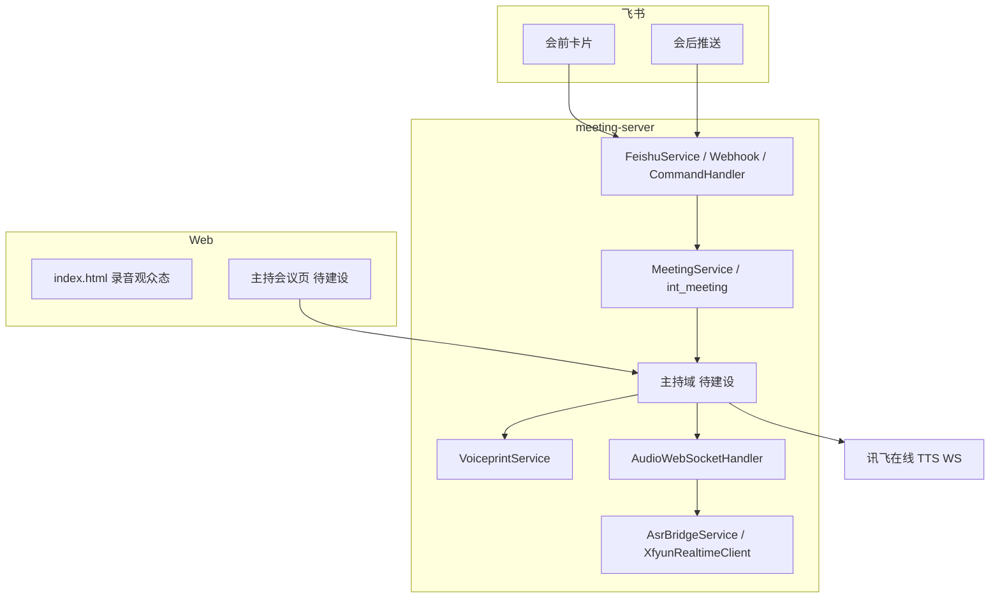

# AI 会议主持人 — 开发文档

**关联需求**：[AI会议主持人PRD_v1.md](./AI会议主持人PRD_v1.md)（PRD v1.6）  
**工程模块**：`meeting-server`（Spring Boot）  
**编写说明**：本文档供研发拆任务与联调用；实现以 PRD 验收为准，接口形态可在评审后微调。

---

## 1. 文档目的与版本范围

| 产品版本 | 范围摘要 | 研发重点 |
|----------|----------|----------|
| **V1.0 MVP** | Web 主持页、议程状态机、两级倒计时、TTS 播报、2D 虚拟形象（口型+表情）、会中**零飞书** | 新领域模型 + WS/HTTP + 前端页 |
| **V1.1 完整版** | 会前飞书盘点卡片、语音点名、声纹/流标注发言人、会后纪要/待办/统计推送 | 复用 `FeishuService`、`VoiceprintService`、`MinuteGenerationService` 等 |
| **V1.2 会控增强** | **仅当前议题**到时：确认「结束本议题 / 继续」；继续则**自动延时**（步长、次数、超时策略可配） | 在 V1.0 议程计时状态机上扩展；**不做**会议总时长到点询问与总倒计时延时（PRD 已明确本期不做） |

---

## 2. 与现有系统的关系



**已有能力（复用）**

- 会议主表 `int_meeting`：`Meeting` 含 `agenda`（JSON）、`chat_id`、`status`、`recording_token` 等（见 `schema.sql`）。
- 音频上行：`/ws/audio/{meetingId}?token=` → `AudioWebSocketHandler` → `AsrBridgeService` → 转写推送（文本 JSON）。
- 飞书：`FeishuService`（消息/卡片/文档）、`FeishuCommandHandler` / `FeishuCommandRouter`。
- 声纹：`VoiceprintService`、`XfyunIsvClient`；配置 `meeting.isv.*`（`application.yml`）。
- 纪要：`MinuteGenerationService` 等（会后链路）。

**缺口（本特性新建）**

- **主持态**与**录音态**：会中由主持页驱动议程与 TTS；**「结束会议」为唯一结束入口**（见 §5、§10），一次点击同时结束主持会话、停止录音/ASR、关闭相关 WebSocket，并走既有会后/纪要触发逻辑。
- **会中零飞书**：所有 `FeishuService` 发群消息路径须在「会议处于主持进行中」时硬拦截（见 §7）。
- **TTS 已定案**：采用**讯飞开放平台「在线语音合成」流式 WebSocket API**（与 ASR 同属讯飞生态，可复用或并列配置 `app_id` / `api_key` / `api_secret`），见 §6。

---

## 3. 领域模型建议

### 3.1 主持会议会话（HostSession）

与 `Meeting` 一对一或一对多（若支持同会重开主持），建议内存 + Redis 可选持久化：

- `meetingId`
- `mode`：`AUDIENCE` | `HOST`（或布尔 `hostModeEnabled`）
- `agendaItems[]`：顺序、标题、**计划时长秒**、**当前剩余结束时间**（绝对时间戳）、状态 `PENDING|RUNNING|COMPLETED|SKIPPED`
- `meetingWallClockEnd`：会议总结束时刻（仅展示与提醒；**V1.2 不对总时长做询问延时**）
- `paused`、当前议题索引、`topicAutoExtendCount`（V1.2）
- `feishuMuted`：会中禁止发飞书标记（见 §7）

### 3.2 议程数据与 `int_meeting.agenda`

表字段已为 JSON。可选两种实现：

1. **轻量**：在现有 `agenda` JSON 上约定 schema（议题数组 + `totalDurationMinutes`），主持启动时解析校验。  
2. **规范**：新增 `int_meeting_agenda_item` 表，模板与实例分行存储，利于统计「计划 vs 实际」；与 PRD 数据需求一致时再拆。

推荐 **V1.0 先 JSON**，减少迁移；在开发文档中固定 JSON schema 版本号（如 `agendaSchemaVersion: 1`）。

### 3.3 状态机（议题）

与 PRD 一致：`PENDING → RUNNING → COMPLETED | SKIPPED`；**不自动** `RUNNING →` 下一题，仅人工「下一议题」或 V1.2 在「结束本议题」确认后再进入可切换状态。

---

## 4. 后端模块划分（建议包路径）

| 模块 | 建议包 / 类 | 职责 |
|------|-------------|------|
| 主持 API | `com.smartmeeting.api.controller.HostMeetingController` | 启动/暂停/下一议题、**结束会议**、查询主持态、V1.2 确认与延时 |
| 主持服务 | `com.smartmeeting.service.host.HostSessionService` | 会话生命周期、议程推进、权限（仅创建者或 token 角色） |
| 计时调度 | `com.smartmeeting.service.host.HostScheduleService` | `ScheduledExecutorService` 或 Spring `@Scheduled` 每 tick 检查提醒点、议题到点、V1.2 弹窗超时 |
| TTS | `com.smartmeeting.service.host.XfyunOnlineTtsClient`（或并入 `HostTtsService`） | 调用讯飞流式 TTS WebSocket，合成音频下发主持页播放；文案队列、并发与主持页 `<audio>` 或 WebAudio 衔接 |
| 推送 | 扩展 `AudioWebSocketHandler` 或新建 `HostWebSocketHandler` | 向主持页推送 `agenda_tick`、`tts_request`、`confirm_topic_end`（V1.2）等 |
| 飞书门闸 | `com.smartmeeting.service.host.FeishuDuringHostGuard` 或 AOP | `FeishuService` 发送前检查 `HostSession.feishuMuted` |

**注意**：若继续复用 `/ws/audio` 仅传 PCM，主持状态可另开 **`/ws/host/{meetingId}`**（仅 JSON，不传音频），避免与 ASR 二进制帧混在同一协议里难以解析。

---

## 5. HTTP API（草案）

路径前缀建议：`/api/v1/host/meetings/{meetingId}`（以项目现有风格为准）。

| 方法 | 路径 | 说明 |
|------|------|------|
| POST | `.../start` |  body：议程 JSON 或模板 ID；校验后创建 HostSession，开始计时与开场 TTS |
| POST | `.../pause` / `.../resume` | 暂停/恢复议程计时 |
| POST | `.../next-topic` | 手动下一议题 |
| POST | `.../skip-topic` | 跳过当前议题 |
| POST | `.../end`（产品按钮文案：**结束会议**） | **主持结束与录音结束同一动作**：结束 `HostSession`、停止 `RecordingService` 写盘、停止实时 ASR、优雅关闭 `/ws/audio`（若仍连接）、清除 `feishuMuted`；随后与现网一致进入纪要/会议状态更新（与 `RecordingController` 或现有「停止录音」服务同一事务顺序，避免缺音频） |
| GET | `.../state` | 当前议题、倒计时、签到摘要等（轮询兜底） |
| POST | `.../confirm-topic`（V1.2） | body：`{ "action": "END_TOPIC" \| "CONTINUE", "clientTime": "..." }`；`CONTINUE` 触发自动延时 |

鉴权：与录音页一致沿用 **JWT**（`JwtUtil`），claims 含 `meetingId`、角色（发起人/只读）。

---

## 6. TTS 与虚拟形象

### 6.1 TTS（已定案：讯飞在线语音合成）

**官方文档**：[在线语音合成 API 文档](https://www.xfyun.cn/doc/tts/online_tts/API.html)（含计费说明入口 `?target=price`）。

**接口形态（与文档一致）**

- 协议：**WebSocket**（推荐 `wss://tts-api.xfyun.cn/v2/tts`）。
- 鉴权：握手 URL 携带 `authorization`、`date`、`host`；签名算法 **HMAC-SHA256**（与项目内讯飞 ASR 鉴权思路一致，可复用或抽取 `XfyunSignatureUtil` 扩展）。
- 音频：支持 pcm / mp3 等；主持场景建议 **16k PCM 或 mp3** 与现网 `meeting.audio` 配置对齐，便于口型与播放链路统一。
- 约束：单次文本 **小于 8000 字节**（约 2000 汉字）；长播报需**服务端分句**排队多次握手或使用流式帧拼接。

**实现分工建议**

1. **Java 服务端**：维护 TTS WebSocket 连接池或「每会议单连接串行」、鉴权刷新、将合成二进制帧 **转发** 给主持 WebSocket（`type: tts_audio_chunk` + `encoding` + `seq`），或先落临时文件再发 URL（一般不如流式直发延迟低）。  
2. **主持前端**：订阅 WS 音频块 → `MediaSource` / `decodeAudioData` 或拼接为 Blob URL 供 `<audio>` 播放；播放开始时间用于 **口型/表情** 联动。  
3. **密钥**：优先复用 `meeting.asr.xfyun.app-id` / `api-key` / `api-secret`；若控制台需单独开通「语音合成（流式版）」，可另加 `meeting.tts.xfyun.*` 指向同一应用或独立应用。

**非功能**：PRD 要求 TTS 起播 ≤3s、口型 ≤200ms → 优先 **首包尽快下发** + 前端预缓冲；失败时降级为 **仅 Web 文案提示**（与 PRD 异常处理一致）。

**降级**：讯飞不可用或超时时，可退回浏览器 `speechSynthesis`（仅应急，不作为默认）。

### 6.2 虚拟形象

静态资源 + Lottie / CSS 动画；表情状态由 `HostSession` 事件驱动（`OPENING`、`TOPIC_CHANGE`、`WARN_5M`、`TOPIC_TIME_UP`、`V12_CONFIRM` 等）。

---

## 7. 会中零飞书（强制）

PRD：**会议开始后禁止向飞书群发任何消息/卡片**；结束后恢复。

**实现要点**

1. 定义 `Meeting` 或 `HostSession` 上布尔 **`inHostSession`**（或 `feishuMuted`）。  
2. 所有落点排查：`FeishuService.send*`、`FeishuCommandHandler` 内主动推送、定时任务等；**统一经一层包装**或在 `FeishuService` 首行判断。  
3. 主持 `end` 时清除标记；异常断开会议需 TTL 或 finally 清除，避免永久静音。  
4. 日志：拦截时打 **WARN** 含 `meetingId`、原调用栈摘要，便于审计。

---

## 8. WebSocket 协议扩展（草案）

建议在 **`/ws/host/{meetingId}`** 使用 **纯文本 JSON**。

**服务端 → 客户端示例**

```json
{"type":"host_state","meetingId":"...","topicIndex":1,"topics":[...],"serverNow":1710000000000,"topicEndsAt":1710000900000,"meetingEndsAt":1710003600000}
```

**时间类提醒**（议题/会议剩余分钟、议题到时）：不占用 TTS 队列，由主持页右下角 toast 展示 3 秒后自动消失。

```json
{"type":"host_toast","text":"会议还剩 10 分钟。","durationMs":3000}
```

**主持话术 TTS**（开场、切题、检点、加时等）：

```json
{"type":"tts_meta","text":"现在进入：事项进度通报，预计 7 分钟。","utteranceId":"uuid","encoding":"pcm_s16le_16000"}
```

```json
{"type":"tts_audio_chunk","utteranceId":"uuid","seq":1,"base64":"..."}
```

（亦可采用服务端一次性返回可播放 URL 的变体，以延迟验收为准；**默认推荐流式 chunk** 对齐讯飞 WS。）

**V1.2**

```json
{"type":"topic_time_up_confirm","topicIndex":1,"utteranceId":"uuid","timeoutSec":30}
```

**客户端 → 服务端**（若需双向 WS）：`{"type":"ack","utteranceId":"uuid"}` 或 HTTP `confirm-topic` 二选一，避免重复实现。

---

## 9. 配置项（`application.yml` 建议前缀）

```yaml
meeting:
  tts:
    provider: xfyun-online
    # 默认可复用 meeting.asr.xfyun 的 app-id / api-key / api-secret
    ws-url: wss://tts-api.xfyun.cn/v2/tts
    vcn: xiaoyan   # 发音人，以控制台可选列表为准
    sample-rate: 16000
    format: pcm    # 或 mp3，与前端解码一致
  host:
    enabled: true
    reminder:
      meeting-minutes-left: [10, 5]
      topic-minutes-left: [3]
    auto-next-topic: false   # 与 PRD 默认一致
    auto-end-meeting: false
    # V1.2
    topic-end-confirm-enabled: false
    topic-extend-step-minutes: 5
    topic-extend-max-count: 3
    topic-confirm-timeout-sec: 30
    topic-confirm-timeout-action: WAIT  # 或 EXTEND_ONCE，与 PRD 定稿一致
```

### 9.1 Admin ↔ meeting-server 内部桥接（联调必读）

- `meeting-admin-server` 通过 `MEETING_SERVER_URL` 调用 meeting-server internal API。
- 若 meeting-server 启用了 `server.servlet.context-path=/meeting-server`（默认即如此），则 `MEETING_SERVER_URL` 必须带该前缀。

推荐：

```bash
MEETING_SERVER_URL=http://127.0.0.1:8765/meeting-server
```

常见现象：

- pipeline 按 code 触发时报错  
  `POST /api/v1/internal/pipeline/execute-by-preset -> 404 Not Found`
- 根因通常为 `MEETING_SERVER_URL` 未带 `/meeting-server` 前缀或 admin 指向了旧实例。

---

## 10. 前端

- **新建** `static/host-meeting.html`（或 Vue 子工程，视团队规范）：议程看板、倒计时、虚拟形象区、控制条。  
- 与 PRD 布局一致；通过 `meeting.base-url` 拼接 WS / REST。  
- 控制条主结束操作：**单一按钮「结束会议」** — 调用 `POST .../end`（或等价 REST），**不要**再分别提供「结束主持」「停止录音」；与 §5 服务端原子操作一致。  
- 现有 `index.html`：**尽量少改**，通过入口链接跳转主持页；若录音页仍需停止能力，可与主持页合并或跳转后由同一「结束会议」完成（避免双入口状态不一致）。

---

## 11. 测试清单（摘要）

| 类型 | 用例 |
|------|------|
| 单元 | 议程解析、状态迁移、提醒点触发、V1.2 延时次数上限 |
| 集成 | 启动主持 → WS 收到 state → 模拟到时 → TTS/文案事件顺序 |
| 回归 | 主持进行中调用飞书发送 → 期望拒绝；结束后发送 → 成功 |
| 性能 | 状态推送频率与 PRD「≤2s」；单机多连接 |

---

## 12. 风险与依赖

- **讯飞 TTS**：需在开放平台开通「语音合成（流式版）」；注意 IP 白名单、QPS 与计费（见官方文档价格页）。鉴权 `date` 与服务器时钟漂移 ≤300s。  
- **结束会议原子性**：`POST .../end` 须保证 **先 flush 录音** 再关 ASR/WS，或顺序与现网 `RecordingService.stop` 一致，避免纪要缺音频。  
- **V1.1 语音点名**：与 `AsrBridgeService` 转写流并行，需防与议程 TTS 抢播（**同一播放队列** + 点名时暂停议程 TTS）。

---

## 13. 文档修订

| 日期 | 版本 | 说明 |
|------|------|------|
| 2026-05-12 | 0.1 | 初稿：对齐 PRD v1.5 与 meeting-server 现状 |
| 2026-05-12 | 0.2 | TTS 定案：讯飞在线语音合成 WebSocket API；**结束会议**单按钮同时结束主持与录音；WS `tts_meta` / `tts_audio_chunk` 草案；`meeting.tts`；PRD v1.6 |
| 2026-05-12 | 0.3 | 首版代码落地：`/api/v1/host/meetings/*`、`/ws/host/{meetingId}`、`GET /api/v1/meetings/{id}/host-url`、`/host/{id}` 静态页；讯飞 `XfyunOnlineTtsSynthesizeService`；会中飞书 `MeetingHostFeishuMuteRegistry`；`MeetingRecordingSessionEndService` 前置 `MeetingHostMediaTeardownService`（结束会议=停 ASR+关音频 WS+清主持） |
| 2026-05-30 | 0.4 | 补充联调约束：`MEETING_SERVER_URL` 必须与 meeting-server context-path 对齐（默认需带 `/meeting-server`），避免 internal pipeline 接口 404。 |
