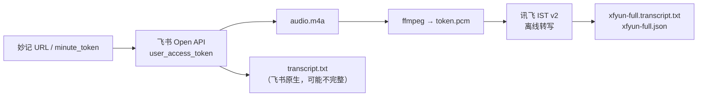

# 飞书 VC 妙记 → 离线全文转写（标准操作）

> 文档版本：2026-08-25  
> 适用：手动处理妙记链接、补转写、或联调 File B 链路  
> 关联：[feishu-vc-recording-design.md](feishu-vc-recording-design.md)、[USER-MANUAL.md](USER-MANUAL.md) §2.1

---

## 1. 流程概览



| 步骤 | 产物 | 说明 |
|------|------|------|
| 1 下载 | `meta.json`、`audio.m4a` | 需 **user_access_token**（Admin 飞书 OAuth） |
| 1b（可选） | `transcript.txt` | 飞书 `/transcript` 导出；长会议可能只有开头若干分钟 |
| 2 转码 | `{token}.pcm` | 16 kHz / mono / s16le，与 meeting-server File B 一致 |
| 3 转写 | `xfyun-full.transcript.txt` | 讯飞 IST 全文 + 说话人分离（roleType=1） |

**全文请以 `xfyun-full.transcript.txt` 为准**；飞书原生 `transcript.txt` 仅作快速预览。

---

## 2. 前置条件

| 项 | 要求 |
|----|------|
| Node.js | 18+（内置 `fetch`） |
| ffmpeg | 在 PATH 中可执行 |
| 脚本依赖 | `cd scripts && npm install`（mysql2） |
| 飞书 OAuth | Admin 飞书 OAuth 授权；DB 存在 `meeting.feishu.minutes.user-refresh-token` |
| 讯飞 IST | `meeting.asr.xfyun.*` 凭证有效（可用环境变量覆盖） |
| MySQL | 可连 `intelligence` 库读/写 refresh_token（OAuth 轮换时脚本自动写回） |

### 2.1 环境变量（可选）

| 变量 | 用途 |
|------|------|
| `MYSQL_HOST` / `MYSQL_USER` / `MYSQL_PASSWORD` / `MYSQL_DB` | intelligence 库 |
| `FEISHU_APP_ID` / `FEISHU_APP_SECRET` | 飞书应用 |
| `XFYUN_APP_ID` / `XFYUN_ACCESS_KEY_ID` / `XFYUN_ACCESS_KEY_SECRET` | 讯飞 IST |

未设置时使用与 `application-dev.yml` 一致的开发默认值。

---

## 3. 标准命令

### 3.1 一键：下载 + PCM + 讯飞全文转写

**Windows（PowerShell，项目根目录）：**

```powershell
.\scripts\vc-minute-offline-transcribe.ps1 "https://xxx.feishu.cn/minutes/obcnl8h3oys41512bprgtq63"
```

**跨平台（项目根目录）：**

```bash
cd scripts
npm install
npm run vc-minute-offline-transcribe -- "https://xxx.feishu.cn/minutes/{token}"
```

输出目录默认：`data/minutes/{minute_token}/`

### 3.2 仅下载飞书妙记（不跑讯飞）

```bash
cd scripts
npm run fetch-feishu-minute -- "https://xxx.feishu.cn/minutes/{token}"
```

### 3.3 常用选项

| 选项 | 作用 |
|------|------|
| `--out-dir <path>` | 指定输出目录 |
| `--skip-download` | 目录内已有 `audio.*` 时跳过飞书下载 |
| `--skip-feishu-transcript` | 不导出飞书原生 `transcript.txt` |
| `--skip-xfyun` | 只下载 + 转 PCM |

示例（已有音频，只补讯飞转写）：

```powershell
.\scripts\vc-minute-offline-transcribe.ps1 obcnl8h3oys41512bprgtq63 --skip-download
```

---

## 4. 输出文件说明

```
data/minutes/{minute_token}/
├── meta.json                      # 妙记元数据
├── audio.m4a                      # 原始音视频
├── transcript.txt                 # 飞书原生转录（可能不完整）
├── {minute_token}.pcm             # 16k PCM
├── xfyun-full.transcript.txt      # 讯飞全文（标准交付物）
└── xfyun-full.json                # 分段 JSON
```

---

## 5. 与 meeting-server 的关系

| 能力 | 标准脚本 | meeting-server 自动链路 |
|------|----------|-------------------------|
| 触发 | 手动传入妙记 URL | `vc.meeting.recording_ready_v1` 或 Admin 填 `vcMinuteToken` |
| 鉴权 | 读 DB refresh_token | `FeishuMinutesUserTokenProvider` |
| File B PCM | `scripts/lib/audio-convert.mjs` | `FeishuMinutesService.downloadAndTranscodeToPcm` |
| 离线 ASR | `scripts/lib/xfyun-offline.mjs` | `XfyunOfflineClient`（已同步 `durationCheckDisable=true`） |
| 入库 | 写本地文件 | `OfflineAsrService` → `int_transcript_segment` |

生产会议仍走会后编排；本 SOP 用于**运维/联调/补数**，逻辑与线上一致。

---

## 6. 故障排查

| 现象 | 原因 | 处理 |
|------|------|------|
| `refresh failed: invalid_grant` | refresh_token 失效 | Admin 重新飞书 OAuth |
| `2091005 permission deny` | 妙记 media 需 user token | 走 OAuth，勿用 tenant token |
| 讯飞 `100020 language` | duration 校验失败 | 已修复：`durationCheckDisable=true` |
| 飞书 `transcript.txt` 很短 | 妙记导出未全量 | 用 `xfyun-full.transcript.txt` |
| 讯飞 poll 很久 | 长音频 IST 排队 | 默认最多轮询约 30 分钟 |
| `ffmpeg failed` | 未安装 ffmpeg | 安装并加入 PATH |

---

## 7. 代码位置

| 路径 | 说明 |
|------|------|
| `scripts/vc-minute-offline-transcribe.mjs` | 标准入口 CLI |
| `scripts/vc-minute-offline-transcribe.ps1` | Windows 包装 |
| `scripts/fetch-feishu-minute.mjs` | 仅下载 |
| `scripts/lib/feishu-minutes.mjs` | 飞书妙记 API |
| `scripts/lib/xfyun-offline.mjs` | 讯飞 IST v2 |
| `scripts/lib/audio-convert.mjs` | ffmpeg PCM |
| `scripts/lib/meeting-db.mjs` | refresh_token 读/写 |
| `meeting-server/.../XfyunOfflineClient.java` | 线上同款 IST 客户端 |

单元测试：

```bash
cd scripts && npm run test:xfyun-offline
cd meeting-server && mvn test -Dtest=XfyunOfflineClientQueryParamTest
```
