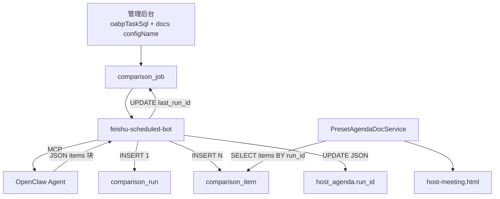

# 会前事项对比通报 — 使用手册（v0.26 结果入库版）

> 调度：`feishu-scheduled-bot` · 业务：`matter-progress-core` · 展示：`meeting-server` 主持页
> 数据：`intelligence.int_weekly_matter_comparison_run` + `int_weekly_matter_comparison_item`

## 1. 功能说明

会前自动将 preset 会序 **SOURCE** 的 oabp 事项表与近 N 天 READY 纪要交叉对比，产出一批 **结构化事项**（每条入库一行），在主持页按三组（延期/已完成/进行中）展示。

**v0.26 关键变化**：
- 产物从「飞书 Doc URL」改为 **入库 `int_weekly_matter_comparison_run` + `int_weekly_matter_comparison_item`**
- 不再调用 `lark-mcp` 写飞书 Doc；`feishu.weekly-comparison.app-id` 仅保留给过渡期 OUTPUT 参考文档
- `host_agenda` OUTPUT 行保存 **`generatedReportRunId`**（指向最新 run），历史 run 及 items 永久保留
- 旧 `generatedReportUrl` 保留只读兼容，下次成功 job 后由 runId 取代

**不会**：发飞书群消息；覆盖 SOURCE 的飞书资料 URL。

## 2. 库表结构

### `int_weekly_matter_comparison_run`（每次 job 执行 1 行）

| 列 | 说明 |
|----|------|
| `id` | 批次主键；host_agenda.generatedReportRunId 指向此 |
| `job_id` | 关联 job 表 |
| `output_config_name` | OUTPUT configName |
| `preset_type_code` / `agenda_index` | 冗余，便于按会序查 |
| `title` | 通报标题 |
| `item_count` | 事项条数 |
| `generation_status` | `READY` / `PARTIAL` / `FAILED` |
| `generated_at` | 生成时间 |
| `run_error` | FAILED/PARTIAL 摘要 |

### `int_weekly_matter_comparison_item`（每行一个事项）

| 列 | 说明 |
|----|------|
| `run_id` | 所属批次（CASCADE 删除） |
| `category` | `DELAYED` / `COMPLETED` / `IN_PROGRESS` |
| `matter_name` | 事项内容（必填） |
| `assignee` | 责任人；缺失存 **NULL**（前端显示「未提及」） |
| `time_node` | 时间节点原文 |
| `status_label` | 延期/已完成/进行中（须与 category 一致） |
| `sort_order` | 组内排序 |
| `source_config_name` | 来源 SOURCE config（多 SOURCE 共享 SQL 无法判断时 NULL） |

### `int_weekly_matter_comparison_job` 新增

- `last_run_id` BIGINT — 最近一次成功 run id

## 3. 部署清单

### 数据库

1. 执行 [`schema-upgrade/v0.26-weekly-matter-comparison-report.sql`](../meeting-server/src/main/resources/schema-upgrade/v0.26-weekly-matter-comparison-report.sql)（幂等，建两表 + ALTER job 加 last_run_id）
2. 同步已写入 [`schema.sql`](../meeting-server/src/main/resources/schema.sql) 基线

### 构建

```powershell
cd smart-meeting-java
mvn -pl meeting-config-core,matter-progress-core,meeting-server install

cd ..\feishu-scheduled-bot
mvn clean package
# 重启 bot
```

启动日志含：`weekly-comparison pipeline=OpenClaw-MCP`、`oabpSchema=oabp_pro`。

### 环境变量

| 变量 | 说明 |
|------|------|
| `MEETING_DB_OABP_ENABLED` | Legacy 路径 Bot 直连 oabp |
| `DB_OABP_NAME` | oabp schema，默认 `oabp_pro` |
| `FEISHU_WEEKLY_COMPARISON_DELEGATE_TO_MCP` | 默认 `true` |
| `FEISHU_WEEKLY_COMPARISON_LEGACY_FALLBACK` | `true`，MCP 失败时 Java 查 oabp + LLM |
| `MEETING_LLM_API_KEY` | Legacy fallback LLM |

### OpenClaw Gateway（MCP 路径）

1. 部署 Skill `matter-progress`（`skills/matter-progress/SKILL.md`）
2. 注册 `meeting-mysql` MCP；账号对 `oabp_pro` 有 SELECT 权限：
   ```sql
   GRANT SELECT ON oabp_pro.* TO 'intelligence'@'%';
   ```
   会序 SQL 使用 `oabp_pro.system_users`（须 `bootstrap-oabp-pro.sql` 已复制该表到 oabp_pro）。
3. **不再需要** `lark-mcp` 写 Doc 权限（v0.26 不写飞书）

## 4. 业务配置

### 为会序配置 oabp SQL（SOURCE 数据）

管理后台「会务预设 → 会序与资料 → oabp 项目任务 SQL」：

```sql
SELECT task_name, business_block, progress,
       CASE status WHEN 0 THEN '未开始' WHEN 1 THEN '进行中'
            WHEN 2 THEN '已完成' WHEN 3 THEN '已延期' END AS status_label,
       start_date, planned_end_date, this_week_plan
FROM jq_project_task_tracking
WHERE deleted = 0 AND project_id = 123
ORDER BY planned_end_date
```

要求：SELECT 开头、禁分号、禁 DML/DDL。`oabpTaskSql` 在会序项级别。

### 确认 SOURCE/OUTPUT 绑定

preset `host_agenda` JSON：

| 字段 | SOURCE 行 | OUTPUT 行 |
|------|-----------|-----------|
| `configName` | 如 `preset1-comp-agenda-01` | 如 `preset1-weekly-report-out` |
| `role` | `SOURCE`/`BOTH` | `OUTPUT` |
| 父 item `oabpTaskSql` | **必填** | — |

### 配置 job

表 `int_weekly_matter_comparison_job`：cron、`source_config_names`、`minute_query_*`、`output_config_name`。Bot 每 15s 同步到 Quartz。

## 5. 产出协议

### MCP 路径（Agent 输出）

Agent 不再写飞书 Doc，回复正文输出 JSON 块：

```
-----BEGIN_WEEKLY_COMPARISON_ITEMS-----
{
  "generatedAt": "2026-06-28 10:00:00",
  "items": [
    {"category":"DELAYED","matterName":"...","assignee":"张三",
     "timeNode":"2026-06-20","statusLabel":"延期","sortOrder":1,
     "sourceConfigName":"preset1-comp-agenda-02"}
  ]
}
-----END_WEEKLY_COMPARISON_ITEMS-----
```

Bot 用 `WeeklyComparisonItemsJsonParser` 解析后批量 INSERT。

### Legacy 路径（LLM）

LLM 产出 Markdown 三组（`## 延期事项` 等 + `- 事项：…，责任人：…，时间节点：…，状态：…`），由 `WeeklyComparisonItemMarkdownParser` 解析。解析失败 → run FAILED。

### 状态判定

| run.generation_status | 触发条件 |
|----------------------|----------|
| `READY` | 解析正常（含 0 条事项） |
| `PARTIAL` | 部分 item 字段缺失或 statusLabel/category 不一致被丢弃 |
| `FAILED` | JSON/Markdown 整体解析失败 |

## 6. 主持页展示

进入对应 preset 会议 → 会序模块 → OUTPUT 绑定的会序项：

1. `findReportBindingForAgenda` 返回 `generatedReportRunId` 优先；无 runId 时 fallback 旧 URL
2. 有 runId → `WeeklyComparisonReportQueryService` 查 run + items
3. `host-meeting.html` 按三组渲染：
   - `## 延期事项` → items where category=DELAYED
   - `## 已完成事项` → COMPLETED
   - `## 进行中事项` → IN_PROGRESS
   - 空组显示「无」；`assignee` 为 NULL 显示「未提及」
4. 无 runId（过渡期）→ 旧飞书 Doc 外链 + plainText

## 7. 日常使用

### 自动执行

Cron 默认每周一 10:00（`Asia/Shanghai`）。

### 手动试跑

```powershell
curl -X POST "http://127.0.0.1:8764/api/weekly-comparison/jobs/1/execute" `
  -H "X-API-Key: <SCHEDULED_BOT_APIKEY>"
```

返回：

```json
{
  "jobId": 1,
  "status": "SUCCESS",
  "generatedReportRunId": 42,
  "itemCount": 18
}
```

`status` 可能 `SUCCESS` / `PARTIAL` / `FAILED`。

## 8. 验证与排错

### 成功标志

- `int_weekly_matter_comparison_run` 新增 1 行，`generation_status=READY`
- `int_weekly_matter_comparison_item` 新增 N 行
- `host_agenda` OUTPUT 行 `generatedReportRunId` 已更新
- job 表 `last_run_id` 指向新 run
- 主持页展示三组事项

### 诊断 SQL

```sql
-- 最新批次
SELECT id, title, item_count, generation_status, generated_at, run_error
FROM int_weekly_matter_comparison_run
WHERE output_config_name = 'preset1-weekly-report-out'
ORDER BY generated_at DESC LIMIT 1;

-- 该批事项明细（每行一事）
SELECT category, matter_name, assignee, time_node, status_label, sort_order
FROM int_weekly_matter_comparison_item
WHERE run_id = ?
ORDER BY FIELD(category,'DELAYED','COMPLETED','IN_PROGRESS'), sort_order;

-- job 最近状态
SELECT id, last_run_status, last_run_id, last_run_error, last_run_at
FROM int_weekly_matter_comparison_job;
```

### 常见失败

| 现象 | 原因 | 处理 |
|------|------|------|
| `SOURCE 未配置 oabpTaskSql` | 会序没配 SQL | 管理后台补 SQL |
| run `FAILED` `Agent items 解析失败` | Agent 未输出 JSON 块 | 查 Gateway 日志；确认 Skill 部署 |
| run `PARTIAL` `部分事项解析被丢弃` | statusLabel/category 不一致或字段缺失 | 查 run_error；改 prompt 或 oabp SQL |
| MCP 读 oabp Access denied | meeting-mysql 无 oabp 权限 | `GRANT SELECT ON oabp_pro.*` |
| Legacy run `FAILED` `Markdown 解析失败` | LLM 输出格式漂移 | 改 LLM prompt 或换模型 |
| 主持页空白 | host_agenda 无 runId 且无旧 URL | 等下次 job 或手工补 runId |

## 9. 数据流



## 10. 相关文档

- [weekly-matter-comparison.md](weekly-matter-comparison.md) — 架构专文
- [matter-progress-core/README.md](../matter-progress-core/README.md)
- [feishu-scheduled-bot USER-MANUAL §12](../../feishu-scheduled-bot/docs/USER-MANUAL.md)
- [开关手册.md](开关手册.md) — oabp 表结构与 SQL 示例
- [WEEKLY-COMPARISON-GATEWAY-CHECKLIST.md](../mcp-servers/WEEKLY-COMPARISON-GATEWAY-CHECKLIST.md)
