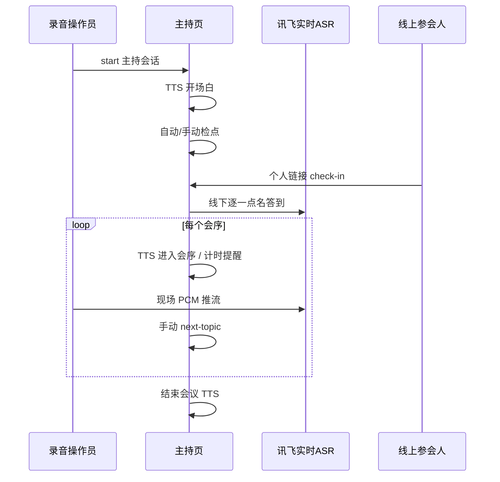
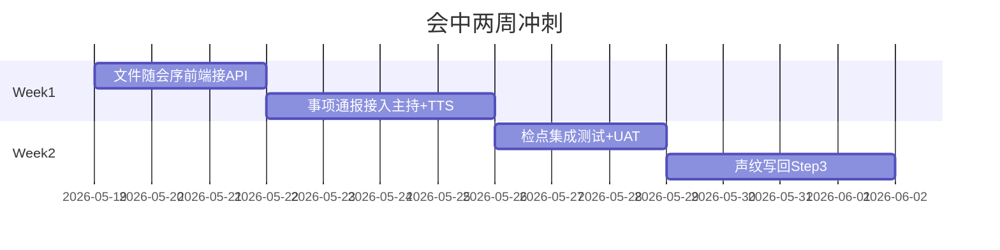

# smart-meeting-java — 会中模块进度评估

> 编制依据：进度矩阵（会中 10 项）+ 代码库对照（2026-05-19）  
> 范围：仅「会中」阶段；会前/会后/闭环不在本文范围。

---

## 1. 评估结论摘要

| 维度 | 结论 |
|------|------|
| 矩阵「已完成」6 项 | 多数与代码一致，**优先做生产 UAT**，不必重复开发 |
| 矩阵「开发中」4 项 | 代码侧平均约 **40%**；按「会中全自动」目标整体约 **65%** |
| 需校正矩阵 | 检点（线上已实现）、议题自动切换（应下调）、议题加时（人工已有） |

**与矩阵明显不一致的 3 处：**

1. **会议检点**：线上个人链接打开即 `AUTO_ONLINE` 检点已实现；矩阵备注「线上入会自动签到待优化」已过时。
2. **议题到时自动切换**：矩阵标 100%；代码为议题到时 **仅 TTS 提醒**，须手动点「下一议题」（约 30%）。
3. **议题加时**：矩阵标 0%；主持页 `extend-topic`（1/3/5/10 分钟）+ TTS 确认 **已有**（约 40%）；缺语音交互加时。

---

## 2. 会中流程（当前实现）

```text
录音操作员开录音推流
    ↓
主持页 start → TTS 开场白 →（可选）自动进入混合检点
    ↓
线上：个人链接 check-in（ONLINE_INVENTORY）
线下：ASR 逐一点名答到（OFFLINE_ROLL_CALL）
    ↓
循环各会序：TTS「进入会序」+ 计时提醒 + 现场 ASR 转写
    ↓
人工「下一议题」/「跳过」/「加时」
    ↓
结束会议 → TTS 收尾
```



---

## 3. 逐项进度对照表

| # | 功能点 | 矩阵状态 | 矩阵完成度 | 代码核实完成度 | 核心实现 | 主要缺口 |
|---|--------|----------|------------|----------------|----------|----------|
| 1 | AI 自动开场 | 已完成 | 100% | **95%** | `MeetingHostSessionService.start`：议程、群静音、TTS 开场、条件自动检点 | 与定时发起未衔接（属会前） |
| 2 | 会议检点点名 | 已完成 | 100% | **90%** | 混合检点 `ONLINE_INVENTORY` → `OFFLINE_ROLL_CALL`；`ParticipantCheckInService`、`RollCallAffirmationMatcher` | 缺集成测试；线下不校验说话人身份（设计如此） |
| 3 | 往期 to-do 审议 | 开发中 | 50% | **45%** | `MatterProgressReportService`；`getPreviousProgress` API | **未接入主持流程**；仅录音页手动生成 + 浏览器 TTS |
| 4 | 会议序列自动切换 | 已完成 | 100% | **85%** | `nextTopic` / `skipTopic` + TTS | 依赖人工点按钮；检点类会序结束可自动下一议题 |
| 5 | 文件随会序切换 | 开发中 | 20% | **25%** | `mergePresetAgendaDocs` + `GET /agenda-doc-content`；主持页 `syncAgendaDocPanel` | **主持页未调用** agenda-doc-content，仅展示外链 |
| 6 | 实时 ASR + 声纹 | 开发中 | 50% | **55%** | `AsrBridgeService` 全链路 + 检点钩子；声纹注册页/API | 实时 `speakerId` 为 Speaker N；纪要 Step3 声纹 TODO |
| 7 | 议题时间提醒 | 已完成 | 100% | **95%** | `tick` 议题/会议倒计时 TTS | 生产核对 `meeting.host.reminder.*` |
| 8 | 议题加时 | 开发中 | 0% | **40%** | `POST /extend-topic` + 主持页 + TTS | 语音交互加时未做（矩阵 09-30） |
| 9 | 议题到时自动切换 | 已完成 | 100% | **30%** | 到时 TTS「请点击下一议题」 | **不自动切题**；仅检点结束可自动 next |
| 10 | TTS 语音合成 | 已完成 | 100% | **95%** | `XfyunOnlineTtsSynthesizeService` + 主持 WS + PCM 队列 | 弱网重试等可优化 |

---

## 4. 能力分层（排期用）

### A 层 — 已可生产验证

| 功能 | 验证要点 |
|------|----------|
| AI 开场 + TTS | 会务类型 1～5、主持页 start、飞书群静音 |
| 混合检点 | 线上单聊链接 → `ONLINE_INVENTORY` 状态更新；线下答到 |
| 议程切换 | next/skip + 列表高亮 |
| 时间提醒 | 议题/会议倒计时 TTS |
| 实时 ASR | 录音页推流 → 转写入库 → 页面展示 |

### B 层 — 有代码未闭环

| 功能 | 达到 80% 还差什么 |
|------|-------------------|
| 往期 to-do 审议 | 进入会序 2 自动 `matter-progress-report` → 主持区展示 → TTS 摘要播报 |
| 文件随会序 | 主持页调用 `agenda-doc-content` 渲染正文（API 已存在、零前端调用） |
| 声纹 | 会后 identify 写回 transcript；可选实时 rl→姓名 |
| 议题加时 | 文档化现有按钮；语音加时单独立项 |

### C 层 — 矩阵与代码不一致

| 功能 | 建议 |
|------|------|
| 议题到时自动切换 | 矩阵改为「提醒已完成 / 自动切题未完成」，或实现可配置自动切题 |
| 会议检点备注 | 改为「线上个人链接自动检点已上线（2026-05 MVP）」 |

---

## 5. 分工 Todo 清单

### 5.1 开发侧（AI / 工程）— 会中

#### P0 — 对齐矩阵 05-22 / 05-29

- [ ] 主持页 `host-meeting.html`：切会序时 `fetch` `GET /api/v1/meetings/{id}/agenda-doc-content?agendaIndex=`
- [ ] 会序 index=1（或 `int_matter_progress_doc_config.agenda_index`）进入时：触发 `matter-progress-report`，主持区展示 + `speakAsync` 播报摘要
- [ ] `MatterProgressReportService`：Docx 失败降级、OpenClaw 超时处理；补集成测试
- [ ] `ParticipantCheckIn` + `recordOnlineCheckIn` 集成测试
- [ ] 更新 `docs/product/混合参会检点-用户手册.md` 与进度矩阵检点备注

#### P1 — 声纹（矩阵 06-30）

- [ ] 实现 `MinuteGenerationService` Step3：`XfyunIsvClient.identify` → 更新 `TranscriptSegment.speakerId`
- [ ] （可选）实时 ASR `rl` → featureId → 参会人姓名
- [ ] 离线校正写回 transcript

#### P1 — 议程控制（需产品拍板）

- [ ] 可配置 `meeting.host.auto-advance-topic-on-timeout`（默认 false）
- [ ] 语音加时：ASR 意图 → `extendTopicTime`（可二期，09-30）

#### P2 — 体验

- [ ] TTS 弱网重试；检点/事项通报话术可配置
- [ ] 主持页合并展示「上次待办」`getPreviousProgress`（若产品需要）

### 5.2 你方 — 会中

#### 产品决策

- [ ] 议题到时：维持手动「下一议题」 vs 自动切题
- [ ] 往期审议数据源：OpenClaw 多维表 vs 飞书 Docx vs 并存
- [ ] 语音加时是否纳入本期（09-30）

#### 环境与配置

- [ ] `MEETING_HOST_ENABLED=true`、主持/录音 JWT、`BASE_URL` HTTPS
- [ ] 混合检点：`attendance_mode` 迁移、参会人 `open_id`、飞书单聊权限
- [ ] `int_matter_progress_doc_config` 按预设 + `agenda_index` 配置飞书 URL/token
- [ ] OpenClaw 分支：`OPENCLAW_COMP_BITABLE_PROGRESS`、CLI、综合管理会预设码
- [ ] 声纹注册：应到人员完成 `/voiceprint` 注册

#### UAT（建议日期）

| 日期 | 验收项 | 通过标准 |
|------|--------|----------|
| 05-22 | 文件随会序 | 切到含飞书资料的会序，主持页**正文**自动加载 |
| 05-29 | 往期 to-do 审议 | 进入会序 2 自动生成通报 + TTS，无需录音页手点 |
| 随时 | 混合检点 | 线上 60s 盘点 + 线下点名全流程 |
| 随时 | 议程控制 | 加时/下一议题/到时提醒符合预期 |
| 06-30 | 声纹 | 纪要中显示真实姓名（非 Speaker 0） |

#### 矩阵校正（会中 4 行）

- [ ] 检点备注：线上个人链接自动检点已上线
- [ ] 议题自动切换：30% 或拆行「提醒✅ / 自动切题❌」
- [ ] 议题加时：40%（主持页人工加时已有）
- [ ] 文件随会序：注明「后端 API 有，主持页未接」

---

## 6. 建议两周冲刺顺序

| 周 | 开发侧 | 你方 |
|----|--------|------|
| W1 | 主持页接 agenda-doc-content；会序 2 自动通报+TTS | 配 `MatterProgressDocConfig`、飞书资料 URL |
| W2 | 检点集成测试；声纹 Step3 写回 | 混合会 UAT；推动声纹注册 |



---

## 7. 关键代码索引

| 模块 | 路径 |
|------|------|
| 主持核心 | `meeting-server/src/main/java/com/smartmeeting/service/host/MeetingHostSessionService.java` |
| 主持 API | `meeting-server/src/main/java/com/smartmeeting/api/controller/MeetingHostController.java` |
| 主持 UI | `meeting-server/src/main/resources/static/host-meeting.html` |
| ASR | `meeting-server/src/main/java/com/smartmeeting/service/AsrBridgeService.java` |
| 事项通报 | `meeting-server/src/main/java/com/smartmeeting/service/MatterProgressReportService.java` |
| 会序资料 API | `meeting-server/src/main/java/com/smartmeeting/api/controller/MeetingController.java` → `agenda-doc-content` |
| 检点 | `meeting-server/src/main/java/com/smartmeeting/service/ParticipantCheckInService.java` |
| 配置 | `meeting-server/src/main/resources/application.yml` → `meeting.host.*` |
| 混合检点手册 | `docs/product/混合参会检点-用户手册.md` |

---

## 8. 相关文档

- [混合参会检点-用户手册](product/混合参会检点-用户手册.md)
- [混合参会-音频与检点策略](product/混合参会-音频与检点策略.md)
- [智能会议系统-全流程闭环评估报告](assessments/智能会议系统-全流程闭环评估报告.md)

---

*文档版本：v1.0 · 2026-05-19*
