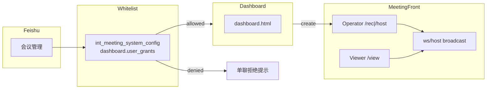
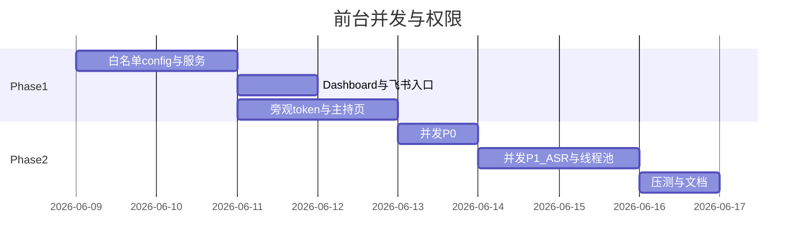

# 智能会议 — 开发计划：前台多人、并发改造、工作台白名单

> 文档版本：2026-06-08  
> 状态：**已完成**（Phase 1 + Phase 2 P0/P1 核心；压测与 P2 多实例后置）  
> 预估工期：**6–8 人日**（Phase 1 约 3.5 人日 + Phase 2 约 3–4 人日）  
> 关联评估：[assessments/并发能力评估与改造方案.md](assessments/并发能力评估与改造方案.md)  
> 发版衔接：[版本迭代历史.md](版本迭代历史.md) §7.6（建议纳入 **0.33 / 0.34**）

---

## 1. 背景与目标

| 诉求 | 说明 |
|------|------|
| 工作台权限 | 飞书「会议管理」入口需 **白名单**；默认拒绝未授权用户 |
| 多人前台 | **1 主控**（录音+主持操作）+ **多旁观**（会序/资料/倒计时同步） |
| 多场并行 | 不同创建人可同时各开一场会；AI/纪要/ASR 不全局堵死 |
| 会中体验 | 飞书「会议管理」在群聊/单聊均发「智能会议前台」交互卡片 |

**本期不做**：按 preset/群 chat 授权；多人同时推流；多人同时点下一议题；P2 多实例 Redis 会话。

---

## 2. 架构概览



---

## 3. Phase 1 — 权限与多人前台（约 3.5 人日）

### 3.1 Dashboard 白名单（不新增表）

**存储**：复用 [`int_meeting_system_config`](数据库表结构说明.md) §10

| 项 | 值 |
|----|-----|
| `config_key` | `dashboard.user_grants` |
| `category` | `dashboard` |

**JSON 结构**：

```json
{
  "defaultDeny": true,
  "entries": [
    {
      "feishuUserId": "b7319b67",
      "userName": "郭儒杰",
      "enabled": true,
      "canCreateMeeting": true,
      "canEndMeeting": false,
      "canRegisterVoiceprint": true,
      "remark": ""
    }
  ]
}
```

**权限策略（已确认）**：

- 不在 `entries` 或 `enabled=false` → **403 拒绝**
- 在名单内 → **人人可注册声纹**（`canRegisterVoiceprint` 默认 true）
- 子集可 **建会 / 恢复 / 结束会**（`canCreateMeeting` / `canEndMeeting`）

**实现要点**：

| 模块 | 文件 | 改动 |
|------|------|------|
| 授权服务 | `DashboardGrantService.java`（新） | 读/解析 `dashboard.user_grants`，缓存 + internal reload |
| Dashboard API | `DashboardController.java` | 各接口 `requireGrant(...)`；`/me` 返回 `permissions` |
| 飞书入口 | `FeishuCommandHandler.handleOpenDashboard` | 权限校验；当前会话发 dashboard 交互卡片 |
| Admin | [`users.js`](meeting-admin-server/src/main/resources/static/admin/modules/users.js) 用户管理 | 编辑用户时维护前台授权 + 页头 defaultDeny；写 system_config + reload |
| 前端 | `dashboard.html` | 按 permissions 显隐建会/结束/声纹区块 |
| 种子 | `schema-seed` 或 `sql-optional` | 幂等 UPSERT 空列表，**无新 DDL** |

**不采用**：扩 `int_user_mapping_feishu` 列（OA 主键与纯飞书授权不符）；`application.yml` 静态名单（不可热改）。

### 3.2 会议前台：主控 + 旁观

| type | can_push_audio | 能力 |
|------|----------------|------|
| `recording` / `host` | true | 主控：录音 WS + 主持写 API |
| `viewer`（新） | false | 旁观：只读 state + agenda-doc-content |
| `join` | false | 仅到会（不变） |

**实现要点**：

| 模块 | 改动 |
|------|------|
| `JwtUtil` | `generateViewerMeetingToken`；`verifyRecordingPageToken` 接受 `viewer` |
| `MeetingHostController` | `/state` 等只读允许 viewer；写操作仍 `verifyHostOperatorToken` |
| `MeetingController` | 只读接口接受 viewer token |
| `MeetingHostSessionService` | `operatorFeishuUserId`：先 `start` 者得主控；`host_state` 带出主控姓名 |
| `host-meeting.html` | viewer/非主控：隐藏操作按钮；保留 WS 与资料区；「复制旁观链接」 |
| `RecorderPageController` | 新增 `/view/{meetingId}` |
| 新 API | `GET /api/v1/meetings/{id}/viewer-page-url`（操作员 token） |

**保持不变**：

- `AudioWebSocketHandler`：每场 **1 路** 推流
- `MeetingHostWebSocketHandler`：多 session **广播**（旁观同步）

---

## 4. Phase 2 — 并发改造（约 3–4 人日）

对齐 [并发能力评估与改造方案.md](assessments/并发能力评估与改造方案.md) **P0 全量 + P1 核心**。

### 4.1 P0（约 1 人日）

| # | 改动 | 文件 |
|---|------|------|
| 1 | `openclaw.max-concurrent-invokes` 默认 5 | `OpenClawMcpProvider.java`、`application.yml` |
| 2 | RestTemplate connect/read 超时 | `RestTemplateConfig.java` |
| 3 | `generateMinute` 拆事务（读/写小事务，中间无事务调 LLM/OpenClaw/飞书） | `MinuteGenerationService.java` |
| 4 | HikariCP `maximum-pool-size: 40`（prod） | `application-prod.yml` |

### 4.2 P1 核心（约 2–3 人日）

| # | 改动 | 说明 |
|---|------|------|
| 5 | `XfyunRealtimeClient` → 按 `meetingId` 连接池 | `meeting.asr.max-concurrent-sessions` |
| 6 | `meetingTaskExecutor` core/max 可配置（默认 16/32） | `AsyncConfig.java` |
| 7 | OpenClaw WS sessionKey 隔离 + 防串台校验 | 与 `runKey` 对齐；压测 3–5 路 |

### 4.3 多场建会规则（文档化）

- 活跃会议限制按 **创建人** `creator_id`（`FeishuMeetingStartCoordinator`）→ 不同主持人可各有一场
- **限制**：同一飞书群 `chat_id` 同时仅建议一场

---

## 5. 测试与文档

### 5.1 测试

- 单测：`DashboardGrantServiceTest`、viewer JWT、`MeetingHostController` 权限矩阵
- 集成：白名单拒绝 / 部分权限 / 主控+旁观 WS / 2 创建人并行建会
- 压测：2 场同时结束纪要 + OpenClaw 并行 5 路

### 5.2 文档同步（交付时）

| 文档 | 内容 |
|------|------|
| [数据库表结构说明.md](数据库表结构说明.md) §10 | `dashboard.user_grants` 配置说明 |
| [USER-MANUAL.md](USER-MANUAL.md) | 工作台权限、旁观链接、会中「会议管理」 |
| [开关手册.md](开关手册.md) | `openclaw.max-concurrent-invokes` 等 |
| [并发能力评估与改造方案.md](assessments/并发能力评估与改造方案.md) | §6 完成项勾选 |
| [版本迭代历史.md](版本迭代历史.md) | §2 总览 + §7.6 状态更新 |

---

## 6. 排期建议



**Phase 1 可先上线**：白名单 + 旁观。  
**Phase 2 上线后**：多场并行与 AI/纪要排队改善。

---

## 7. 风险与缓解

| 风险 | 缓解 |
|------|------|
| OpenClaw 并行串台 | sessionKey/runKey 隔离 + `AgendaBriefingMarkdownValidator` |
| 主控占用争议 | 首期「先连先得」；后续 admin 强制释放（后置） |
| 白名单 JSON 变大 | 预计 <50 人；>200 人再评估专表 |

---

## 8. 任务清单（开发跟踪）

- [x] `DashboardGrantService` + `dashboard.user_grants` 种子与 reload
- [x] `DashboardController` / `FeishuCommandHandler` 权限与 dashboard 卡片
- [x] Admin 用户管理集成 `dashboard.user_grants`（原 dashboard-grants 侧栏已并入）
- [x] `dashboard.html` permissions UI
- [x] viewer JWT + `/view` + 主控占用 + 旁观链接 API
- [x] `host-meeting.html` 旁观模式
- [x] 并发 P0（Semaphore、RestTemplate、拆事务、HikariCP）
- [x] 并发 P1（ASR 池、线程池、OpenClaw sessionKey 隔离）
- [x] 测试 + 文档 sweep（单测；集成/压测建议上线前手工执行 §5.1）
