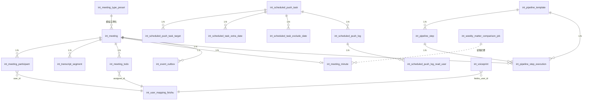

# smart-meeting-java 数据库表结构说明

> 文档生成：2026-06-07  
> 数据库：`intelligence`  
> 字符集：utf8mb4 / utf8mb4_unicode_ci  
> 涵盖项目：`smart-meeting-java`（meeting-server + meeting-admin-server + matter-progress-core）、`feishu-scheduled-bot`  
> 权威 DDL 来源：
> - meeting-server 部分：[`meeting-server/src/main/resources/schema.sql`](../meeting-server/src/main/resources/schema.sql)（v0.10）
> - feishu-scheduled-bot 部分：[`sql/schema-final-ddl.sql`](../sql/schema-final-ddl.sql)（Flyway V1–V6）

---

## 表清单总览

| 序号 | 表名 | 归属项目 | 用途简述 |
| ---- | ---- | -------- | -------- |
| 1 | `int_meeting` | meeting-server | 会议主表，记录每次会议的核心信息 |
| 2 | `int_meeting_type_preset` | meeting-server | 会议类型预设模板（1–5 类例会 + 6 自定义） |
| 3 | `int_meeting_participant` | meeting-server | 参会人表，记录每场会议的参会人及签到状态 |
| 4 | `int_transcript_segment` | meeting-server | 语音转写分段表，存储实时/离线 ASR 结果 |
| 5 | `int_meeting_todo` | meeting-server | 待办事项表，AI 从纪要中提取的行动项 |
| 6 | `int_meeting_minute` | meeting-server | 会议纪要正文表（Markdown 格式） |
| 7 | `int_voiceprint` | meeting-server | 声纹特征表，用于说话人识别 |
| 8 | `int_user_mapping_feishu` | meeting-server | OA 用户与飞书用户 ID 映射表 |
| 9 | `int_weekly_matter_comparison_job` | matter-progress-core | 每周事项对比定时任务配置 |
| 10 | `int_meeting_system_config` | meeting-server | 会议系统可热改参数（运行时配置） |
| 11 | `int_meeting_system_config_audit` | meeting-server | 系统参数变更审计日志 |
| 12 | `int_event_outbox` | meeting-server | 事务外盒（Transactional Outbox）事件表 |
| 13 | `int_pipeline_template` | meeting-server | Pipeline 流水线模板定义 |
| 14 | `int_pipeline_step` | meeting-server | Pipeline 步骤定义 |
| 15 | `int_pipeline_step_execution` | meeting-server | Pipeline 步骤运行时记录 |
| 16 | `int_processed_command` | meeting-server | 幂等命令处理记录（防重复执行） |
| 17 | `int_scheduled_push_task` | feishu-scheduled-bot | 飞书定时推送任务配置 |
| 18 | `int_scheduled_push_task_target` | feishu-scheduled-bot | 推送任务的多接收方 |
| 19 | `int_scheduled_task_extra_date` | feishu-scheduled-bot | 额外推送日（非 cron 触发的特殊日期） |
| 20 | `int_scheduled_task_exclude_date` | feishu-scheduled-bot | 排除推送日（跳过推送的日期） |
| 21 | `int_scheduled_push_log` | feishu-scheduled-bot | 飞书推送流水日志 |
| 22 | `int_scheduled_push_log_read_user` | feishu-scheduled-bot | 推送消息已读用户明细 |

> **已废弃**：`int_matter_progress_doc_config` 已在 v0.15 下线，资料配置内嵌到 `int_meeting_type_preset.host_agenda` v2 JSON 中。

---

## 表关系图



---

## 一、智能会议核心表

### 1. `int_meeting` — 会议主表

**用途**：记录每次会议的核心信息，是整个系统的聚合根（Aggregate Root）。所有其他表均通过 `meeting_id` 外键关联到本表。

**使用场景**：
- 飞书机器人「开始会议」时插入一条记录
- 录音、主持、签到、纪要等流程更新对应字段
- 会议结束后状态流转为 `COMPLETED`

**字段说明**：

| 字段 | 类型 | 必填 | 默认值 | 说明 |
| ---- | ---- | ---- | ------ | ---- |
| `id` | VARCHAR(36) | ✅ | — | 会议 UUID，主键 |
| `title` | VARCHAR(200) | ✅ | — | 会议主题 |
| `agenda` | JSON | — | — | 会务议程：JSON 字符串数组，如 `["议题1","议题2"]` |
| `host_agenda` | JSON | — | — | AI 主持议程模板，结构 `{"items":[{"title","minutes","detail?","feishuDocUrl?","feishuDocs"?}]}` |
| `company` | VARCHAR(200) | ✅ | — | 所属集团 |
| `department` | VARCHAR(200) | — | — | 集团部门 |
| `group_name` | VARCHAR(200) | ✅ | — | 会议组（如"周一例会"） |
| `preset_type_code` | TINYINT | — | — | 会议类型预设：1–5 对应 `int_meeting_type_preset.code`，6=自定义，NULL=无预设 |
| `status` | VARCHAR(30) | ✅ | ISSUE_COLLECTING | 会议状态，枚举值见下方状态机 |
| `creator_id` | VARCHAR(64) | ✅ | — | 发起人飞书 user_id |
| `chat_id` | VARCHAR(100) | — | — | 飞书群聊 ID，用于通知推送 |
| `room_id` | VARCHAR(64) | — | — | 会议室或视频会议 ID |
| `meeting_scenario` | VARCHAR(20) | ✅ | OFFLINE | 会议场景：`OFFLINE`=线下、`HYBRID`=混合、`ONLINE`=纯线上 |
| `source_audio_url` | VARCHAR(1000) | — | — | 云端录音文件 URL（混合/纯线上场景兜底） |
| `previous_meeting_id` | VARCHAR(36) | — | — | 上次会议 ID，用于关联上下次会议 |
| `scheduled_time` | DATETIME | — | — | 预定开会时间 |
| `actual_start_time` | DATETIME | — | — | 实际开始时间（录音开始时写入） |
| `actual_end_time` | DATETIME | — | — | 实际结束时间 |
| `duration_seconds` | INT | — | — | 录音总时长（秒） |
| `audio_path` | VARCHAR(500) | — | — | 音频本地存储路径 |
| `doc_url` | VARCHAR(500) | — | — | 飞书纪要文档 URL |
| `doc_token` | VARCHAR(100) | — | — | 飞书文档 token（用于 API 访问） |
| `recording_url` | VARCHAR(500) | — | — | 历史完整 URL（已废弃写入，仅只读兼容） |
| `recording_token` | VARCHAR(2048) | — | — | 录音页 JWT；完整 URL 由 `meeting.base-url` + token 动态拼接 |
| `created_at` | DATETIME | ✅ | CURRENT_TIMESTAMP | 创建时间 |
| `updated_at` | DATETIME | ✅ | CURRENT_TIMESTAMP | 更新时间（自动维护） |

**会议状态枚举**（`status` 字段）：

| 状态值 | 含义 |
| ------ | ---- |
| `ISSUE_COLLECTING` | 议题收集中（建会后初始状态） |
| `CONFIRMING` | 议题确认中 |
| `CONFIRMED` | 议题已确认，待开会 |
| `IN_PROGRESS` | 会议进行中（录音中） |
| `PAUSED` | 会议暂停（静音自动暂停） |
| `MINUTE_GENERATING` | 纪要生成中 |
| `COMPLETED` | 会议已完成 |

**索引**：
- `idx_meeting_status` — 按状态查询
- `idx_meeting_creator` — 按创建人查询
- `idx_meeting_previous` — 查找上次会议
- `idx_meeting_company_group` — 按集团+会议组查询

---

### 2. `int_meeting_type_preset` — 会议类型预设模板

**用途**：定义 5 类固定例会模板 + 1 类自定义模板。建会时可选择预设，自动填充议程、参会人、主持模板等信息。

**使用场景**：
- meeting-admin-server 提供管理界面 CRUD
- meeting-server 建会时读取模板，填充 `int_meeting` 的 `host_agenda` 等字段
- `host_agenda` v2 格式内嵌了飞书资料配置（替代已废弃的 `int_matter_progress_doc_config`）

**字段说明**：

| 字段 | 类型 | 必填 | 说明 |
| ---- | ---- | ---- | ---- |
| `code` | TINYINT | ✅ | 主键，1–5 固定类型，6 自定义 |
| `display_name` | VARCHAR(120) | ✅ | 列表展示名（如"综合管理会"） |
| `company` | VARCHAR(200) | ✅ | 所属集团 |
| `department` | VARCHAR(200) | — | 部门 |
| `group_name` | VARCHAR(200) | ✅ | 会议组 |
| `schedule_note` | VARCHAR(500) | — | 召开时间说明（如"每周一上午 9:00"） |
| `agenda_summary` | VARCHAR(1000) | — | 会议内容摘要 |
| `organizer_name` | VARCHAR(100) | — | 组织人姓名 |
| `leader_name` | VARCHAR(100) | — | 会议主导/主持人 |
| `participants_names` | TEXT | — | 与会人姓名，逗号或顿号分隔 |
| `host_agenda` | JSON | — | AI 主持议题模板 v2，结构：`{"version":2,"items":[{"title","minutes","docs":[{"configName","role","slot","url"}]}]}` |

> **注意**：`host_agenda` v2 的 `docs` 数组内嵌了资料配置（SOURCE/OUTPUT/BOTH），取代了原 `int_matter_progress_doc_config` 表。

---

### 3. `int_meeting_participant` — 参会人表

**用途**：记录每场会议的参会人名单，包括签到状态、声纹绑定、待办统计等。

**使用场景**：
- 建会时根据模板预填参会人
- 会中盘点/签到时更新 `checked_in_at`、`check_in_source`
- 会后统计 `todo_count`、`completed_count`

**字段说明**：

| 字段 | 类型 | 必填 | 默认值 | 说明 |
| ---- | ---- | ---- | ------ | ---- |
| `id` | VARCHAR(36) | ✅ | — | 记录 UUID，主键 |
| `meeting_id` | VARCHAR(36) | ✅ | — | 会议 ID，外键 → `int_meeting(id)` |
| `preset_type_code` | TINYINT | — | — | 会议类型预设（冗余自 `int_meeting`，便于按类型查询） |
| `user_id` | VARCHAR(64) | ✅ | — | 飞书 user_id |
| `name` | VARCHAR(100) | ✅ | — | 参会人姓名 |
| `status` | VARCHAR(20) | ✅ | PENDING | 确认状态：`PENDING`=待确认、`CONFIRMED`=已确认、`DECLINED`=已拒绝 |
| `attendance_mode` | VARCHAR(20) | ✅ | OFFLINE | 参会方式：`OFFLINE`=线下答到点名、`ONLINE`=线上链接盘点 |
| `checked_in_at` | DATETIME | — | — | 到场登记时间 |
| `check_in_source` | VARCHAR(30) | — | — | 签到来源：`AUTO_ONLINE`=线上自动、`ROLL_CALL`=点名、`MANUAL`=手动、`TIMEOUT`=超时默认 |
| `feature_id` | VARCHAR(100) | — | — | 讯飞声纹特征 ID，关联 `int_voiceprint.feature_id` |
| `voiceprint_ready` | TINYINT(1) | ✅ | 0 | 声纹是否就绪（0=否，1=是） |
| `todo_count` | INT | ✅ | 0 | 该参会人在本次会议的待办总数 |
| `completed_count` | INT | ✅ | 0 | 已完成待办数 |

**约束**：
- 外键：`meeting_id` → `int_meeting(id)` ON DELETE CASCADE
- 唯一键：`uk_meeting_user (meeting_id, user_id)` — 同一会议同一用户只能有一条记录

**索引**：
- `idx_participant_meeting` — 按会议查询参会人
- `idx_participant_preset` — 按预设类型查询
- `idx_participant_userid` — 按用户查询参会记录

---

### 4. `int_transcript_segment` — 语音转写分段表

**用途**：存储 ASR（语音识别）返回的转写结果，每段文字对应一个时间区间。支持实时 ASR（会中）和离线 ASR（会后校正）。

**使用场景**：
- 会中：`AudioWebSocketHandler` 接收浏览器 PCM 音频 → `XfyunRealtimeClient` 实时 ASR → 写入本表
- 会后：`OfflineCorrectionService` 离线 ASR + 声纹识别 → 写入本表
- 纪要生成时读取本表拼接完整转写文本

**字段说明**：

| 字段 | 类型 | 必填 | 默认值 | 说明 |
| ---- | ---- | ---- | ------ | ---- |
| `id` | VARCHAR(36) | ✅ | — | 分段 UUID，主键 |
| `meeting_id` | VARCHAR(36) | ✅ | — | 会议 ID，外键 → `int_meeting(id)` |
| `preset_type_code` | TINYINT | — | — | 会议类型预设（冗余） |
| `speaker_id` | VARCHAR(100) | — | — | 说话人标识（如 `Speaker 0`、声纹特征 ID） |
| `speaker_name` | VARCHAR(100) | — | — | 说话人姓名（声纹识别后回写） |
| `start_time_ms` | INT | ✅ | — | 开始时间偏移（毫秒，相对录音起点） |
| `end_time_ms` | INT | ✅ | — | 结束时间偏移（毫秒） |
| `text` | TEXT | ✅ | — | 转写/校正后的文字内容 |
| `is_final` | TINYINT(1) | ✅ | 0 | 是否最终结果（0=中间结果，1=最终定稿） |
| `confidence` | DOUBLE | — | — | ASR 置信度（0.0–1.0） |
| `corrected` | TINYINT(1) | ✅ | 0 | 是否已校正（0=原始 ASR 结果，1=经离线校正） |

**约束**：
- 外键：`meeting_id` → `int_meeting(id)` ON DELETE CASCADE

**索引**：
- `idx_segment_meeting_time (meeting_id, start_time_ms)` — 按会议+时间排序查询
- `idx_segment_preset` — 按预设类型查询

---

### 5. `int_meeting_todo` — 待办事项表

**用途**：存储 AI 从会议纪要中提取的行动项（待办），支持责任人分配、优先级、截止时间、提醒等。

**使用场景**：
- `TodoExtractionService` 在纪要生成后调用 LLM 提取待办 → 写入本表
- `TodoReminderScheduler` 定时扫描即将到期的待办 → 飞书推送提醒
- 下次会议时读取未完成待办 → 生成进度通报

**字段说明**：

| 字段 | 类型 | 必填 | 默认值 | 说明 |
| ---- | ---- | ---- | ------ | ---- |
| `id` | VARCHAR(36) | ✅ | — | 待办 UUID，主键 |
| `meeting_id` | VARCHAR(36) | ✅ | — | 来源会议 ID，外键 → `int_meeting(id)` |
| `preset_type_code` | TINYINT | — | — | 会议类型预设（冗余） |
| `content` | TEXT | ✅ | — | 待办内容描述 |
| `assignee_id` | VARCHAR(64) | ✅ | — | 责任人飞书 user_id |
| `assignee_name` | VARCHAR(100) | — | — | 责任人姓名 |
| `operator_id` | VARCHAR(64) | — | — | 经办人飞书 user_id（实际执行人，可与责任人相同） |
| `operator_name` | VARCHAR(100) | — | — | 经办人姓名 |
| `status` | VARCHAR(20) | ✅ | PENDING | 待办状态：`PENDING`=待处理、`IN_PROGRESS`=进行中、`COMPLETED`=已完成、`BLOCKED`=阻塞 |
| `priority` | VARCHAR(10) | ✅ | MEDIUM | 优先级：`HIGH`、`MEDIUM`、`LOW` |
| `deadline` | DATETIME | — | — | 截止时间 |
| `completed_at` | DATETIME | — | — | 完成时间 |
| `completion_note` | TEXT | — | — | 完成说明/备注 |
| `block_reason` | TEXT | — | — | 卡点/延期原因（`status=BLOCKED` 时填写） |
| `last_remind_at` | DATETIME | — | — | 上次提醒时间 |
| `remind_count` | INT | ✅ | 0 | 累计提醒次数 |
| `next_meeting_id` | VARCHAR(36) | — | — | 下次会议 ID（待办将在下次会议中通报） |
| `reported_in_next` | TINYINT(1) | ✅ | 0 | 是否已在下次会议中通报（0=否，1=是） |
| `created_at` | DATETIME | ✅ | CURRENT_TIMESTAMP | 创建时间 |

**约束**：
- 外键：`meeting_id` → `int_meeting(id)` ON DELETE CASCADE

**索引**：
- `idx_todo_meeting` — 按会议查询待办
- `idx_todo_preset` — 按预设类型查询
- `idx_todo_assignee` — 按责任人查询
- `idx_todo_operator` — 按经办人查询
- `idx_todo_status_deadline (status, deadline)` — 扫描即将到期/未完成的待办

**权限说明（v0.22）**：
- **责任人**：可标记完成/挂起/延期；可更新进度、上传附件
- **经办人**：仅可更新进度、上传附件（不可改终态）
- **Admin**：可强制改状态/删除，写入 `int_meeting_todo_audit`

---

### 5a. `int_meeting_todo_progress` — 待办进度时间线

| 字段 | 类型 | 说明 |
| ---- | ---- | ---- |
| `id` | VARCHAR(36) | 主键 |
| `todo_id` | VARCHAR(36) | 外键 → `int_meeting_todo` |
| `author_id` / `author_name` | VARCHAR | 提交人 |
| `author_role` | VARCHAR(20) | `ASSIGNEE` 或 `OPERATOR` |
| `progress_text` | TEXT | 进度说明 |
| `progress_percent` | TINYINT | 可选 0–100 |
| `created_at` | DATETIME | 创建时间 |

---

### 5b. `int_meeting_todo_attachment` — 待办附件

| 字段 | 类型 | 说明 |
| ---- | ---- | ---- |
| `id` | VARCHAR(36) | 主键 |
| `todo_id` | VARCHAR(36) | 外键 |
| `progress_id` | VARCHAR(36) | 可选关联进度记录 |
| `uploader_id` / `uploader_name` | VARCHAR | 上传人 |
| `file_name` | VARCHAR(255) | 原始文件名 |
| `storage_path` | VARCHAR(500) | 服务器相对路径 |
| `file_size` | BIGINT | 字节 |
| `mime_type` | VARCHAR(128) | MIME |
| `created_at` | DATETIME | 上传时间 |

---

### 5c. `int_meeting_todo_audit` — Admin 强制操作审计

| 字段 | 类型 | 说明 |
| ---- | ---- | ---- |
| `id` | BIGINT | 自增主键 |
| `todo_id` | VARCHAR(36) | 待办 ID |
| `action` | VARCHAR(32) | `ADMIN_FORCE_STATUS` / `ADMIN_DELETE` 等 |
| `old_status` / `new_status` | VARCHAR(20) | 状态变更 |
| `operator_id` / `operator_name` | VARCHAR | Admin 操作者 |
| `reason` | VARCHAR(500) | 强制原因（必填） |
| `payload_json` | JSON | 变更快照 |
| `created_at` | DATETIME | 时间 |

---

### 6. `int_meeting_minute` — 会议纪要正文表

**用途**：存储 AI 生成的会议纪要正文（Markdown 格式），与飞书文档双写（飞书 URL 存于 `int_meeting.doc_url`）。

**使用场景**：
- `MinuteGenerationService` 生成纪要后写入
- `MeetingMinuteQueryService` 查询纪要内容
- 每周事项对比任务读取纪要做分析

**字段说明**：

| 字段 | 类型 | 必填 | 默认值 | 说明 |
| ---- | ---- | ---- | ------ | ---- |
| `meeting_id` | VARCHAR(36) | ✅ | — | 会议 UUID，主键（与 `int_meeting` 一对一） |
| `preset_type_code` | TINYINT | — | — | 会议类型预设（冗余） |
| `content_markdown` | LONGTEXT | ✅ | — | 纪要正文 Markdown |
| `content_url` | VARCHAR(300) | — | — | 正文对应文档链接（如飞书纪要 URL） |
| `content_length` | INT UNSIGNED | ✅ | 0 | 正文字符数 |
| `generation_status` | VARCHAR(20) | ✅ | READY | 生成状态：`READY`=成功、`FAILED`=失败、`PARTIAL`=部分成功 |
| `generated_at` | DATETIME | ✅ | — | 纪要生成时间 |
| `updated_at` | DATETIME | ✅ | CURRENT_TIMESTAMP | 更新时间 |

**约束**：
- 外键：`meeting_id` → `int_meeting(id)` ON DELETE CASCADE

**索引**：
- `idx_minute_preset` — 按预设类型查询

---

### 7. `int_voiceprint` — 声纹特征表

**用途**：存储用户的讯飞声纹特征信息，用于会议中的说话人自动识别（ISV 声纹识别）。

**使用场景**：
- `VoiceprintRegisterService` 注册声纹时写入
- 会中 ASR 通过声纹匹配识别说话人
- `VoiceprintService` 更新转写片段的 `speaker_name`

**字段说明**：

| 字段 | 类型 | 必填 | 说明 |
| ---- | ---- | ---- | ---- |
| `id` | VARCHAR(36) | ✅ | 记录 UUID，主键 |
| `user_id` | INT | ✅ | OA 用户 ID |
| `user_name` | VARCHAR(100) | ✅ | 用户姓名 |
| `feishu_user_id` | VARCHAR(100) | — | 飞书 user_id |
| `feature_id` | VARCHAR(100) | ✅ | 讯飞声纹特征 ID（讯飞 ISV API 返回） |
| `group_id` | VARCHAR(100) | — | 讯飞声纹组 ID |
| `registered_at` | DATETIME | ✅ | 注册时间 |
| `expires_at` | DATETIME | ✅ | 过期时间（默认 10 年） |

**索引**：
- `idx_voiceprint_feishu_user (feishu_user_id)` — 按飞书用户查声纹

---

### 8. `int_user_mapping_feishu` — OA 用户与飞书用户 ID 映射表

**用途**：维护内部 OA 系统用户 ID 与飞书企业内 user_id 的映射关系。

**使用场景**：
- 飞书机器人收到消息时，通过 `feishu_user_id` 反查 `user_id`
- 声纹注册时关联 OA 用户
- 各业务表中 `user_id` 字段的身份解析

**字段说明**：

| 字段 | 类型 | 必填 | 说明 |
| ---- | ---- | ---- | ---- |
| `user_id` | INT | ✅ | OA 用户 ID，主键 |
| `user_name` | VARCHAR(100) | ✅ | 用户姓名 |
| `feishu_user_id` | VARCHAR(100) | — | 飞书 user_id（企业内唯一，业务主键） |

**索引**：
- `idx_feishu_user_id (feishu_user_id)` — 按飞书用户查 OA 用户

---

## 二、会议系统运维与配置表

### 9. `int_weekly_matter_comparison_job` — 每周事项对比定时任务

**用途**：配置每周定时执行的「事项对比通报」任务。由 `feishu-scheduled-bot` + `matter-progress-core` 执行，从纪要中提取事项进度并生成对比报告。

**使用场景**：
- meeting-admin-server 提供管理界面 CRUD
- `WeeklyComparisonJobScheduler` 按 cron 扫描到期任务 → 执行对比
- 执行结果写回 `last_run_*` 字段

**字段说明**：

| 字段 | 类型 | 必填 | 默认值 | 说明 |
| ---- | ---- | ---- | ------ | ---- |
| `id` | BIGINT UNSIGNED | ✅ | AUTO_INCREMENT | 主键 |
| `job_name` | VARCHAR(64) | ✅ | — | 任务名，全局唯一 |
| `enabled` | TINYINT UNSIGNED | ✅ | 1 | 是否启用（0=关闭，1=启用） |
| `cron_expression` | VARCHAR(64) | ✅ | `0 10 * * MON` | Quartz cron 表达式（默认每周一 10:00） |
| `schedule_timezone` | VARCHAR(64) | ✅ | Asia/Shanghai | Cron 解析时区 |
| `source_config_names` | JSON | ✅ | — | SOURCE/BOTH 资料配置名列表（JSON 数组） |
| `minute_query_type` | VARCHAR(32) | ✅ | — | 纪要查询类型：`PRESET_LAST_7_DAYS`=按预设查近 7 天、`MEETING_IDS`=按指定会议 ID |
| `minute_query_params` | JSON | ✅ | — | 纪要查询参数 JSON（如 `{"presetTypeCode":1,"days":7}` 或 `{"meetingIds":["id1","id2"]}`） |
| `output_config_name` | VARCHAR(64) | ✅ | — | 写回 config_name（OUTPUT/BOTH） |
| `output_doc_title_tpl` | VARCHAR(200) | ✅ | 事项对比通报-{date} | 飞书文档标题模板，`{date}` 替换为当天日期 |
| `feishu_folder_token` | VARCHAR(128) | — | — | 可选：飞书文档创建目录 token |
| `last_run_at` | DATETIME | — | — | 最近一次执行时间 |
| `last_run_status` | VARCHAR(20) | — | — | 最近执行状态：`SUCCESS`=成功、`FAILED`=失败 |
| `last_run_error` | TEXT | — | — | 失败时错误摘要 |
| `created_at` | DATETIME | ✅ | CURRENT_TIMESTAMP | 创建时间 |
| `updated_at` | DATETIME | ✅ | CURRENT_TIMESTAMP | 更新时间 |

**唯一键**：`uk_weekly_comparison_job_name (job_name)`

---

### 10. `int_meeting_system_config` — 会议系统可热改参数

**用途**：存储 meeting-server **可热加载（Admin 绿标）** 运行时参数，无需重启即可生效。**冷启动（灰标）参数不在此表**，须改 `application.yml` 后重启。

**使用场景**：
- meeting-admin-server 提供管理界面修改（仅 `hotReloadable=true` 且 `requiresRestart=false` 的键）
- meeting-server 通过 internal reload 热加载 DB 覆盖
- 修改时自动写入 `int_meeting_system_config_audit` 审计日志

**字段说明**：

| 字段 | 类型 | 必填 | 默认值 | 说明 |
| ---- | ---- | ---- | ------ | ---- |
| `id` | BIGINT UNSIGNED | ✅ | AUTO_INCREMENT | 主键 |
| `config_key` | VARCHAR(128) | ✅ | — | 参数键（唯一） |
| `category` | VARCHAR(32) | ✅ | host | 参数分组（如 `host`=主持、`asr`=转写、`llm`=大模型） |
| `value_json` | JSON | ✅ | — | 参数值（JSON 格式，支持复杂结构） |
| `description` | VARCHAR(500) | — | — | 参数说明 |
| `updated_at` | DATETIME | ✅ | CURRENT_TIMESTAMP | 更新时间 |

**唯一键**：`uk_meeting_system_config_key (config_key)`

**常用 config_key 示例**：

| config_key | category | 说明 |
| ---------- | -------- | ---- |
| `dashboard.user_grants` | `dashboard` | 工作台白名单与细粒度权限（建会/结束/声纹）；JSON 结构见 [`开发计划.md`](开发计划.md) §3.1；Admin **用户管理** 编辑用户时维护，保存后 internal reload |
| `meeting.host.*` | `host` | AI 主持开关与检点/提醒参数；**可热加载**；Admin **系统参数** 维护 |
| `meeting.minute.*` | `minute` | 会后纪要链路开关；**可热加载** |
| `meeting.asr.*` | `asr` | 实时/离线转写开关；**可热加载**（`post-open-wait-max-ms` 为冷启动，见 config-ranges） |
| `meeting.todo.extraction-enabled` | `minute` | 待办提取；**可热加载**；挂在「自动生成纪要」下 |

**不在此表的配置**：冷启动键（`meeting.kafka.enabled`、`meeting.audio.sample-rate` 等 15 项）与部署/密钥（DB 连接、API Key）仅存于 YAML，见 [config-ranges.md](config-ranges.md)。

出厂默认种子（新环境/空库推荐）：[`schema-seed/meeting-runtime-defaults-prod.sql`](../meeting-server/src/main/resources/schema-seed/meeting-runtime-defaults-prod.sql) — 写入生产策略；`application.yml` 不再承载业务开关。Admin「恢复默认」删除 DB 行后回 **Java/Descriptor 出厂值**。

`dashboard.user_grants` 示例：

```json
{
  "defaultDeny": true,
  "entries": [
    {
      "feishuUserId": "ou_xxx",
      "userName": "张三",
      "enabled": true,
      "canCreateMeeting": true,
      "canEndMeeting": false,
      "canRegisterVoiceprint": true,
      "remark": ""
    }
  ]
}
```

---

### 11. `int_meeting_system_config_audit` — 系统参数变更审计

**用途**：记录 `int_meeting_system_config` 的每次变更，用于追溯和审计。

**使用场景**：
- meeting-admin-server 修改参数时自动插入审计记录
- 运维排查配置变更历史

**字段说明**：

| 字段 | 类型 | 必填 | 说明 |
| ---- | ---- | ---- | ---- |
| `id` | BIGINT UNSIGNED | ✅ | 主键 |
| `config_key` | VARCHAR(128) | ✅ | 参数键 |
| `action` | VARCHAR(16) | ✅ | 操作类型：`UPSERT`=新增/更新、`DELETE`=删除 |
| `old_value_json` | JSON | — | 变更前的值 |
| `new_value_json` | JSON | — | 变更后的值 |
| `operator` | VARCHAR(64) | — | 操作者标识 |
| `created_at` | DATETIME | ✅ | 变更时间 |

**索引**：`idx_config_audit_key_time (config_key, created_at)` — 按参数键+时间查询变更记录

---

### 12. `int_event_outbox` — 事务外盒事件表

**用途**：实现 Transactional Outbox 模式，保证业务操作与事件发布的原子性。业务事务内写入事件，异步调度器轮询发布。

**使用场景**：
- 会议状态变更时写入领域事件（如 `MeetingEndedEvent`）
- `OutboxPoller` 定时扫描 `status=PENDING` 的事件 → 发布到 Kafka 或本地事件总线
- 支持重试和幂等投递

**字段说明**：

| 字段 | 类型 | 必填 | 默认值 | 说明 |
| ---- | ---- | ---- | ------ | ---- |
| `id` | BIGINT UNSIGNED | ✅ | AUTO_INCREMENT | 主键 |
| `aggregate_type` | VARCHAR(64) | ✅ | — | 聚合类型（如 `MEETING`） |
| `aggregate_id` | VARCHAR(64) | ✅ | — | 聚合 ID（如会议 UUID） |
| `event_type` | VARCHAR(64) | ✅ | — | 事件类型（如 `MEETING_ENDED`、`MINUTE_GENERATED`） |
| `event_key` | VARCHAR(128) | ✅ | — | 幂等键（唯一） |
| `payload_json` | JSON | ✅ | — | 事件载荷 JSON |
| `status` | VARCHAR(20) | ✅ | PENDING | 状态：`PENDING`=待发布、`RETRY`=重试中、`PUBLISHED`=已发布、`FAILED`=失败 |
| `retry_count` | INT | ✅ | 0 | 重试次数 |
| `next_retry_at` | DATETIME | ✅ | CURRENT_TIMESTAMP | 下次重试时间 |
| `error_message` | VARCHAR(500) | — | — | 错误摘要 |
| `published_at` | DATETIME | — | — | 最终投递成功时间 |
| `created_at` | DATETIME | ✅ | CURRENT_TIMESTAMP | 创建时间 |
| `updated_at` | DATETIME | ✅ | CURRENT_TIMESTAMP | 更新时间 |

**唯一键**：`uk_event_outbox_key (event_key)` — 幂等

**索引**：
- `idx_event_outbox_scan (status, next_retry_at)` — 扫描待发布事件
- `idx_event_outbox_aggregate (aggregate_type, aggregate_id)` — 按聚合查询事件

---

### 13. `int_pipeline_template` — Pipeline 模板定义

**用途**：定义会议流水线的模板，分为三个阶段：PRE（会前）、MID（会中）、POST（会后）。每个模板包含一组有序步骤。

**使用场景**：
- meeting-admin-server 管理模板 CRUD
- 建会时根据预设类型自动关联 PRE 模板
- 会议结束自动触发 POST 模板

**字段说明**：

| 字段 | 类型 | 必填 | 默认值 | 说明 |
| ---- | ---- | ---- | ------ | ---- |
| `id` | BIGINT UNSIGNED | ✅ | AUTO_INCREMENT | 模板 ID，主键 |
| `template_code` | VARCHAR(64) | ✅ | — | 模板编码（唯一，如 `PRE_DEFAULT`、`POST_STANDARD`） |
| `template_name` | VARCHAR(120) | ✅ | — | 模板名称 |
| `stage` | VARCHAR(16) | ✅ | — | 阶段：`PRE`=会前、`MID`=会中、`POST`=会后 |
| `enabled` | TINYINT(1) | ✅ | 1 | 是否启用 |
| `version_no` | INT | ✅ | 1 | 版本号 |
| `description` | VARCHAR(500) | — | — | 模板说明 |
| `created_at` | DATETIME | ✅ | CURRENT_TIMESTAMP | 创建时间 |
| `updated_at` | DATETIME | ✅ | CURRENT_TIMESTAMP | 更新时间 |

**唯一键**：`uk_pipeline_template_code (template_code)`

---

### 14. `int_pipeline_step` — Pipeline 步骤定义

**用途**：定义模板内的具体执行步骤，每个步骤对应一个 `StepExecutor` 实现类。

**使用场景**：
- 模板内按 `order_no` 排序执行各步骤
- `step_type` 对应 Java 执行器 Bean 名称
- `config_json` 传递步骤特定配置

**字段说明**：

| 字段 | 类型 | 必填 | 默认值 | 说明 |
| ---- | ---- | ---- | ------ | ---- |
| `id` | BIGINT UNSIGNED | ✅ | AUTO_INCREMENT | 步骤 ID，主键 |
| `template_id` | BIGINT UNSIGNED | ✅ | — | 模板 ID，外键 → `int_pipeline_template(id)` |
| `step_code` | VARCHAR(64) | ✅ | — | 步骤编码（模板内唯一） |
| `step_name` | VARCHAR(120) | ✅ | — | 步骤名称 |
| `step_type` | VARCHAR(64) | ✅ | — | 执行器类型（对应 Java Bean 名称） |
| `stage` | VARCHAR(16) | ✅ | — | 阶段：`PRE`/`MID`/`POST` |
| `order_no` | INT | ✅ | — | 执行顺序（升序） |
| `timeout_seconds` | INT | — | — | 超时时间（秒） |
| `config_json` | JSON | — | — | 步骤配置 JSON |
| `enabled` | TINYINT(1) | ✅ | 1 | 是否启用 |
| `created_at` | DATETIME | ✅ | CURRENT_TIMESTAMP | 创建时间 |
| `updated_at` | DATETIME | ✅ | CURRENT_TIMESTAMP | 更新时间 |

**约束**：
- 外键：`template_id` → `int_pipeline_template(id)` ON DELETE CASCADE
- 唯一键：`uk_pipeline_step_code (template_id, step_code)`

**索引**：`idx_pipeline_step_template_order (template_id, order_no)` — 按模板+顺序查询

---

### 15. `int_pipeline_step_execution` — Pipeline 步骤运行时

**用途**：记录每个会议执行 Pipeline 时各步骤的运行状态、重试次数、执行时间等。

**使用场景**：
- `PipelineStepDispatcher` 为会议创建执行记录
- 各 `StepExecutor` 更新 `status`、`started_at`、`ended_at`
- `PipelineTimeoutScanner` 扫描超时步骤并重试或标记失败

**字段说明**：

| 字段 | 类型 | 必填 | 默认值 | 说明 |
| ---- | ---- | ---- | ------ | ---- |
| `id` | BIGINT UNSIGNED | ✅ | AUTO_INCREMENT | 执行 ID，主键 |
| `meeting_id` | VARCHAR(36) | ✅ | — | 会议 ID |
| `template_id` | BIGINT UNSIGNED | ✅ | — | 模板 ID，外键 → `int_pipeline_template(id)` |
| `step_id` | BIGINT UNSIGNED | ✅ | — | 步骤 ID，外键 → `int_pipeline_step(id)` |
| `stage` | VARCHAR(16) | ✅ | — | 阶段：`PRE`/`MID`/`POST` |
| `status` | VARCHAR(20) | ✅ | PENDING | 执行状态：`PENDING`=待执行、`RUNNING`=执行中、`SUCCESS`=成功、`FAILED`=失败、`WAITING`=等待中、`WAITING_CALLBACK`=等待回调、`TIMEOUT`=超时 |
| `retry_count` | INT | ✅ | 0 | 已重试次数 |
| `max_retries` | INT | ✅ | 3 | 最大重试次数 |
| `timeout_at` | DATETIME | — | — | 超时截止时间 |
| `started_at` | DATETIME | — | — | 开始执行时间 |
| `ended_at` | DATETIME | — | — | 结束执行时间 |
| `last_error` | VARCHAR(500) | — | — | 最后一次错误信息 |
| `context_json` | JSON | — | — | 执行上下文 JSON（步骤间传递数据） |
| `created_at` | DATETIME | ✅ | CURRENT_TIMESTAMP | 创建时间 |
| `updated_at` | DATETIME | ✅ | CURRENT_TIMESTAMP | 更新时间 |

**约束**：
- 外键：`template_id` → `int_pipeline_template(id)` ON DELETE CASCADE
- 外键：`step_id` → `int_pipeline_step(id)` ON DELETE CASCADE

**索引**：
- `idx_pipeline_exec_meeting_stage (meeting_id, stage, status)` — 按会议+阶段+状态查询
- `idx_pipeline_exec_timeout (status, timeout_at)` — 扫描超时步骤

---

### 16. `int_processed_command` — 幂等命令处理记录

**用途**：防止同一命令被重复执行（如飞书机器人重复回调、网络重试等）。

**使用场景**：
- 飞书 Webhook 收到事件时，先查本表是否已处理
- 已处理则跳过，未处理则执行并写入记录
- `command_key` 为幂等键（如飞书事件 ID + 类型）

**字段说明**：

| 字段 | 类型 | 必填 | 说明 |
| ---- | ---- | ---- | ---- |
| `id` | BIGINT UNSIGNED | ✅ | 主键 |
| `command_key` | VARCHAR(128) | ✅ | 命令幂等键（唯一） |
| `command_type` | VARCHAR(64) | ✅ | 命令类型（如 `FEISHU_CARD_ACTION`、`START_MEETING`） |
| `aggregate_type` | VARCHAR(64) | ✅ | 聚合类型（如 `MEETING`） |
| `aggregate_id` | VARCHAR(64) | ✅ | 聚合 ID |
| `processed_at` | DATETIME | ✅ | 处理时间 |

**唯一键**：`uk_processed_command_key (command_key)` — 幂等保证

**索引**：`idx_processed_command_aggregate (aggregate_type, aggregate_id)` — 按聚合查询

---

## 三、飞书定时推送表（feishu-scheduled-bot）

> 以下 6 张表由 `feishu-scheduled-bot` 项目通过 Flyway V1–V6 迁移创建，与 meeting-server 共库。

### 17. `int_scheduled_push_task` — 飞书定时推送任务

**用途**：定义定时推送到飞书群聊/个人的任务配置，支持 cron 表达式和外部调度两种模式。

**使用场景**：
- 管理后台 CRUD 配置推送任务
- Quartz 调度器按 cron 触发，或外部系统通过 API 触发
- 推送结果写入 `int_scheduled_push_log`

**字段说明**：

| 字段 | 类型 | 必填 | 默认值 | 说明 |
| ---- | ---- | ---- | ------ | ---- |
| `id` | VARCHAR(36) | ✅ | — | 任务 ID，主键 |
| `task_name` | VARCHAR(100) | ✅ | — | 展示用任务名称 |
| `cron_expr` | VARCHAR(50) | — | — | Quartz Cron 表达式；EXTERNAL 模式可为 NULL |
| `target_type` | VARCHAR(10) | ✅ | — | 接收方类型：`USER`=个人、`GROUP`=群聊（legacy 单目标，V6 起优先用子表） |
| `target_id` | VARCHAR(100) | ✅ | — | 与 target_type 对应的 receive_id |
| `message_text` | TEXT | ✅ | — | 纯文本消息正文 |
| `enabled` | TINYINT(1) | ✅ | 1 | 是否启用 |
| `schedule_mode` | VARCHAR(10) | ✅ | INTERNAL | 调度模式：`INTERNAL`=内部 Quartz、`EXTERNAL`=外部调度 |
| `schedule_tz` | VARCHAR(30) | — | — | 任务级 IANA 时区（如 `Asia/Shanghai`） |
| `skip_holidays` | TINYINT(1) | ✅ | 0 | 法定假日是否跳过推送 |
| `misfire_policy` | VARCHAR(20) | — | SMART | 错过策略：`SMART`=智能、`DROP_ALL`=全部丢弃、`SINGLE`=补发一次、`ALL`=全部补发 |
| `schedule_version` | BIGINT | ✅ | 0 | 元数据变更版本号（用于检测配置变更） |
| `description` | VARCHAR(500) | — | — | 任务描述 |
| `created_at` | TIMESTAMP | ✅ | CURRENT_TIMESTAMP | 创建时间 |
| `updated_at` | TIMESTAMP | ✅ | CURRENT_TIMESTAMP | 更新时间 |

---

### 18. `int_scheduled_push_task_target` — 推送任务多接收方

**用途**：V6 起支持一个推送任务发送给多个接收方（多群聊/多人），替代主表的单 target 字段。

**使用场景**：
- 同一任务推送到多个群聊
- `sort_order` 控制推送顺序

**字段说明**：

| 字段 | 类型 | 必填 | 默认值 | 说明 |
| ---- | ---- | ---- | ------ | ---- |
| `id` | VARCHAR(36) | ✅ | — | 主键 |
| `task_id` | VARCHAR(36) | ✅ | — | 任务 ID，外键 → `int_scheduled_push_task(id)` |
| `target_type` | VARCHAR(10) | ✅ | — | 接收方类型：`USER`/`GROUP` |
| `target_id` | VARCHAR(100) | ✅ | — | 接收方 ID |
| `sort_order` | INT | ✅ | 0 | 同任务内推送顺序 |

**约束**：
- 外键：`task_id` → `int_scheduled_push_task(id)` ON DELETE CASCADE
- 唯一键：`uq_int_sch_task_target (task_id, target_type, target_id)`

**索引**：`idx_int_sch_task_target_task (task_id)`

---

### 19. `int_scheduled_task_extra_date` — 额外推送日

**用途**：为推送任务配置非 cron 触发的特殊日期（如临时加推一天）。

**字段说明**：

| 字段 | 类型 | 必填 | 说明 |
| ---- | ---- | ---- | ---- |
| `id` | VARCHAR(36) | ✅ | 主键 |
| `task_id` | VARCHAR(36) | ✅ | 任务 ID，外键 → `int_scheduled_push_task(id)` |
| `extra_date` | DATE | ✅ | 额外推送日期 |

**约束**：外键 → `int_scheduled_push_task(id)` ON DELETE CASCADE

**索引**：
- `idx_int_sch_extra_date_date (extra_date)`
- `idx_int_sch_extra_date_task (task_id)`

---

### 20. `int_scheduled_task_exclude_date` — 排除推送日

**用途**：为推送任务配置跳过推送的日期（如节假日、特殊工作日）。

**字段说明**：

| 字段 | 类型 | 必填 | 说明 |
| ---- | ---- | ---- | ---- |
| `id` | VARCHAR(36) | ✅ | 主键 |
| `task_id` | VARCHAR(36) | ✅ | 任务 ID，外键 → `int_scheduled_push_task(id)` |
| `exclude_date` | DATE | ✅ | 排除推送日期 |

**约束**：外键 → `int_scheduled_push_task(id)` ON DELETE CASCADE

**索引**：
- `idx_int_sch_exclude_date_date (exclude_date)`
- `idx_int_sch_exclude_date_task (task_id)`

---

### 21. `int_scheduled_push_log` — 飞书推送流水

**用途**：记录每次飞书推送的详细日志，包括发送结果、耗时、已读状态轮询等。

**使用场景**：
- 每次推送（定时/手动/事件触发）写入一条记录
- 推送后轮询飞书 API 获取已读状态
- 管理后台查询推送历史和成功率

**字段说明**：

| 字段 | 类型 | 必填 | 默认值 | 说明 |
| ---- | ---- | ---- | ------ | ---- |
| `id` | VARCHAR(36) | ✅ | — | 主键 |
| `task_id` | VARCHAR(36) | ✅ | — | 任务 ID |
| `task_name` | VARCHAR(100) | ✅ | — | 任务名称（冗余，便于查询） |
| `meeting_id` | VARCHAR(36) | — | — | 关联会议 UUID（EVENT 推送时关联） |
| `source_event_type` | VARCHAR(40) | — | — | 触发事件类型：`MINUTE_READY`、`TODO_SYNC`、`TODO_PROGRESS` 等 |
| `idempotency_key` | VARCHAR(128) | — | — | 业务幂等键（per-target） |
| `batch_id` | VARCHAR(36) | — | — | 批量推送批次 ID（V6 `/api/push/batch`） |
| `target_type` | VARCHAR(10) | ✅ | — | 接收方类型：`USER`/`GROUP` |
| `target_id` | VARCHAR(100) | ✅ | — | 接收方 ID |
| `message_text` | TEXT | ✅ | — | 推送消息正文 |
| `status` | VARCHAR(10) | ✅ | — | 推送状态：`SUCCESS`=成功、`FAILED`=失败、`SKIPPED`=跳过 |
| `skip_reason` | VARCHAR(20) | — | — | 跳过原因 |
| `error_message` | VARCHAR(1000) | — | — | 错误信息 |
| `trigger_type` | VARCHAR(15) | ✅ | SCHEDULED | 触发类型：`SCHEDULED`=定时、`MISFIRE`=错过补发、`MANUAL`=手动、`EXTRA_DATE`=额外日、`EVENT`=事件 |
| `response_code` | VARCHAR(20) | — | — | 飞书 API 响应码 |
| `feishu_cost_ms` | BIGINT | — | — | 飞书 API 调用耗时（毫秒） |
| `total_cost_ms` | BIGINT | — | — | 总耗时（毫秒） |
| `send_time` | TIMESTAMP | ✅ | — | 发送时间 |
| `feishu_message_id` | VARCHAR(64) | — | — | 飞书 message_id（用于已读轮询） |
| `read_poll_status` | VARCHAR(20) | — | — | 已读轮询状态 |
| `read_count` | INT | ✅ | 0 | 已读人数 |
| `last_read_poll_at` | TIMESTAMP | — | — | 最近一次已读轮询时间 |
| `read_poll_error` | VARCHAR(500) | — | — | 已读轮询错误 |

**索引**：
- `idx_int_sch_log_task_id (task_id)`
- `idx_int_sch_log_send_time (send_time)`
- `idx_int_sch_log_status (status)`
- `idx_int_sch_log_meeting_id (meeting_id)`
- `idx_int_sch_log_idempotency (idempotency_key)`
- `idx_int_sch_log_batch_id (batch_id)`
- `idx_int_sch_log_msg_id (feishu_message_id)`
- `idx_int_sch_log_read_poll (read_poll_status, send_time)`

---

### 22. `int_scheduled_push_log_read_user` — 推送消息已读用户明细

**用途**：记录每条推送消息的已读用户列表，用于统计已读率和未读提醒。

**字段说明**：

| 字段 | 类型 | 必填 | 默认值 | 说明 |
| ---- | ---- | ---- | ------ | ---- |
| `id` | VARCHAR(36) | ✅ | — | 主键 |
| `push_log_id` | VARCHAR(36) | ✅ | — | 推送流水 ID，外键 → `int_scheduled_push_log(id)` |
| `user_id_type` | VARCHAR(20) | ✅ | open_id | 用户 ID 类型（飞书 API 返回） |
| `user_id` | VARCHAR(100) | ✅ | — | 用户 ID |
| `read_at` | TIMESTAMP | ✅ | — | 已读时间 |
| `tenant_key` | VARCHAR(64) | — | — | 飞书租户 key |
| `user_name` | VARCHAR(100) | — | — | 已读用户姓名（V3 回写） |

**约束**：
- 外键：`push_log_id` → `int_scheduled_push_log(id)` ON DELETE CASCADE
- 唯一键：`uk_push_log_user (push_log_id, user_id)` — 同一消息同一用户只记一次

**索引**：
- `idx_int_sch_log_read_user_log (push_log_id)`
- `idx_int_sch_log_read_user_at (read_at)`

---

## 附录：废弃表说明

### `int_matter_progress_doc_config`（已废弃，v0.15 下线）

**原用途**：配置会序议程关联的飞书资料链接（多维表、文档等）。

**废弃原因**：资料配置改为内嵌到 `int_meeting_type_preset.host_agenda` v2 JSON 的 `docs` 数组中，减少跨表查询，简化配置管理。

**历史 DDL**：仍保留在 `sql/schema-final-ddl.sql` 中供参考，新环境无需创建。

---

## 维护说明

- **新增表**：先在 `meeting-server/src/main/resources/schema.sql` 或 `schema-upgrade/v*.sql` 中添加 DDL，再同步本文档。
- **字段变更**：同步更新对应表的字段说明表。
- **废弃表**：在本文档末尾「废弃表说明」中标注原因和替代方案。
